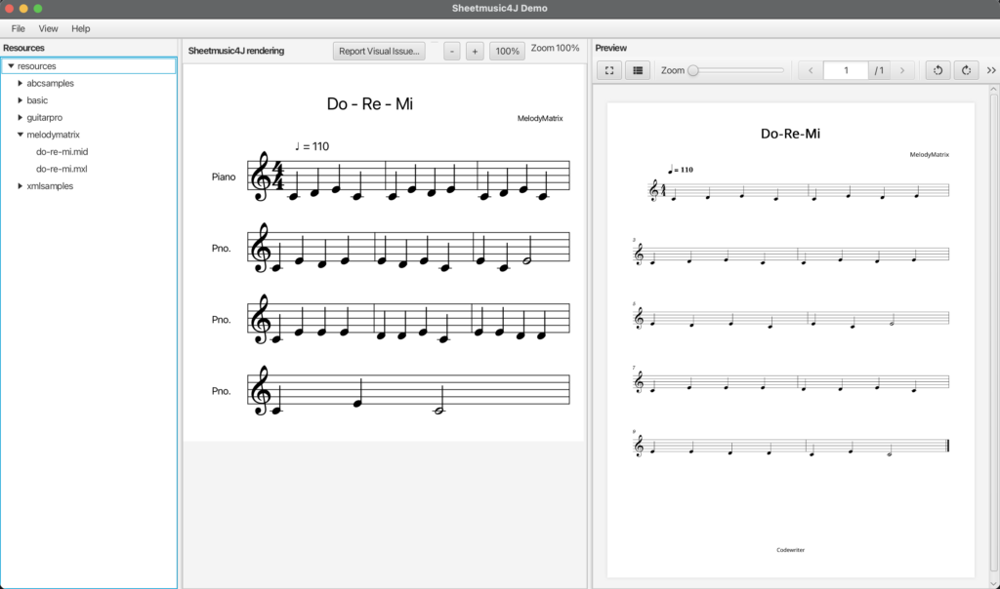
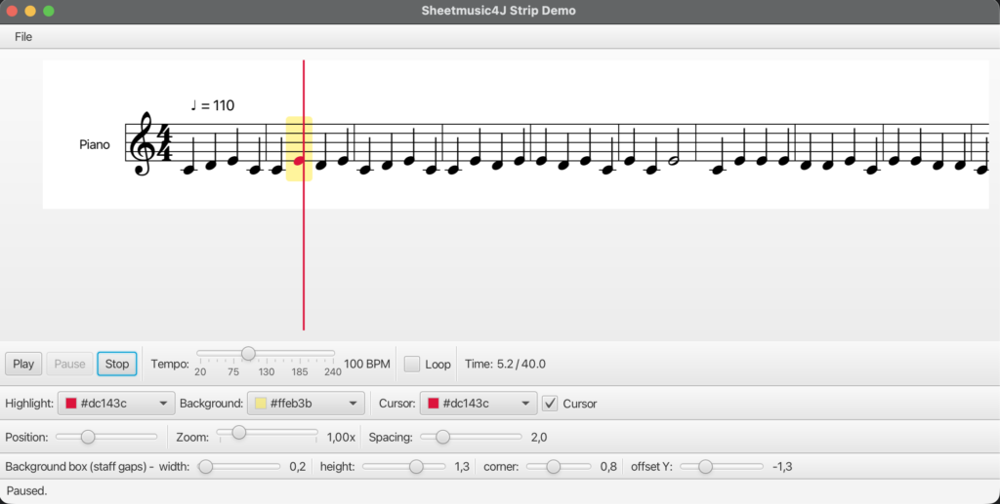

Last week I [introduced Sheetmusic4J](/posts/2026/2026-07-24-introducing-sheetmusic4j/), a Java(FX) library to render and interact with sheet music. That first **0.0.1** release was really a question more than a product: is there any interest in a native Java(FX) sheet music library before I invest more time in it? So I shared it on social media and waited to see what would come back.

The answers arrived faster than I expected. And they gave me more homework...



## Two Comments, Two New Formats

I posted about the release on [LinkedIn](https://www.linkedin.com/feed/update/urn:li:activity:7486390283673247744/), and almost immediately two comments landed with the same kind of challenge: "Nice, but does it support **ABC notation** ?" and "What about **Guitar Pro** files?"

That's exactly the feedback loop I hoped the 0.0.1 release would trigger. The whole point of shipping something small and early is to find out where people actually want it to go, instead of guessing. So I took the challenge, wrote plans in Theia IDE with the @Architect and followed up with the @Coder. And now, one week later, **Sheetmusic4J 0.0.3** is out with support for both formats, plus a lot of polish on how the notation actually looks on the staff. There is also a 0.0.2, but that has a bug which don't correctly load the abc-files...

## ABC Notation, In and Out

Requested by [Peter De Coninck](https://www.linkedin.com/in/peter-de-coninck-7656b0b4/).

The headline of this release is [ABC notation](https://sheetmusic4j.com/inspired-by/abc/) support: the `core` module can now both **read and write** `.abc` files.

If you've spent time around folk and traditional music, you know ABC. It's a compact, text-based format where an entire tune fits in a few lines of plain text that you can paste into an email, a forum post, or a tune database. It's the exact opposite of MusicXML: terse and human-writable where MusicXML is verbose and tool-oriented. And there are decades of freely shared ABC tunes out there to read.

Here's what a small tune looks like:

```
X:1
T:Speed the Plough
M:4/4
L:1/8
K:G
|:GABc dedB|dedB dedB|c2ec B2dB|c2A2 A2BA|
```

The new `AbcReader` and `AbcWriter` parse into and generate from the same `Score` model as everything else, so once a tune is loaded, the engraving, JavaFX rendering, and MIDI export all just work. Coverage already goes well beyond the basics: keys and modes, unit note length, meter, tuplets, ties and slurs, grace notes, decorations like staccato and rolls, barline styles, repeats and 1st/2nd endings, guitar chord symbols, lyrics, and multi-line titles, all backed by round-trip tests.

And because `ScoreFile` dispatches on the file extension, most applications never touch the reader or writer directly:

```
// Import: build a Score from an ABC tune
Score score = ScoreFile.load(Path.of("speed-the-plough.abc"));

// Export: write a Score back out as ABC
ScoreFile.save(score, Path.of("speed-the-plough-copy.abc"));
```

ABC is a big enough format that not every corner is covered yet, so real-world tunes that don't render correctly are exactly the kind of bug report I want.


## Guitar Pro: An Experiment

Requested by [Soheil Rahsaz](https://www.linkedin.com/in/soheilrahsaz/).

The second new format is more of an experiment. Sheetmusic4J can now do **basic import of [Guitar Pro](https://sheetmusic4j.com/inspired-by/guitarpro/) 7/8 files** (`.gp`, load only).

I want to be upfront about what this is. Unlike MusicXML, MIDI, and ABC, Guitar Pro is **not an open format** . There's no published specification, and this importer is built on the community's documented reverse-engineering of the modern GPIF format, the XML document tucked inside the `.gp` ZIP archive. It reads that with the JDK only, no third-party dependency. The older binary formats (`.gp3`, `.gp4`, `.gp5`, `.gpx`) are not handled, and there's no saving back.

```
// Import a Guitar Pro 7/8 file (load only)
Score score = ScoreFile.load(Path.of("song.gp"));
```

I added it deliberately early, because I genuinely don't know yet how people would want to use Guitar Pro files here. Is rendering them as standard notation enough, or is tablature-specific rendering the whole point? That's the kind of thing I'd rather learn from real use than guess at. If you have a use case or a file that doesn't import cleanly, [let me know on GitHub](https://github.com/sheetmusic4j/sheetmusic4j/issues).

## Better-Looking Engraving

The rest of this release is behind-the-scenes work of making the notation look right. Some of the improvements:

* Grace notes now render as proper small flagged/beamed notes with a connecting curve, and their beam follows the pitch contour of the run. Still not perfect, but a lot better than in the first release.
* Distinct flag glyphs for 32nd/64th/128th notes, and a real double-whole (breve) notehead.
* Ties and slurs sit on the opposite side of the stem by default, and the tuplet bracket disappears when the run already beams cleanly.
* Barline styles, repeat dots and voltas; articulations that hug the notehead; chord symbols closer to the staff; and better spacing around titles and accidentals.

There's also a new `NoteBackgroundStyle` in the FX viewer to configure the highlight box drawn behind a note (handy for play-along views), and a fix for a crash on very large scores by rendering through a windowed canvas instead of one oversized texture.

## Under the Hood

The demo app got reorganized and gained a standalone strip play-along demo, the library now logs through SLF4J, the MusicXML reader correctly merges multiple `<attributes>` blocks per part instead of overwriting, and MIDI import produces fewer spurious rests.


## Still 0.0.x, Still Listening

This is version **0.0.3**, not a stable release. The API and the rendering can still change, and that's the point of publishing this early. The first release asked whether anyone cared; this one is what happened when a couple of people answered in the comments.

The full list of changes is in the [release notes](https://sheetmusic4j.com/releases/), and the [code examples](https://sheetmusic4j.com) show how to get started. If you try it and hit a rendering difference, or you want a format that isn't there yet, [issues and feedback on GitHub](https://github.com/sheetmusic4j/sheetmusic4j/issues) are exactly what shapes where this goes next. As it turns out, so is a comment on LinkedIn.
