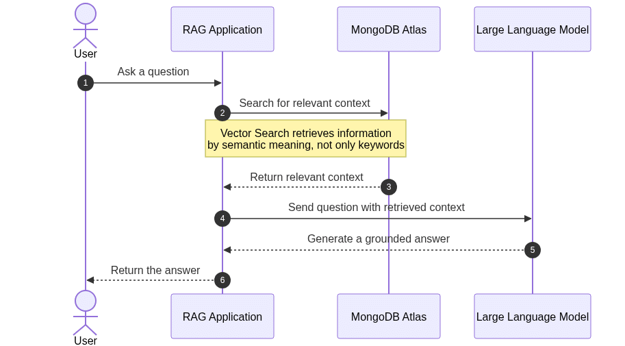

Modern organizations store large volumes of information in documents, databases, internal platforms, support systems, policies, and operational tools. However, having data does not guarantee that employees or applications can access the right information when needed. As data grows, traditional search tools often fail to identify context, meaning, and relationships between distributed sources. This results in a growing gap between the information an organization holds and its ability to use that information for effective decisions and actions.

Retrieval-Augmented Generation (**RAG**) tackles this challenge by combining the reasoning abilities of Large Language Models with dynamically retrieved organizational data. Instead of depending solely on static knowledge from model training, a RAG application retrieves relevant information at runtime and supplies it as context to the model. This enables businesses to develop AI applications that deliver more accurate, current, and domain-specific responses, making better use of existing knowledge. As a result, RAG is becoming a key architectural pattern for transforming enterprise data into usable and actionable intelligence.

This tutorial introduces the RAG pattern and demonstrates how to implement it with [MongoDB](https://www.mongodb.com/?utm_campaign=devrel&utm_source=third-party-content&utm_medium=cta&utm_term=hugh.murray).

<br />

In this tutorial, you'll:

* Model a simple HR Policy system.
* Model and interact with MongoDB using Java.
* Explore how MongoDB can help you achieve an AI with a RAG Pattern.

You can find all the code presented in this tutorial in the GitHub repository:

```
<a href="/cdn-cgi/l/email-protection" class="__cf_email__" data-cfemail="0e69677a4e69677a667b6c206d6163">[email protected]</a>:soujava/mongodb-rag.git
```


Prerequisites {#h2-0-prerequisites}
-----------------------------------

For this tutorial, you'll need:

* Java 21.
* Maven.
* A MongoDB cluster.
  * [MongoDB Atlas](https://www.mongodb.com/cloud/atlas/register?utm_campaign=devrel&utm_source=third-party-content&utm_medium=cta&utm_content=data_driven_test_dev&utm_term=otavio.santana) (Option 1)

Retrieval-Augmented Generation (RAG) is an architectural approach that merges a sizable Language Model with external information retrieved at runtime. Rather than depending solely on static knowledge from model training, the application searches organizational documents and data sources for relevant information and incorporates it into the prompt before generating a response. This approach is valuable for businesses that have extensive internal knowledge but struggle to make it accessible, up to date, and useful across applications and teams.

Vector databases aid this process by storing text as numerical representations known as embeddings. Unlike classic lexical indexes that search for exact words or phrases, vector indexes retrieve information based on semantic context and meaning. For example, a query about "working from home" can locate documents mentioning "remote work," even if the exact words differ. MongoDB Atlas supports this architecture by allowing application data, document content, metadata, and embeddings to remain on a single platform. This enables Java applications to combine operational queries, contextual filtering, and semantic retrieval when building effective RAG solutions.


<br />

Step 1: Generate the Project {#h2-1-step-1-generate-the-project}
----------------------------------------------------------------

In this tutorial, we will build a JAX-RS application designed to answer questions using the context of a human resources policy. Users will be able to both ask questions and provide context through the resource. To begin, create a new project using Helidon, as in[the previous article](https://www.mongodb.com/community/forums/t/introduction-to-mongodb-and-helidon/303061/?utm_campaign=devrel&utm_source=third-party-content&utm_medium=cta&utm_content=versioning-foojay&utm_term=hugh.murray). Visit[Helidon Starter](https://helidon.io/starter/), select Microprofile and Quickstart, then download the project.

After downloading the project, we will add the required dependencies, including langchain4j. As in previous articles, this project serves as an AI orchestrator, simplifying communication with APIs through a unified interface. We will also add several langchain4j extensions to support CDI, Eclipse MicroProfile, RAG, OpenAPI, and MongoDB Atlas as the communication driver. We will include it in the pom.xml file.

```
    <properties>
        <project.build.sourceEncoding>UTF-8</project.build.sourceEncoding>
        <maven.compiler.source>21</maven.compiler.source>
        <maven.compiler.target>21</maven.compiler.target>
        <langchain4j-cdi.version>1.3.4</langchain4j-cdi.version>
    </properties>

 <dependencies>
        <dependency>
            <groupId>org.mongodb</groupId>
            <artifactId>mongodb-driver-sync</artifactId>
            <version>5.9.0</version>
        </dependency>
        <dependency>
            <groupId>dev.langchain4j.cdi</groupId>
            <artifactId>langchain4j-cdi-portable-ext</artifactId>
            <version>${langchain4j-cdi.version}</version>
        </dependency>
        <dependency>
            <groupId>dev.langchain4j.cdi.mp</groupId>
            <artifactId>langchain4j-cdi-config</artifactId>
            <version>${langchain4j-cdi.version}</version>
        </dependency>
        <dependency>
            <groupId>dev.langchain4j</groupId>
            <artifactId>langchain4j-open-ai</artifactId>
            <version>1.16.0</version>
        </dependency>
        <dependency>
            <groupId>dev.langchain4j</groupId>
            <artifactId>langchain4j-embeddings-all-minilm-l6-v2</artifactId>
            <version>1.18.0-beta28</version>
        </dependency>
        <dependency>
            <groupId>dev.langchain4j</groupId>
            <artifactId>langchain4j-mongodb-atlas</artifactId>
            <version>1.18.0-beta28</version>
        </dependency>

        </dependencies>
```


The next step is to add credentials, including the LLM provider and API key, to src/main/resources/META-INF/microprofile-config.properties. Please ensure you update the Open API key or MongoDB Atlas configuration as needed.

Step 2: Create the Service {#h2-2-step-2-create-the-service}
------------------------------------------------------------

With the project and credentials set up, we can begin by creating the agent that will serve as the bridge between Java and the LLM. Using Langchain4J with CDI, this can be achieved through a single interface. Our implementation will include one method to handle questions, utilizing SystemMessage for the prompt and UserMessage for user input.

```
import dev.langchain4j.cdi.spi.RegisterAIService;
import dev.langchain4j.service.SystemMessage;
import dev.langchain4j.service.UserMessage;
import jakarta.enterprise.context.ApplicationScoped;

@RegisterAIService(scope = ApplicationScoped.class, contentRetrieverName = "#default")
public interface HRPolicyAgent {

    @SystemMessage("""
            You are an assistant responsible for answering questions about
            the company's Human Resources policies.

            Answer using only the information retrieved from the HR policy
            knowledge base.

            If the retrieved information does not contain the answer, say:
            "The available HR policies do not contain this information."

            Do not invent policies, benefits, limits, dates, or approvals.
            Keep the answer concise and clear.
            """)
    String ask(@UserMessage String question);
}
```


With the Agent set up, we can now define the Data Transfer Objects (**DTOs**) that will carry request and response messages within our REST API. In this context, we will use Java records.

The first DTO represents a request containing an HR question. This question is a String text field that must not be blank, enforced by a single Bean Validation annotation.

```
import jakarta.validation.constraints.NotBlank;

public record HRPolicyQuestion(
       @NotBlank
       String question
) {
}
```


The response DTO includes both the original question and its corresponding answer.  

```
public record HRPolicyAnswer(
       String question,
       String answer
) {
}
```


For the context category, we use a similar request/response structure. The request contains a text field that will be inserted into the MongoDB Atlas Vector Database. This information is essential for enhancing our LLM's knowledge and is central to the application's functionality.

```
import jakarta.validation.constraints.NotBlank;

public record HRPolicyContextRequest(@NotBlank String context) {
}
```


The response indicates whether the information was successfully inserted and provides a relevant message to the user.

```
public record HRPolicyContextResponse(boolean inserted, String message) {
}
```


To begin implementing the services, start with HRPolicyService, which manages project-related questions. This class injects the agent and submits questions to the LLM.

```
import jakarta.enterprise.context.ApplicationScoped;
import jakarta.inject.Inject;
import org.soujava.demos.rag.dto.HRPolicyAnswer;
import org.soujava.demos.rag.dto.HRPolicyQuestion;

import java.util.logging.Logger;

@ApplicationScoped
public class HRPolicyService {

   private static final Logger LOGGER = Logger.getLogger(HRPolicyService.class.getName());

   @Inject
   private HRPolicyAgent agent;

   public HRPolicyAnswer ask(HRPolicyQuestion request) {
       var answer = agent.ask(request.question());
       var response = new HRPolicyAnswer(request.question(), answer);
       LOGGER.info("Generated response: " + response);
       return response;
   }
}
```


The Context service includes additional logic. It inserts information into the database, prevents duplicate entries, and returns the relevant data from the database.

```
import dev.langchain4j.data.document.Document;
import dev.langchain4j.data.document.splitter.DocumentSplitters;
import dev.langchain4j.data.segment.TextSegment;
import dev.langchain4j.model.embedding.EmbeddingModel;
import dev.langchain4j.store.embedding.EmbeddingSearchRequest;
import dev.langchain4j.store.embedding.EmbeddingStore;
import dev.langchain4j.store.embedding.EmbeddingStoreIngestor;
import jakarta.enterprise.context.ApplicationScoped;
import jakarta.inject.Inject;
import org.soujava.demos.rag.dto.HRPolicyContextRequest;
import org.soujava.demos.rag.dto.HRPolicyContextResponse;

import java.util.logging.Logger;

@ApplicationScoped
public class HRPolicyContextService {

   private static final Logger LOGGER = Logger.getLogger(HRPolicyContextService.class.getName());
   @Inject
   private EmbeddingModel embeddingModel;

   @Inject
   private EmbeddingStore<TextSegment> vectorDb;

   public HRPolicyContextResponse add(HRPolicyContextRequest request) {
       LOGGER.info("Adding HR policy context to the knowledge base: " + request.context());
       Document document = Document.from(request.context());

       LOGGER.fine("Embedding incoming HR policy context to check for duplicates");
       var documentEmbedding = embeddingModel
               .embed(document.text())
               .content();

       var result = vectorDb.search(
               EmbeddingSearchRequest.builder()
                       .queryEmbedding(documentEmbedding)
                       .maxResults(1)
                       .minScore(0.95)
                       .build()
       );

       if (!result.matches().isEmpty()) {
           LOGGER.info("Similar HR policy context already exists; skipping ingestion: " + request.context());
           return new HRPolicyContextResponse(       false,"Similar HR policy context already exists.");
       }

       LOGGER.fine("No similar context found; ingesting the new HR policy context: " + request.context());
       EmbeddingStoreIngestor ingestor = EmbeddingStoreIngestor.builder()
               .documentSplitter(DocumentSplitters.recursive(100, 10))
               .embeddingModel(embeddingModel)
               .embeddingStore(vectorDb)
               .build();

       ingestor.ingest(document);

       LOGGER.info("HR policy context was added to the knowledge base: " + request.context());
       return new HRPolicyContextResponse(   true,"The HR policy context was added to the knowledge base.");
   }
}
```


The final service in this tutorial ensures the database contains the minimum required information. It checks if the database is empty and, if so, inserts an initial HR policy context.

```
import dev.langchain4j.data.document.Document;
import dev.langchain4j.data.document.splitter.DocumentSplitters;
import dev.langchain4j.data.segment.TextSegment;
import dev.langchain4j.model.embedding.EmbeddingModel;
import dev.langchain4j.store.embedding.EmbeddingSearchRequest;
import dev.langchain4j.store.embedding.EmbeddingStore;
import dev.langchain4j.store.embedding.EmbeddingStoreIngestor;
import jakarta.enterprise.context.ApplicationScoped;
import jakarta.enterprise.context.Initialized;
import jakarta.enterprise.event.Observes;
import jakarta.inject.Inject;

import java.util.logging.Logger;

@ApplicationScoped
public class HRPolicyLoader {

   private static final Logger LOGGER = Logger.getLogger(HRPolicyLoader.class.getName());

   @Inject
   EmbeddingModel embeddingModel;

   @Inject
   EmbeddingStore<TextSegment> vectorDb;

   public void onStart(@Observes @Initialized(ApplicationScoped.class) Object init) {
       LOGGER.info("Checking HR policy data in Vector DB...");

       Document document = Document.from(
               "Company Policy Update 2026: " +
                       "Remote work is permitted on Tuesdays and Thursdays. " +
                       "The annual hardware stipend has been increased to $1,500. " +
                       "Core hours are 10:00 AM to 3:00 PM EST."
       );

       var documentEmbedding = embeddingModel.embed(document.text()).content();

       var result = vectorDb.search(
               EmbeddingSearchRequest.builder()
                       .queryEmbedding(documentEmbedding)
                       .maxResults(5)
                       .build()
       );

       LOGGER.info("Matches found: " + result.matches().size());

       if (result.matches().isEmpty()) {
           LOGGER.info("No existing embeddings found. Proceeding with ingestion.");

           EmbeddingStoreIngestor ingestor = EmbeddingStoreIngestor.builder()
                   .documentSplitter(DocumentSplitters.recursive(100, 10))
                   .embeddingModel(embeddingModel)
                   .embeddingStore(vectorDb)
                   .build();

           ingestor.ingest(document);

           LOGGER.info("HR policy document ingested successfully.");
       } else {
           LOGGER.info("Document already ingested. Skipping ingestion step.");
       }
   }
}
```


Step 3: Create the producers {#h2-3-step-3-create-the-producers}
----------------------------------------------------------------

The purpose of these producers is to demonstrate how to create and inject instances, or make them available to CDI containers. The following example uses the @Produces method in CDI.

The VectorStoreProducer creates the vector database that generates context for the LLM. In this example, we use MongoDB Atlas. Configuration values are injected using Eclipse MicroProfile Configuration, which allows for easy configuration management and overrides through system environment variables in production. This approach supports the Twelve Factor Application methodology.

```
import com.mongodb.client.MongoClient;
import com.mongodb.client.MongoClients;
import com.mongodb.client.model.CreateCollectionOptions;
import dev.langchain4j.data.segment.TextSegment;
import dev.langchain4j.store.embedding.EmbeddingStore;
import dev.langchain4j.store.embedding.mongodb.IndexMapping;
import dev.langchain4j.store.embedding.mongodb.MongoDbEmbeddingStore;
import jakarta.enterprise.context.ApplicationScoped;
import jakarta.enterprise.inject.Produces;
import jakarta.inject.Inject;
import org.bson.conversions.Bson;
import org.eclipse.microprofile.config.inject.ConfigProperty;

import java.util.HashSet;
import java.util.Set;

/**
* Produces the MongoDB-backed {@link EmbeddingStore} that persists and searches vectors.
*/
@ApplicationScoped
class VectorStoreProducer {

   @Inject
   @ConfigProperty(name = "jnosql.mongodb.url")
   private String mongodbURL;

   @Inject
   @ConfigProperty(name = "rag.embedding.dimension", defaultValue = "1536")
   private int embeddingDimension;

   @Inject
   @ConfigProperty(name = "rag.mongodb.database", defaultValue = "rag_app")
   private String databaseName;

   @Inject
   @ConfigProperty(name = "rag.mongodb.collection", defaultValue = "embeddings")
   private String collectionName;

   @Inject
   @ConfigProperty(name = "rag.mongodb.index", defaultValue = "embedding")
   private String indexName;

   @Inject
   @ConfigProperty(name = "rag.mongodb.max-result-ratio", defaultValue = "10")
   private long maxResultRatio;

   @Produces
   @ApplicationScoped
   EmbeddingStore<TextSegment> createVectorStore() {
       MongoClient client = MongoClients.create(mongodbURL);
       CreateCollectionOptions createCollectionOptions = new CreateCollectionOptions();
       Bson filter = null;
       Set<String> metadataFields = new HashSet<>();
       IndexMapping indexMapping = new IndexMapping(embeddingDimension, metadataFields);
       Boolean createIndex = true;
       return new MongoDbEmbeddingStore(
               client,
               databaseName,
               collectionName,
               indexName,
               maxResultRatio,
               createCollectionOptions,
               filter,
               indexMapping,
               createIndex
       );
   }
}
```


The EmbeddingModelProducer class defines the model used for vector operations. Configuration values can be overridden, and default values are provided.

```
import dev.langchain4j.model.embedding.EmbeddingModel;
import dev.langchain4j.model.openai.OpenAiEmbeddingModel;
import jakarta.enterprise.context.ApplicationScoped;
import jakarta.enterprise.inject.Produces;
import jakarta.inject.Inject;
import org.eclipse.microprofile.config.inject.ConfigProperty;

/**
* Produces the {@link EmbeddingModel} used to turn text into vectors.
*/
@ApplicationScoped
class EmbeddingModelProducer {

   @Inject
   @ConfigProperty(name = "dev.langchain4j.cdi.plugin.chat-model.config.api-key")
   private String apiKey;

   @Inject
   @ConfigProperty(name = "rag.embedding.model-name", defaultValue = "text-embedding-3-small")
   private String modelName;

   @Produces
   @ApplicationScoped
   EmbeddingModel createEmbeddingModel() {
       return OpenAiEmbeddingModel.builder()
               .apiKey(apiKey)
               .modelName(modelName)
               .build();
   }
}
```


Finally, the ContentRetrieverProducer configures the retriever with minimum score and maximum result parameters.

```
import dev.langchain4j.data.segment.TextSegment;
import dev.langchain4j.model.embedding.EmbeddingModel;
import dev.langchain4j.rag.content.retriever.ContentRetriever;
import dev.langchain4j.rag.content.retriever.EmbeddingStoreContentRetriever;
import dev.langchain4j.store.embedding.EmbeddingStore;
import jakarta.enterprise.context.ApplicationScoped;
import jakarta.enterprise.inject.Produces;
import jakarta.inject.Inject;
import org.eclipse.microprofile.config.inject.ConfigProperty;

/**
* Produces the {@link ContentRetriever} that searches the vector store for a query.
*/
@ApplicationScoped
class ContentRetrieverProducer {

   @Inject
   @ConfigProperty(name = "rag.retriever.max-results", defaultValue = "3")
   private int maxResults;

   @Inject
   @ConfigProperty(name = "rag.retriever.min-score", defaultValue = "0.7")
   private double minScore;

   @Produces
   @ApplicationScoped
   ContentRetriever createRetriever(EmbeddingStore<TextSegment> store, EmbeddingModel model) {
       // The architectural bridge that searches the DB based on the query vector
       return EmbeddingStoreContentRetriever.builder()
               .embeddingStore(store)
               .embeddingModel(model)
               .maxResults(maxResults) // Fetch the top N most relevant chunks
               .minScore(minScore) // Strict boundary: Ignore low-confidence matches
               .build();
   }
}
```


Step 4: Define Resources {#h2-4-step-4-define-resources}
--------------------------------------------------------

The configuration, credentials, services, and producers are ready. The remaining step is to expose this service to users. We will use a REST API by creating a resource class with JAX-RS. This resource class will expose both question and context endpoints using the POST method. JAX-RS provides a straightforward API for our REST application, allowing us to easily identify operations through annotations such as POST for the HTTP verb and Path to define the URL.

```
import jakarta.inject.Inject;
import jakarta.validation.Valid;
import jakarta.ws.rs.Consumes;
import jakarta.ws.rs.POST;
import jakarta.ws.rs.Path;
import jakarta.ws.rs.Produces;
import jakarta.ws.rs.core.MediaType;
import jakarta.ws.rs.core.Response;
import org.soujava.demos.rag.dto.HRPolicyAnswer;
import org.soujava.demos.rag.dto.HRPolicyContextRequest;
import org.soujava.demos.rag.dto.HRPolicyQuestion;

import java.util.logging.Logger;

@Path("/hr/policies")
@Consumes(MediaType.APPLICATION_JSON)
@Produces(MediaType.APPLICATION_JSON)
public class HRPolicyResource {

   private static final Logger LOGGER = Logger.getLogger(HRPolicyResource.class.getName());

   @Inject
   private HRPolicyService service;

   @Inject
   private HRPolicyContextService contextService;

   @POST
   @Path("/ask")
   public HRPolicyAnswer ask(@Valid HRPolicyQuestion request) {
       LOGGER.info("Received request: " + request);
       return service.ask(request);
   }

   @POST
   @Path("/context")
   public Response addContext(@Valid HRPolicyContextRequest request) {
       LOGGER.info("Received request to add HR policy context: " + request);
       var response = contextService.add(request);

       if (response.inserted()) {
           LOGGER.info("HR policy context was added to the knowledge base: " + request.context());
           return Response.status(Response.Status.CREATED)
                   .entity(response)
                   .build();
       }
       LOGGER.info("Similar HR policy context already exists; skipping ingestion: " + request.context());
       return Response.ok(response).build();
   }
}
```


Once the application is running, you can test it locally or deploy it to a cloud environment. If testing locally, ensure your IP address is included to allow access to the MongoDB Atlas database.

Conclusion {#h2-5-conclusion}
-----------------------------

This tutorial showed how to implement Retrieval-Augmented Generation in Java using Jakarta EE, LangChain4j, and MongoDB Atlas. We demonstrated how to convert contextual information into embeddings, store them in a vector database, retrieve them through semantic similarity, and provide them to a Large Language Model for grounded responses. MongoDB Atlas adds value by keeping operational data, document content, metadata, and vector embeddings on a single managed platform. This reduces architectural complexity and enables scalable semantic search. As a result, Java applications can move beyond isolated AI integrations and use RAG to make organizational knowledge more accessible, up-to-date, and practical for business needs.

<br />

Ready to explore the benefits of MongoDB Atlas? Get started now by [trying MongoDB Atlas](https://www.mongodb.com/lp/cloud/atlas/try4-reg?utm_campaign=devrel&utm_source=third-party-content&utm_medium=cta&utm_content=data_driven_test_dev&utm_term=otavio.santana).

[Access the source code](https://github.com/soujava/mongodb-rag) used in this tutorial.

Any questions? Come chat with us in the [MongoDB Community Forum](https://www.mongodb.com/community/forums/?utm_campaign=devrel&utm_source=third-party-content&utm_medium=cta&utm_content=data_driven_test_dev&utm_term=otavio.santana).

**References**:

* [Source code](https://github.com/soujava/mongodb-rag)
