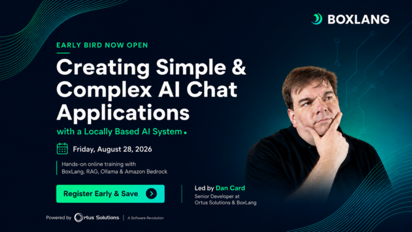

Build Secure AI Chat Applications with BoxLang, RAG, Ollama, and Amazon Bedrock
-------------------------------------------------------------------------------

AI demos are everywhere. Building an AI-powered feature that can securely work with your documents, databases, and real application data is a very different challenge.

How do you give an AI model access to the right information without exposing sensitive data? Should you use a locally hosted model or a cloud service? How do you move beyond a basic chatbot and build something genuinely useful for your users or organization?

Join **Dan Card on August 28, 2026** , for a practical, hands-on online workshop where you will build simple and complex AI chat applications using **BoxLang, Retrieval-Augmented Generation (RAG), Ollama, and Amazon Bedrock.**

### Go Beyond a Basic AI Chatbot

Whether you believe AI is the answer to everything, an incarnation of Skynet waiting to destroy us all, or somewhere in between, one thing is clear: clients, users, and organizations are increasingly looking for ways to integrate AI into real applications.

**But adding AI is not as simple as sending a prompt to a model.**

Developers need to consider security, data access, infrastructure, costs, model selection, and how to keep control over the information used to generate an answer.

This full-day workshop is designed to help you work through those challenges by building an AI chat application step by step.

You will begin with a simple, ongoing conversation and progressively enhance it with real application capabilities, including access to documents and database data through code you control.

What You Will Learn
-------------------

**During the workshop, you will learn how to:**

* Build a conversational AI chat application with BoxLang
* Maintain context across an ongoing conversation
* Use RAG to provide relevant information from documents
* Connect your AI application to database-driven data
* Run AI locally using Ollama and locally hosted language models
* Integrate securely with Amazon Bedrock using IAM
* Compare the benefits, limitations, and economics of self-hosted and serverless AI
* Create tools that allow the AI engine to determine how to retrieve the information it needs
* Use BoxLang's `bx-ai` module to interact natively with 15 AI providers

Rather than stopping at theory, you will write and control the code responsible for retrieving data and supplying context to the AI model.

By the end of the day, you will have a clearer understanding of how the pieces fit together and how these techniques can be adapted to real enterprise web applications.

Build with More Control Over Your AI Stack
------------------------------------------

**Choosing an AI provider is only one part of building an effective solution.**

Some applications may benefit from the privacy and control of a locally hosted model. Others may need the scalability and flexibility of a serverless platform such as Amazon Bedrock.

In this workshop, you will explore both approaches and learn how BoxLang can help you work across different providers and models without building every integration from scratch.

BoxLang will be the primary development language, using the bx-ai module to provide a consistent way to interact with AI services, including Amazon Bedrock and the many engines and models it supports.

Who Should Attend?
------------------

**This workshop is ideal for:**

* BoxLang, Java and ColdFusion developers
* Software engineers
* Technical leads
* Development teams exploring practical AI use cases
* Organizations interested in adding AI capabilities to existing web applications

Basic knowledge of BoxLang or ColdFusion is encouraged. **You do not need to be an AI expert to participate.**

Prerequisites and Workshop Support
----------------------------------

**To participate in the hands-on exercises, you will need:**

* A working BoxLang installation
* An AWS account or a Docker-enabled environment, such as Docker Desktop

If you need help getting ready, you will have support before the workshop. Participants will receive access to a **private pre- and post-workshop Slack channel** for assistance with prerequisites and follow-up questions after the session.

Get Your Early Bird Ticket and Save $50
---------------------------------------

Early Bird tickets are currently available for **$349, saving you $50 on the regular General Admission price of $399.**

Early Bird pricing ends on **August 14, 2026**, so secure your seat before the price increases.

Want to learn alongside your team? Discounted ticket packs are also available:

* **Duo Pack: Buy 1, Get the 2nd 50% Off** Two tickets for $261.75 per person, saving $174.50.
* **Team Pack: Buy 2, Get 1 Free** Three tickets for $232.66 per person, saving your team $349.

Learning together makes it easier to apply what you build during the workshop to your own projects, systems, and client needs.

Turn AI Ideas into Working Applications
---------------------------------------

If you have been wondering how to move from experimenting with prompts to building secure, data-driven AI features, this workshop will give you a practical place to start.

Build the application. Connect your own data. Compare local and cloud-based AI systems. Leave with techniques you can apply to real projects.

[**Get your ticket today and join Dan Card on August 28 for this hands-on BoxLang AI workshop here!**](https://www.eventbrite.com/e/creating-simple-and-complex-chat-application-with-a-locally-based-ai-system-tickets-1993889866264?aff=oddtdtcreator "Get your ticket today and join Dan Card on August 28 for this hands-on BoxLang AI workshop.")

Join the Ortus Community
------------------------

Be part of the movement shaping the future of modern web development.

Subscribe to our newsletter for product updates, conference news, and community highlights.

Follow us:

* <https://twitter.com/ortussolutions>
* <https://www.facebook.com/OrtusSolutions>
* <https://www.linkedin.com/company/ortus-solutions-corp>
* <https://www.youtube.com/OrtusSolutions>
* <https://github.com/Ortus-Solutions>
