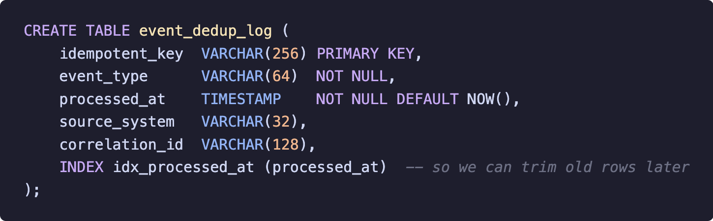
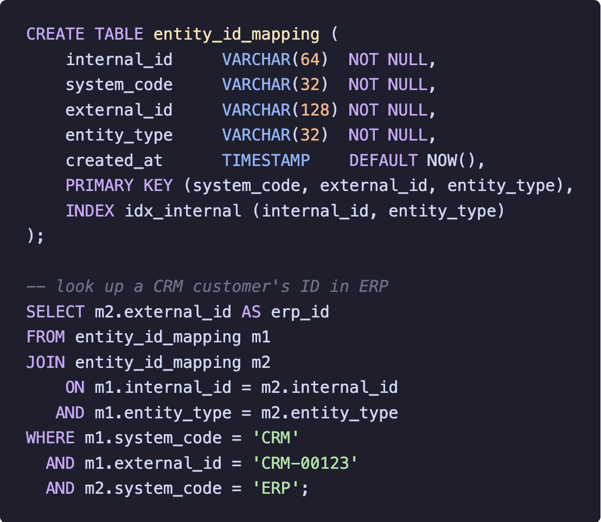

A reconciliation that didn't add up
-----------------------------------

Let me start with a real one. After a big sales promo, during reconciliation, finance said a batch of orders had the wrong status: on our side it showed "paid", but the finance system hadn't booked it.

Tracing it back, we found the payment gateway had retried during its peak, and the same payment notification got pushed twice. The first one was processed normally; the second time it came, the consumer happened to be in the middle of a rolling restart, so the message got re-queued and consumed again.

Our intermediate status table got written twice. The downstream did its own dedup so it wasn't affected, but our reconciliation report logic blew up over the one extra dirty row.

It wasn't a big deal, but it made one thing clear: in a distributed environment, messages just get repeated. Network retransmission, queue redelivery, consumer restart, upstream timeout resend. You can't stop it.

The only thing you can do is make the system behave the same whether it gets a message once or five times. That's idempotency.

What you key idempotency on is the whole game
---------------------------------------------

A lot of people think idempotency is just "add a unique key". Yes and no. What matters is what you actually key on.

Early on we just took the message queue's message ID as the idempotent key. It looked reasonable: every message has an ID, right?

But here's the trap. If the upstream manually re-pushes once, or its own retry mechanism fires, it generates a brand-new message ID. At the message level they look like two "different messages", but at the business level they're the same thing, so dedup just fails. We fell into this pit twice before we fixed it for good.

Later we changed it to require every upstream to carry a business-level idempotent key in the event body. How the key is formed varies by scenario, but there's one core principle: it has to uniquely identify "this business event happened once". A few examples:

```json
// payment event -> payment id + status
{
  "idempotent_key": "PAY-20240315-0042:PAID",
  "event_type": "payment.completed",
  "payment_id": "PAY-20240315-0042",
  "status": "PAID",
  "amount": 1299.00
}

// inventory change -> SKU + warehouse + batch
{
  "idempotent_key": "SKU-8823:WH-SZ-01:BATCH-20240315-003",
  "event_type": "inventory.adjusted",
  "sku": "SKU-8823",
  "warehouse": "WH-SZ-01",
  "batch": "BATCH-20240315-003",
  "delta": -5
}

// generic entity sync -> entity type + id + version
{
  "idempotent_key": "customer:C-10042:v17",
  "event_type": "entity.updated",
  "entity_type": "customer",
  "entity_id": "C-10042",
  "version": 17
}
```

Note that the idempotent key is often compound. The same order triggers several status changes, so you can't just use the order ID: "paid" and "shipped" are two different things, and you have to add the status or version number to tell them apart.

"Uniquely identifying an entity" and "uniquely identifying that an event happened once" are two different things, and a lot of people mix them up.

Rolling this standard out wasn't all smooth sailing either. Some upstream teams felt "why should I change my data format to fit your pipeline?" When that happened, we had to pull in the architects to get aligned and explain why this has to be done at the source.

If you try to patch it in the middle layer, you'll never finish patching, because you don't know the upstream's business semantics.

Where the dedup check actually lives
------------------------------------

Early on we did dedup in the business code: before processing a message, check whether this key has been handled. Functionally there's nothing wrong with it, but there's a race condition.

When the consumer's processing logic is complex (one event writes three tables and calls two downstream services), there's some processing time between the dedup check and the actual write. If a duplicate message arrives inside that window, you can get "no duplicate at check time, but a duplicate at write time". Under high concurrency this happens more often than you'd think.

Later we pushed dedup down to the database layer and let a unique constraint be the backstop. First, a dedup table:


<br />

The handling logic is roughly this: the dedup record and the business data are written in the same transaction, so they either both succeed or both roll back:

```java
@Transactional
public void handleEvent(IntegrationEvent event) {
    try {
        dedupRepository.insert(DedupRecord.builder()
            .idempotentKey(event.getIdempotentKey())
            .eventType(event.getEventType())
            .sourceSystem(event.getSource())
            .correlationId(event.getCorrelationId())
            .build());

        // no exception means it's not a duplicate; carry on
        businessService.process(event);

    } catch (DuplicateKeyException e) {
        // primary-key collision = duplicate event; skip it and move on
        log.info("Duplicate event skipped: key={}", event.getIdempotentKey());
    }
}
```

This way dedup and the business write are atomic, and there's no race window anymore.

By the way, this dedup table grows over time, so it needs periodic cleanup. We set up a scheduled job that clears records older than 30 days every night. The 30 days is a number we picked from the actual repeat-message window in our business: the vast majority of duplicate deliveries happen within a few minutes, so 30 days is plenty safe.

If your business write spans multiple data sources (after writing the database you still have to call an external API), the database transaction alone can't cover it, and you need a compensation mechanism. I'll get into that in the resilience part later.

When a duplicate arrives: ignore, overwrite, or merge
-----------------------------------------------------

How you handle it depends on the business semantics; there's no standard answer. In practice we ran into three strategies.

Ignore is used the most: detect a duplicate and just drop it, do nothing. It suits naturally idempotent operations, like "set the user's status to activated", where doing it once and doing it ten times have the same effect. In our system about 70% of event types go this route. It's the simplest to implement and the least likely to have bugs.

Overwrite suits final-state synchronization, like syncing a customer's latest contact info from CRM. But there's a trap: if events arrive out of order (the one that comes first is actually the newer data, and the later one is the older data), blindly overwriting rolls the new data back. This kind of bug is particularly disgusting to track down, because the data "looks right", it's just not the latest, and you might not notice for a long time. So we added a version-number check to the overwrite:

```java
public void upsertWithVersionCheck(EntitySync sync) {
    int updated = jdbcTemplate.update(
        "UPDATE entity_store SET data = ?, version = ?, updated_at = NOW() " +
        "WHERE entity_id = ? AND entity_type = ? AND version < ?",
        sync.getData(), sync.getVersion(),
        sync.getEntityId(), sync.getEntityType(), sync.getVersion()
    );
    if (updated == 0) {
        // either a new row to INSERT, or a stale version to drop
        try {
            jdbcTemplate.update(
                "INSERT INTO entity_store (entity_id, entity_type, data, version) " +
                "VALUES (?, ?, ?, ?)",
                sync.getEntityId(), sync.getEntityType(),
                sync.getData(), sync.getVersion());
        } catch (DuplicateKeyException e) {
            // a newer version already landed; dropping this one is correct
            log.debug("Stale version discarded: entity={}, ver={}",
                sync.getEntityId(), sync.getVersion());
        }
    }
}
```

It's essentially a simplified Last-Write-Wins: only a higher version can overwrite. This version field has to be generated by the source system. You can't fabricate it in the middle layer, because you don't know when the source updated what.

Merge is the most complex: you combine the old and new data. It suits incremental data (appending a note to an order, adding items to a cart, that kind of thing). It has the highest implementation complexity and is the most bug-prone. Take "append a note": what if the same note gets appended twice because of a duplicate delivery? Then you have to do another layer of dedup inside the merge logic. Nesting dolls, basically. So avoid it if you can.

Stitching identities together across systems
--------------------------------------------

Anyone who does integration has probably hit this: different systems have different IDs for the same entity. A customer is CRM-00123 in CRM, becomes ERP-C456 in ERP, and WMS-CUST-789 in WMS, and our platform has its own internal ID on top of that.

When an event flows from CRM to ERP, you need to know which record CRM-00123 maps to in ERP. Inside the integration platform we keep an ID mapping table that uses a platform-internal internal_id to string together each system's external_id:


<br />

The first thing an event does when it enters the pipeline is look up the mapping table to get the target system's ID. If it's not found (say a create event, where the downstream has no matching record yet), it's marked "to be created", and once the downstream finishes creating it, we write the mapping back.

One detail here: the write-back itself can also fail or repeat, so writes to this table have to be idempotent too. We use INSERT ... ON CONFLICT DO NOTHING.

Another very important thing is the correlation ID. Each business process (say "create an order and sync it to all systems") gets a globally unique ID that runs through every event and log line in that process.

When you're tracking down a problem, one grep can string together information scattered across dozens of systems and hundreds of log lines. Anyone who's used it knows how much it matters when something breaks. Without it, you're staring at the separate logs of dozens of systems with no idea what connects to what, and locating one problem goes from half an hour to half a day.

How do you prove you didn't lose anything
-----------------------------------------

Every few days the boss asks the same question: "how do you prove the pipeline hasn't lost data?" With a distributed system you really can't prove it mathematically, but you can use engineering to push the confidence very high.

We built end-to-end event tracing. Every event, from entering the pipeline to leaving it, leaves a trace log at each processing node it passes through:

```java
public class EventTracer {

    private final KafkaTemplate<String, TraceRecord> traceProducer;

    public void trace(IntegrationEvent event, String node, TraceStatus status) {
        TraceRecord record = TraceRecord.builder()
            .eventId(event.getEventId())
            .idempotentKey(event.getIdempotentKey())
            .correlationId(event.getCorrelationId())
            .processingNode(node)
            .status(status)  // RECEIVED / PROCESSING / COMPLETED / FAILED
            .timestamp(Instant.now())
            .build();
        traceProducer.send("event-trace-log", event.getEventId(), record);
    }
}
```

These trace logs are written to Kafka and archived long-term in object storage. On top of them we run two kinds of reconciliation.

Real-time reconciliation scans every five minutes for events that were "received but not finished". If an event still has no COMPLETED record more than ten minutes after it was received, it fires an alert. This quickly surfaces "stuck" events, like a deadlocked consumer or a downstream endpoint that never returns.

Offline reconciliation runs a full comparison every night. It diffs the list of events the upstream says it sent against the list we actually finished processing, and finds "upstream sent it but we didn't finish" and "we processed it but upstream never sent it". The former means it was lost; the latter is a possible duplicate or ghost record. The two kinds complement each other: real-time is fast but has limited coverage, offline is slow but catches the edge cases.

With this tracing system in place, the answer to the boss is no longer "it can't lose data". It's "if we lose one, we know in five minutes, locate it in ten, and recover it in half an hour".

<br />
