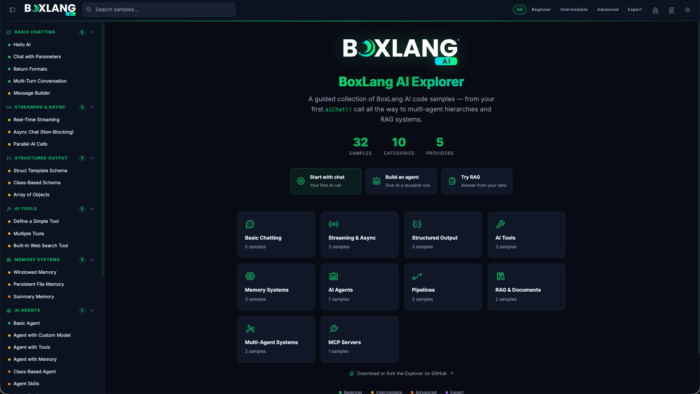

Learning a new AI API usually means jumping between scattered documentation pages, guessing at imports, and copy-pasting code that may or may not still work. We wanted something better for BoxLang AI, so we built the **BoxLang AI Explorer** : a local, browser-based catalog of runnable BoxLang AI examples, organized by category and difficulty, each with guidance, source code, and sample output. You can also try it online at <https://ai.boxlang.io/explorer/>

Whether you're sending your first chat request or wiring up a multi-agent RAG pipeline, the Explorer gives you a working example to start from.

## What It Is

BoxLang AI Explorer reads a set of `.bxs` sample files and presents them in a searchable, filterable catalog. Each sample includes:

A metadata block describing the category, difficulty, and what the example demonstrates  

Full, runnable BoxLang source  

Guidance text explaining the pattern  

Sample output so you know what to expect before you run it  

You can browse by category, filter by difficulty, search by title or content, and copy any sample's source directly from the UI.

## What's Covered

The samples span the full range of BoxLang AI capabilities:

* Chat and structured responses
* Streaming
* Async requests
* Tools and function calling
* Memory
* Agents
* Pipelines
* RAG (retrieval-augmented generation)
* Orchestration
* MCP servers

If you're wondering how a particular AI pattern works in BoxLang, there's a good chance a sample already demonstrates it.

## Try It Live, Run It Local

You can browse the catalog right now at ai.boxlang.io/explorer. The hosted version is for exploring the samples and reading through the code. For security and usage reasons, it doesn't execute AI requests directly in the browser.

To actually run the examples against a live AI provider, clone or fork the repo and run the Explorer locally:

github.com/ortus-boxlang/bx-ai-explorer

## Quick Start

Make sure you have the BoxLang Version Manager installed, or BoxLang Operating System installed: <https://boxlang.ortusbooks.com/getting-started/installation>

```java
// Install the version pinned by the repo
bvm install 1.16.0
bvm use

// Install the bx-ai module locally
install-bx-module bx-ai --local

// Start MiniServer
boxlang-miniserver
```

Open `http://localhost:8080` and start browsing. Stop the server with `Ctrl+C` whenever you're done.

Need a different port or some debug output?

```java
bvm miniserver --port 9090 --debug
```

## Bring Your Own Provider

The Explorer ships with a .env.example file covering OpenAI, Anthropic, Gemini, DeepSeek, Grok, Groq, Perplexity, OpenRouter, Mistral, Hugging Face, Voyage, Cohere, and AWS. Copy it, drop in the key for whichever provider you want to use, and load it into your shell before starting the server:

```java
cp .env.example .env

set -a
. ./.env
set +a

boxlang-miniserver
```

The default configuration in `config/boxlang.json` points at OpenAI, but you can point it at any supported provider and model. Individual samples can also override the provider and model right in their BoxLang code.

## Running a Sample Directly

The Explorer itself is a catalog and viewer, not a code runner. To actually execute a sample, run it from a second terminal or stop the server and run it from the repo root:

```java
bvm use

set -a
. ./.env
set +a
export BOXLANG_CONFIG="./config/boxlang.json"

boxlang samples/001-hello-ai.bxs
```

Swap in any sample file to try a different pattern:

```java
boxlang samples/018-basic-agent.bxs
boxlang samples/029-rag-system.bxs
```

## Explore, Fork, Contribute

BoxLang AI Explorer is meant to be a living reference. Adding a new sample is as simple as dropping a new `.bxs` file into `samples/` with a metadata block and working BoxLang code, the filename controls where it sorts in the catalog.

Clone the repo, run it locally, and start exploring what BoxLang AI can do:

github.com/ortus-boxlang/bx-ai-explorer

For the full BoxLang AI module documentation, visit [ai.ortusbooks.com](https://ai.ortusbooks.com/ "ai.ortusbooks.com").
