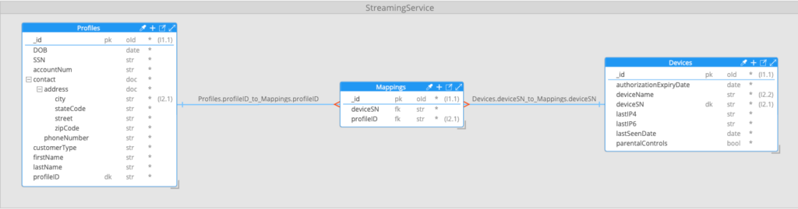
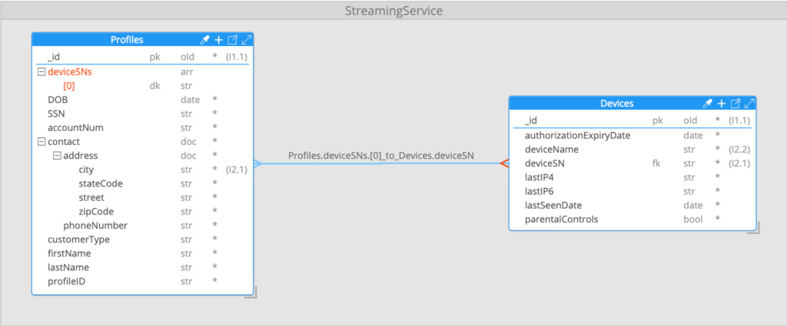

*And why MongoDB might be a better relational database than you ever realized.*

[*Design reviews*](https://www.mongodb.com/events/mongodb-schema-design-reviews/?utm_campaign=devrel&utm_source=third-party-content&utm_medium=cta&utm_content=agg-part3-foojay&utm_term=tony.kim)*are one-on-one meetings where MongoDB experts deliver advice on data modeling best practices and application design challenges. In this series, we are going to explore common real-life scenarios where design reviews helped developers achieve meaningful success with MongoDB.*


[In Part 1 of this series](https://foojay.io/today/aggregation-optimization-in-mongodb-a-case-study-from-the-field-part-1/), we described a use case based on a recent design review I conducted with a team at a MongoDB customer. The team in question was new to MongoDB, and the approach they had taken to both modeling their data and then subsequently querying it was very "RDBMS-like." As a result, query performance was significantly slower than their SLA called for.

The use case involved a fictional video streaming service, with a database mapping user profiles to the devices from which those users were accessing the service.

The query that we were attempting to support was to find all profiles associated with a contact address in a given city, and that had used a given device type to access the service—for example, all profiles registered in Austin, TX, which had accessed the service using an iPhone 12. To perform this query an [aggregation pipeline](https://www.mongodb.com/docs/manual/aggregation/?utm_campaign=devrel&utm_source=third-party-content&utm_medium=cta&utm_content=agg-part3-foojay&utm_term=tony.kim#aggregation-operations) had been built with ten stages:


In Part 1, we broke down what each stage of the pipeline was designed to do. If you are unfamiliar or need a refresher on MongoDB aggregation pipelines, I'd suggest you refer back to that before continuing.

So far, our efforts to improve the pipeline had involved removing unnecessary unwind stages, and, as a result, we had seen a 60% improvement in performance. However, we were still well short of our target sub-one second query response time.

|----------------------|------------------------|------------------------------------------------------------------|
| Pipeline description | Average time per query | Total elapsed time (300 query iterations, 15 concurrent threads) |
| Initial Design       | 11.8 seconds           | 260 seconds                                                      |
| $unwind removed      | 4.7 seconds            | 105 seconds                                                      |

## Optimization Step 2: refactoring the many-to-many relationship

Our initial data model included the use of an intermediate, or "associative," mapping collection, splitting the many-to-many relationship between the profile and device collections into a one-to-many and many-to-one pair of relationships:


The use of associative tables to model many-to-many relationships is a pattern that will be familiar to anyone who has worked with relational databases. It was created to work around one of the limitations of tabular data storage, namely that there is no good way to store an arbitrary number of references from a row in one table to the many rows in another table to which it is related. While the introduction of an associative table in an RDBMS model removes this limitation, the downside is that it means two joins are required to get from data on one side of the many-to-many relationship, to data on the other side. Regardless of the database type being used, joins are always computationally expensive, and the more joins needed to satisfy a query, the slower that query will be.

The document data model used by MongoDB, through the use of subdocuments and arrays, does not suffer the same limitations and gives you options for modelling one-to-many and many-to-many relationships in ways that can avoid some or all joins, and significantly improve query performance as a result.

With many-to-many relationships, one of the options the document model gives is to replace associative collections with an array of IDs of documents on one side of the relationship to associated documents on the other side of the relationship. Usually, the array of IDs is added to documents on the side of the relationship with the lower cardinality—i.e., where the resulting array will be smaller. By eliminating the intermediate associative collection, we reduce the number of join operations needed when traversing the relationship.  

In the case of the streaming service data, the cardinality of the many-to-many relationship between profiles and devices was not significantly different on either side of the relationship — less than 10, in almost all cases—so we elected to add an array of device serial numbers to the profile documents. This changed the data model to look like this:


With this revised model, a profile with three associated devices would now look like this (note the added deviceSNs array):

```
{
  "_id": {...},
  "DOB": "0001-01-01T00:00:00Z",
  "SSN": "943-83-1203",
  "accountNum": "G173VDREI5",
  "contact": {...},
  "customerType": "S",
  "deviceSNs": [
    "59737620-3d81-4c13-a161-b3c4e045cfe3",
    "24652cac-27a7-4961-8d11-1d77a55a1774",
    "6ea648d9-dc75-4909-82e2-0955fffb7a94"
  ],
  "firstName": "Martin",
  "lastName": "Smith",
  "profileID": "G173VDREI5-1"
}
```

By making this one change, the first [$lookup](https://www.mongodb.com/docs/manual/reference/operator/aggregation/lookup/?utm_campaign=devrel&utm_source=third-party-content&utm_medium=cta&utm_content=agg-part3-foojay&utm_term=tony.kim) stage—joining profiles to the intermediate mapping documents—could be eliminated from the pipeline. It's worth noting that this is *not* an example of denormalizing data. We didn't duplicate any data. We simply modified where it was being stored so that it could be used more efficiently.

With the first $lookup stage removed from the pipeline, the remaining $lookup stage was modified to join the profile documents directly to their corresponding device documents without going through the intermediate mapping collection:

```
{
  $lookup: {
    from: "Devices",
    localField: "deviceSNs",
    foreignField: "deviceSN",
    pipeline: [
      {
        $match: {
            deviceName: "iPhone 12"
        }
      },
      {
        $set: {
          _id: "$$REMOVE"
        }
      }
    ],
    as: "deviceData"
  }
}
```

As we saw in Part 2 when removing the [$unwind](https://www.mongodb.com/docs/manual/reference/operator/aggregation/unwind/?utm_campaign=devrel&utm_source=third-party-content&utm_medium=cta&utm_content=agg-part3-foojay&utm_term=tony.kim) stages, setting localField in a $lookup stage to an array field—in this case, deviceSNs—results in the $lookup operation being carried out for each value in the array.

The overall pipeline now looked like this:

```
[
  {
    $match: {
      "contact.address.city": "Austin"
    }
  },
  {
    $lookup: {
      from: "Devices",
      localField: "deviceSNs",
      foreignField: "deviceSN",
      pipeline: [
        {
          $match: {
            deviceName: "iPhone 12"
          }
        },
        {
          $set: {
            _id: "$$REMOVE"
          }
        }
      ],
      as: "deviceData"
    }
  },
  {
    $set: {
      accountNum: "$$REMOVE",
      mappingData: "$$REMOVE",
      customerType: "$$REMOVE",
      DOB: "$$REMOVE",
      _id: "$$REMOVE"
    }
  },
  {
    $match: {
      deviceData: {
        $ne: []
      }
    }
  },
  {
    $sort: {
      profileID: 1
    }
  },
  {
    $skip: 0
  },
  {
    $limit: 10
  }
]
```

Working with our test data set, the removal of the first $lookup stage meant that—in the example of profile documents where "city" was equal to Austin—a series of lookups for 6763 matching profile documents had been eliminated. Retesting the pipeline now showed a 75% reduction in both the average individual query time, and the time to complete 300 query iterations. This was a significant change and a great illustration of how the flexibility and options MongoDB provides when it comes to modelling relationships, including options that aren't available in relational databases, can have a significant positive impact on performance. It could be argued that MongoDB is better at modelling relationships than "relational" databases are.

|------------------------------------------|------------------------|------------------------------------------------------------------|
| Pipeline description                     | Average time per query | Total elapsed time (300 query iterations, 15 concurrent threads) |
| Initial design                           | 11.8 seconds           | 260 seconds                                                      |
| $unwind removed                          | 4.7 seconds            | 105 seconds                                                      |
| **Refactored many-to-many relationship** | **2.9 seconds**        | **62.5 seconds**                                                 |

While the changes made to this point had significantly improved performance of the pipeline, we were still well short of the sub-one second target query response time. In part 4, we'll show how appropriate use of data duplication can significantly improve read performance with minimal negative impacts.
