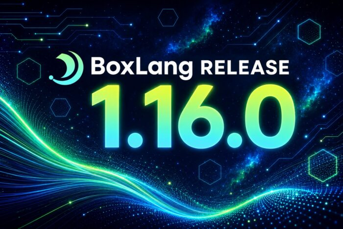

BoxLang 1.16.0 is here, closing **50 issues** across new features, improvements, and bug fixes. The theme running through this release is control: control over how HTTP clients are created and reused, control over what happens when a request fails, control over how much data a response is allowed to buffer, control over when Java classpaths reload, and tighter alignment with CFML behavior in the edge cases when doing migrations.

## HTTP Client Lifecycle and Observability

The HTTP stack received the largest investment in this release.

**HTTP and SOAP clients are now cached through Box caches** ([BL-2559](https://ortussolutions.atlassian.net/browse/BL-2559 "BL-2559")). Instead of uncontrolled client creation on every call, clients are pooled and reused, which means predictable timeout behavior and far less churn under load. This matters most in high-traffic integration code where client construction was quietly dominating request cost.

**A new `onHTTPError` event** ([BL-2558](https://ortussolutions.atlassian.net/browse/BL-2558 "BL-2558")) gives client-level error interception. Instead of wrapping every outbound call in defensive try/catch blocks, error handling can be centralized at the application level: log it, emit a metric, trigger a circuit breaker, or transform the response.

```java
class {

    function onHTTPError( event, data ){
        var httpResult = data.result
        var target     = data.target

        application.logger.error(
            "HTTP call failed to #target.url#",
            {
                statusCode : httpResult.statusCode ?: "none",
                errorDetail : httpResult.errorDetail ?: "",
                timeout : httpResult.timeout ?: false
            }
        )
    }

}
```

**HTTP client configuration and request target metadata are now exposed in BoxLang statistics** ([BL-2562](https://ortussolutions.atlassian.net/browse/BL-2562 "BL-2562")), and **`BoxHTTPClient` tracks observed hosts** ([BL-2566](https://ortussolutions.atlassian.net/browse/BL-2566 "BL-2566")). Together these answer a question that used to require guesswork: what is this application actually talking to, and how is it configured to do it? That data feeds straight into operational dashboards and traffic analysis.

**Maximum stream content length controls** ([BL-2565](https://ortussolutions.atlassian.net/browse/BL-2565 "BL-2565")) protect against unbounded response buffering. A misbehaving upstream service that streams gigabytes into memory is now a bounded failure instead of an out-of-memory event.

Rounding out the HTTP work, a low-level connection failure no longer leaves `fileContent` missing from the result ([BL-2556](https://ortussolutions.atlassian.net/browse/BL-2556 "BL-2556")), and Basic Auth charset assignment during security protocol negotiation was corrected ([BL-2567](https://ortussolutions.atlassian.net/browse/BL-2567 "BL-2567")).

## MiniServer Deployments Behind a Reverse Proxy

Running BoxLang MiniServer behind nginx, Traefik, an ALB, or any other proxy layer got noticeably smoother with a new configuration setting.

**`useProxyHeaders`** ([BL-2598](https://ortussolutions.atlassian.net/browse/BL-2598 "BL-2598")) tells the runtime to trust and honor forwarded headers, so the client IP, protocol, and host reflect the original request rather than the proxy hop.

```java
{
    "useProxyHeaders": true
}
```

Alongside that, **MiniServer no longer rewrites `/ws` requests** because of trailing slash handling ([BL-2572](https://ortussolutions.atlassian.net/browse/BL-2572 "BL-2572")), which unblocks WebSocket endpoints, and **MiniServer now defaults form-field charset encoding to UTF-8** ([BL-2613](https://ortussolutions.atlassian.net/browse/BL-2613 "BL-2613")), so accented characters and non-Latin scripts survive a form post without extra configuration.

## Struct Streams

Structs join arrays and queries with first-class Java Stream support ([BL-2590](https://ortussolutions.atlassian.net/browse/BL-2590 "BL-2590")). Three new members: `stream()`, `keyStream()`, and `valueStream()`.

```java
inventory = {
    widgets  : 42,
    gadgets  : 7,
    sprockets: 0,
    gizmos   : 118
}

// Keys with zero stock
outOfStock = inventory.stream()
    .filter( entry -> entry.getValue() == 0 )
    .map( entry -> entry.getKey() )
    .toList()

// Total units on hand
totalUnits = inventory.valueStream()
    .mapToInt( qty -> qty )
    .sum()

// Sorted key listing
sortedKeys = inventory.keyStream()
    .sorted()
    .toList()
```

Because these are real Java streams, the full `java.util.stream` surface is available: parallel processing, collectors, flat mapping, and every terminal operation the JDK ships. No custom BoxLang abstraction sitting in between.

## Hot Reloading Java Libraries

**`javasettings.reloadOnChange`** is now implemented ([BL-2588](https://ortussolutions.atlassian.net/browse/BL-2588 "BL-2588")). Point an application at a set of JARs and the runtime picks up changes without a restart, which shortens the loop considerably when developing against a Java library in parallel with BoxLang code.

```java
bx:application
    name = "reloadOnChangeApp"
    javaSettings = {
        loadPaths     : [ "/path/to/libs/helloworld.jar" ],
        reloadOnChange: true
    }
```

Complementing this, **`dynamicClassLoader.addPaths()`** **now accepts a single JAR or class file path** ([BL-2585](https://ortussolutions.atlassian.net/browse/BL-2585 "BL-2585")) rather than requiring a directory.

```java
getRequestClassLoader().addPaths( "/opt/app/lib/acme-utils.jar" )
```

Two related fixes land here as well: `createObject()` no longer errors when the classloader is wrapped in a `DynamicObject` ([BL-2587](https://ortussolutions.atlassian.net/browse/BL-2587 "BL-2587")), and relative class resolution now includes base template path lookup ([BL-2582](https://ortussolutions.atlassian.net/browse/BL-2582 "BL-2582")).

## Archive Format Expansion Support

`compress()` and `extract() `gained the archive formats that Unix-oriented pipelines actually use ([BL-2592](https://ortussolutions.atlassian.net/browse/BL-2592 "BL-2592")).

`compress()` now supports `bzip`, `bzip2`, `tar`, `tar.bz`, `tbz`, `tbz2`, `tgz`, and `tar.gz`. `extract() `supports `bzip`, `bzip2`, `tar`, `tbz`, `tbz2`, `tgz`, and` tar.gz`.

```java
compress(
    source      = "/tmp/project",
    destination = "/tmp/project.tar.gz",
    format      = "tar.gz"
)

extract(
    source      = "/tmp/project.tbz2",
    destination = "/tmp/project-out",
    format      = "tbz2"
)
```

Note that the `extract()` argument name is now `destination` rather than `target`, and the transpiler maps the old form automatically ([BL-2591](https://ortussolutions.atlassian.net/browse/BL-2591 "BL-2591")). Zipping a directory into a file inside itself is also fixed ([BL-2573](https://ortussolutions.atlassian.net/browse/BL-2573 "BL-2573")). We also have a new compression guide: <https://boxlang.ortusbooks.com/boxlang-framework/file-handling/compression>

## Query Enhancements

`query.findColumn()` gained compatibility behavior ([BL-2609](https://ortussolutions.atlassian.net/browse/BL-2609 "BL-2609")), returning the positional index of a named column.

```java
users = queryNew(
    "id,name,email",
    "integer,varchar,varchar",
    [
        [ 1, "Ana", "ana@example.com" ],
        [ 2, "Luis", "luis@example.com" ]
    ]
)

nameColumnIndex  = users.findColumn( "name" )
emailColumnIndex = users.findColumn( "email" )
```

The query layer also picked up a solid round of correctness fixes: `query.filter` now handles null column values ([BL-2563](https://ortussolutions.atlassian.net/browse/BL-2563 "BL-2563")), QoQ no longer errors on empty list parameters ([BL-2575](https://ortussolutions.atlassian.net/browse/BL-2575 "BL-2575")), casting errors when setting defaults on non-string query columns are resolved ([BL-2606](https://ortussolutions.atlassian.net/browse/BL-2606 "BL-2606")), compound operators work correctly on query columns ([BL-2611](https://ortussolutions.atlassian.net/browse/BL-2611 "BL-2611")), and Oracle null refcursor out params no longer default to an empty string in compat mode ([BL-2603](https://ortussolutions.atlassian.net/browse/BL-2603 "BL-2603")). Mixed positional and indexed `procresult` usage is now allowed ([BL-2601](https://ortussolutions.atlassian.net/browse/BL-2601 "BL-2601")).

## CFML and Transpiler Parity

1.16.0 continues the steady work of closing behavioral gaps for CFML codebases and transpiled output:

* `listAppend()` is now transpiled in member-method form as well as BIF form - ([BL-2580](https://ortussolutions.atlassian.net/browse/BL-2580 "BL-2580"))
* CFC and BX files can be included in compatibility scenarios ([BL-2610](https://ortussolutions.atlassian.net/browse/BL-2610 "BL-2610"))
* `e.extendedInfo` can be set in CF scenarios ([BL-2586](https://ortussolutions.atlassian.net/browse/BL-2586 "BL-2586"))
* Default `output` annotation behavior in classes has been loosened ([BL-2589](https://ortussolutions.atlassian.net/browse/BL-2589 "BL-2589"))
* The missing implementation path for `cfloop` struct attributes is filled in ([BL-2554](https://ortussolutions.atlassian.net/browse/BL-2554 "BL-2554"))
* The DateTime caster handles `M/d/yyyy hh:mm: ss.SSS` ([BL-2583](https://ortussolutions.atlassian.net/browse/BL-2583 "BL-2583"))
* Cookie `expires="never"` no longer fails casting ([BL-2602](https://ortussolutions.atlassian.net/browse/BL-2602 "BL-2602"))  

## Closures, Interfaces, and Java Interop

Three fixes tighten how BoxLang functions behave when handed to Java:

* Closures proxied to functional interfaces now respect default methods ([BL-2381](https://ortussolutions.atlassian.net/browse/BL-2381 "BL-2381"))
* Overriding default interface methods with a generic proxy works correctly ([BL-2608](https://ortussolutions.atlassian.net/browse/BL-2608 "BL-2608"))
* Closure binding to non-lexical variables in calling UDFs is fixed ([BL-2552](https://ortussolutions.atlassian.net/browse/BL-2552 "BL-2552"))  

## Stability and Performance

The remaining fixes cover whitespace management, file loops, parsing, and casting.

Whitespace management no longer breaks JavaScript output ([BL-2578](https://ortussolutions.atlassian.net/browse/BL-2578 "BL-2578")) and correctly removes leading spaces ([BL-2581](https://ortussolutions.atlassian.net/browse/BL-2581 "BL-2581")). File loops got `index` and `item` handling fixes ([BL-2596](https://ortussolutions.atlassian.net/browse/BL-2596 "BL-2596")), character support ([BL-2597](https://ortussolutions.atlassian.net/browse/BL-2597 "BL-2597")), and validation requiring either `item` or `index` ([BL-2604](https://ortussolutions.atlassian.net/browse/BL-2604 "BL-2604")).

On the parser side, `rethrow` inside a nested `switch` parses correctly ([BL-2584](https://ortussolutions.atlassian.net/browse/BL-2584 "BL-2584")) and `null` in `assert` statements no longer trips the parser ([BL-2605](https://ortussolutions.atlassian.net/browse/BL-2605 "BL-2605")). Casting fixes include `urlDecode( 0 )` ([BL-2553](https://ortussolutions.atlassian.net/browse/BL-2553 "BL-2553")), `structKeySet()` forcing keys to strings ([BL-2570](https://ortussolutions.atlassian.net/browse/BL-2570 "BL-2570")), `formatBaseN() `for `Long` inputs ([BL-2571](https://ortussolutions.atlassian.net/browse/BL-2571 "BL-2571")), and list append/prepend `includeEmptyFields` behavior ([BL-2579](https://ortussolutions.atlassian.net/browse/BL-2579 "BL-2579")). Bitwise BIFs were extended to `long` values ([BL-2561](https://ortussolutions.atlassian.net/browse/BL-2561 "BL-2561")).

Two performance and stability items worth calling out: a performance regression in the compare operator was corrected ([BL-2560](https://ortussolutions.atlassian.net/browse/BL-2560 "BL-2560")), and a `NullPointerException` in `getClassMetadata` was eliminated ([BL-2564](https://ortussolutions.atlassian.net/browse/BL-2564 "BL-2564")).

Also new in the output pipeline: `disposition` can be set on write-to-browser interception ([BL-2577](https://ortussolutions.atlassian.net/browse/BL-2577 "BL-2577")).

## Upgrading

BoxLang 1.16.0 is the recommended update for teams that rely heavily on HTTP integrations, run MiniServer behind proxies, or depend on CFML compatibility edge-case behavior.

Installation and upgrade instructions for every supported runtime are in the[BoxLang installation guide.](https://boxlang.ortusbooks.com/getting-started/installation " BoxLang installation guide.")

## ResourcesResources

* [Full 1.16.0 changelog](https://boxlang.ortusbooks.com/readme/release-history/1.16.0 "Full 1.16.0 changelog")
* [BoxLang documentation](https://boxlang.ortusbooks.com/ "BoxLang documentation")
* [Community forum](https://community.ortussolutions.com/ "Community forum")
* [BoxLang+ plans](https://boxlang.io/plans?_gl=1*w5ci3r*_gcl_au*MTY3OTk4MjQwNS4xNzgyMTI1MTI4Li0uLS4xNzg0NTY3NDQ1Ljk3ODAzMTgzNi4xNzg0NzE2NjAzLjE3ODQ3MTY2MDI.*_ga*NzIzNTM2MjY0LjE3NzYwOTE0MjI.*_ga_663JFQ7YGX*czE3ODc2NTc0NDgkbzEzOSRnMSR0MTc4NzY1Nzg0NCRqNjAkbDAkaDA.*_ga_D1P6P1YYT0*czE3ODc2NTc0NDgkbzEyOCRnMSR0MTc4NzY1Nzg0NCRqNjAkbDAkaDA. "BoxLang+ plans")
* [ForgeBox modules](https://forgebox.io/ "ForgeBox modules")
