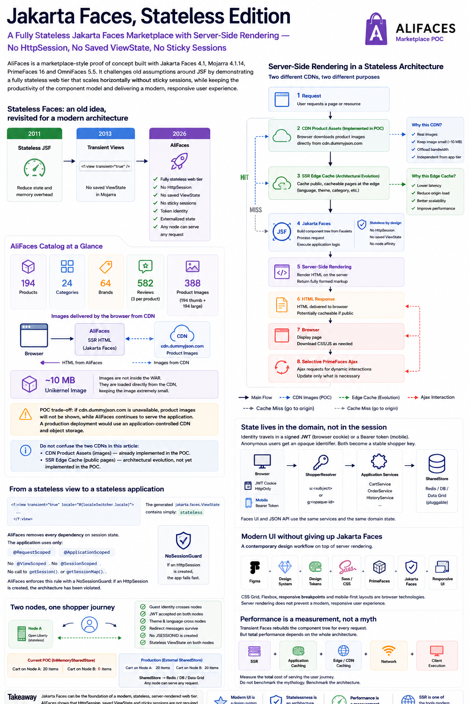
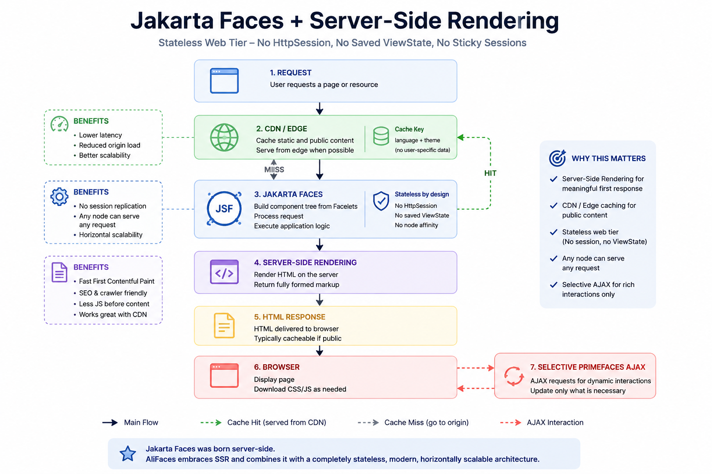
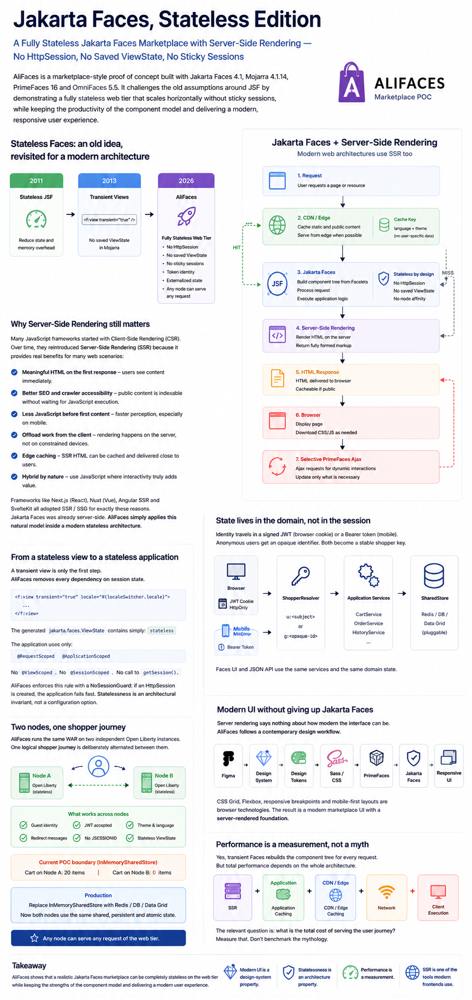

### Author (1)

  
[#### Angelo Rubini](https://foojay.io/today/author/angelo-rubini/)

* [](https://www.linkedin.com/in/angelo-rubini-1754379/)

### A Fully Stateless Jakarta Faces Marketplace with Server-Side Rendering — No HttpSession, No Saved ViewState, No Sticky Sessions

(see the poc on: [AliFaces POC Run On Oracle OCI(Nanos Unikernel)](http://89.168.28.199:8080/alifaces/ "AliFaces POC Run On Oracle OCI"))

Jakarta Faces still carries a few persistent assumptions: it is stateful, it requires `HttpSession`, it needs sticky sessions to scale horizontally, and its server-side rendering model belongs to an older generation of web applications.

**AliFaces** challenges those assumptions with running code — not a Hello World, but a marketplace-style application with catalog, search, filters, cart, checkout, orders, browsing history, themes, responsive layouts and a JSON API for mobile clients.

The stack is deliberately mainstream: **Jakarta Faces 4.1, Mojarra 4.1.14, PrimeFaces 16 and OmniFaces 5.5** , with the same WAR running on **Tomcat 11 and Open Liberty**.
> **No HttpSession. No saved ViewState. No node affinity.**

The goal is simple: **any web node should be able to serve the next request, regardless of which node served the previous one.**

[](alifaces-overview.png)

## Stateless Faces: an old idea, revisited

Stateless JSF is not new. It was already being explored in **2011** to reduce state and memory overhead, and by **2013** Mojarra supported transient views with:

```xhtml
<f:view transient="true">
```

AliFaces asks a broader question: **can an entire modern Jakarta Faces application be designed so that the web tier does not depend on HttpSession, saved ViewState or node affinity?**

Every AliFaces page uses a transient master view. The generated `jakarta.faces.ViewState` is simply `stateless`. The application uses `@RequestScoped` and `@ApplicationScoped` beans, with no `@ViewScoped`, no `@SessionScoped` and no application calls to `getSession()`.

A `NoSessionGuard` turns accidental `HttpSession` creation into an architectural violation. Statelessness is therefore **enforced, not assumed**.

## A marketplace, not a Hello World

The catalog contains **194 products across 24 categories and 64 brands** , with **582 reviews** — three per product. Each product carries around 25 fields covering pricing, stock, dimensions, shipping, warranty, returns, tags and reviews.

All **194 thumbnails and 194 full-size images** are loaded by the browser directly from `cdn.dummyjson.com`. They are not packaged inside the WAR, helping keep the complete unikernel image at around **10 MB** despite the visually rich catalog.

The external CDN is a deliberate POC trade-off: if it is unavailable, product images disappear while AliFaces continues serving the application. A production deployment would use an application-controlled object store and CDN.

This is separate from **edge caching of public SSR pages**: product assets are already CDN-delivered in the POC; caching public server-rendered catalog pages at the edge is an architectural evolution.

## State lives in the domain, not in the session

A marketplace still needs state. AliFaces removes it from the web node instead of pretending it does not exist.

Browser identity travels in a signed JWT stored in an `HttpOnly` cookie; mobile clients use a Bearer token; anonymous visitors receive an opaque identifier. `ShopperResolver` converts these identities into a stable shopper key.

Faces UI and JSON API use the same application services. Cart and history sit behind `SharedStore` rather than `HttpSession`. The POC currently uses `InMemorySharedStore`; a production adapter can use **Redis, a database or a data grid** without changing Faces pages or application services.

## Server-Side Rendering fits naturally

AliFaces deliberately keeps Jakarta Faces' native **Server-Side Rendering** model.

This is not a return to an obsolete architecture. Large e-commerce experiences such as Amazon and AliExpress use server-generated and cacheable content within broader hybrid delivery strategies, while JavaScript ecosystems that grew around Client-Side Rendering have also introduced or expanded SSR through **Next.js, Nuxt, Angular SSR and SvelteKit**.

SSR remains useful for meaningful initial HTML, public content, SEO, reduced mandatory client-side work and caching. Jakarta Faces already starts from the server-rendered side; AliFaces combines it with stateless web nodes, CDN-delivered assets, potential edge caching and selective PrimeFaces Ajax.
> **Server-Side Rendering is not the opposite of a modern frontend. It is one of the tools modern frontends use.**

[](alifaces-ssr-flow.png)

## Modern UI is independent of the rendering model

AliFaces follows a contemporary workflow:

**Figma → Design System → Design Tokens → Sass / CSS → PrimeFaces → Jakarta Faces → Responsive UI**

CSS Grid, Flexbox, responsive breakpoints and mobile-first layouts are browser technologies. Server rendering does not prevent a modern marketplace interface.
> **Modern UI is a design-system property.**   
> **Statelessness is an architecture property.**   
> **Performance is a measurement.**

## Performance is a measurement

Transient Faces rebuilds the component tree for every request. That has a cost, but a cost is not a benchmark result.

A stateless architecture also makes application caching, public edge caching and horizontal scaling easier to reason about. The relevant question is the **total cost of serving the user journey** across SSR, caching, network and client execution.
> **Do not benchmark the mythology. Benchmark the architecture.**

## Two nodes, one shopper

The strongest evidence comes from a two-node test using two independent **Open Liberty** instances running the same WAR. One logical shopper journey is deliberately alternated between them.

Guest identity crosses nodes. A token created on Node A is accepted by Node B. Theme, language and redirect messages survive node changes. **No `JSESSIONID` is created and both nodes return stateless ViewState.**

One boundary is intentionally visible: with `InMemorySharedStore`, the cart can contain **20 items on Node A and 0 on Node B**. This proves the JVMs really have separate memory and identifies exactly where node-local state remains.

Replace that adapter with Redis, a database or a data grid and both nodes use shared, persistent and atomic state. Faces pages and application services do not change.

[](alifaces-architecture-poster.png)

## Takeaway

AliFaces is not about proving that one JSF page can be stateless. It asks whether a realistic Jakarta Faces web application can make the **entire web tier stateless** while retaining native SSR, a modern responsive UI and horizontal scalability.

**No HttpSession. No saved ViewState. No sticky sessions. Token identity. Externalized domain state. CDN-delivered assets. Shared application services. Browser and mobile clients. Any web node can serve any request.**
> **Modern UI is a design-system property.**   
> **Statelessness is an architecture property.**   
> **Performance is a measurement.**   
> **Server-Side Rendering is one of the tools modern frontends use.**

**Jakarta Faces, Stateless Edition.**

*AliFaces is an independent technical proof of concept. Its marketplace interaction model is used only to exercise realistic e-commerce scenarios. AliFaces and AmaFaces are independent demo brands and are not affiliated with Amazon, AliExpress or any other marketplace company.*

## References

* Source POC: <https://github.com/AngeloRubens/alifaces>
* BalusC — *Stateless JSF* (2013): <https://balusc.omnifaces.org/2013/02/>
* AWS Compute Blog — *Server-side rendering micro-frontends – the architecture* : <https://aws.amazon.com/blogs/compute/server-side-rendering-micro-frontends-the-architecture/>
