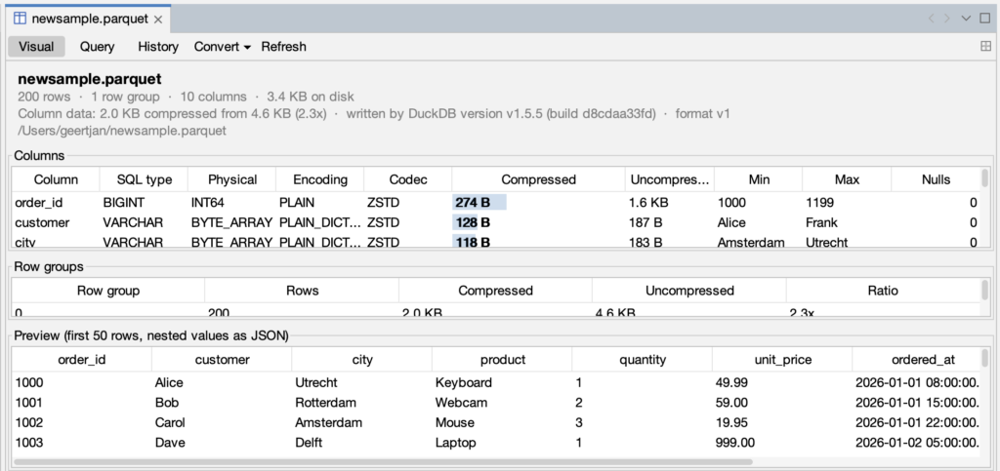
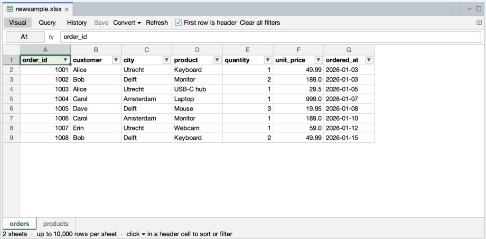
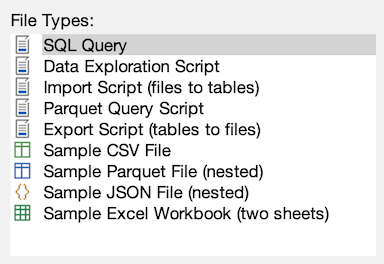
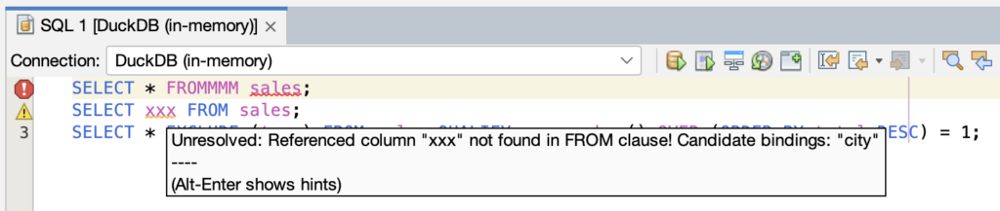
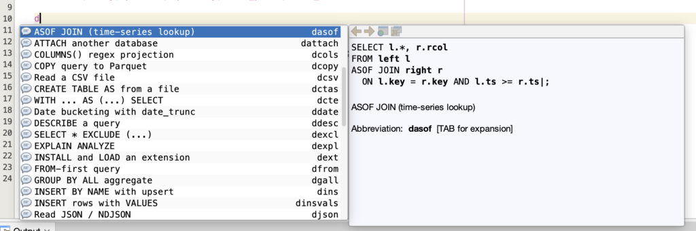
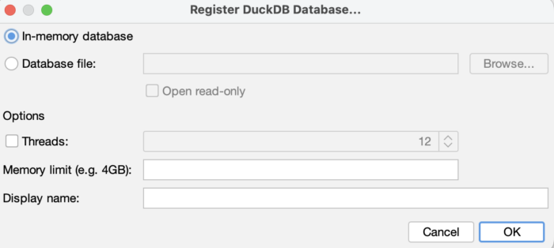
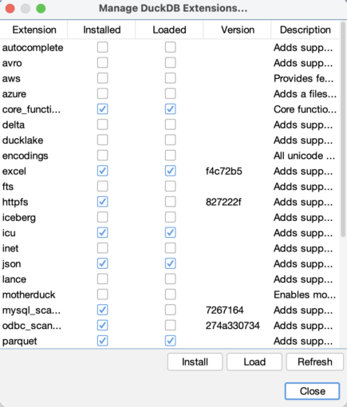

[Apache NetBeans DataWrangler](https://github.com/geertjanw/Apache-NetBeans-Data-Wrangler) brings the file formats of data analytics into Apache NetBeans 31: CSV, [Apache Parquet](https://parquet.apache.org/), JSON and Excel, the formats exchanged with pandas, Spark, R, dbt, Power BI and Excel itself.

You can query, convert, inspect, edit and analyze them without leaving the IDE. They open as documents with their own views and you can query them with SQL, join, aggregate and pivot them, convert them between formats, load them into tables and export the results. The SQL editor is enhanced with code completion, documentation, error checking and quick fixes for analytical SQL.

The engine behind all of this is [DuckDB](https://duckdb.org/), which is bundled with the plugin.



Sources are here, issues and pull requests are very welcome: [github.com/geertjanw/Apache-NetBeans-Data-Wrangler](https://github.com/geertjanw/Apache-NetBeans-Data-Wrangler).

## File support

**Parquet.** A Parquet file opens in a window with a Visual tab and a Query tab.

* The Visual tab shows the number of rows and row groups, the writer and format version, and a table of columns with their SQL type, physical type, encoding, compression codec, compressed and uncompressed size, minimum, maximum and null count.
* A bar in the size column shows each column's share of the file.
* Below that are the row groups and a preview of the first fifty rows, with LIST and STRUCT values shown as JSON.
* The Query tab is an SQL editor over the file, pre-filled with a `read_parquet` query and commented examples.

**Excel.** A workbook opens as a spreadsheet: lettered columns, numbered rows, a name box and formula bar above the grid, and one tab per sheet along the bottom.

* Header cells have a dropdown with Sort A to Z, Sort Z to A and a filter by value, sorting renumbers the rows, filtering hides rows and shows their original numbers in blue, as Excel does.
* Columns can be dragged to reorder and resized.
* Rows and columns can be inserted and deleted from their headers.
* Cells and the formula bar are editable, Ctrl+S writes all sheets back to the file, and each save appears in the History tab.
* Cells are read through DuckDB's `read_xlsx`, the excel extension is installed on first use.
* The used range of each sheet is determined from the workbook itself, so sheets with blank header cells or empty rows are read in full.
* A Query tab reads the workbook with `read_xlsx`.

**CSV, TSV, JSON and JSON Lines** files (`.csv`, `.tsv`, `.json`, `.jsonl`, `.ndjson`) have icons, editors and the same context-menu actions as the formats above.

**New File › Analytics** contains five script templates: SQL Query, Data Exploration Script, Import Script, Parquet Query Script and Export Script, each line explained in a comment and with expected results where the data is fixed, together with sample CSV, Parquet, JSON and Excel files. The Parquet sample has 200 rows with LIST and STRUCT columns, the JSON sample has nested objects and arrays, the Excel sample has two sheets.

## Query, convert, copy

Right-clicking a CSV, Parquet, JSON or Excel file, or inside an open CSV or JSON editor, provides actions for querying and converting the currently selected file to one of the other formats.



**Query with DuckDB** opens an SQL editor bound to a DuckDB connection with a query that reads the file using the appropriate function: `read_csv`, `read_parquet`, `read_json_auto` (or `read_json` with `format = 'newline_delimited'` for JSON Lines) or `read_xlsx`. Below the query is a set of commented examples for that format, such as `sniff_csv` for CSV, `parquet_metadata` for Parquet, `unnest(items, recursive := true)` for JSON and `sheet = '...'` for Excel. For Parquet and Excel files the query opens in the file's own Query tab.

**Convert with DuckDB** writes the file as CSV, TSV, Parquet (zstd or snappy), JSON Lines, a JSON array, an Excel workbook or a DuckDB database file. Each conversion is a single `COPY ... TO` statement. A save dialog proposes a name next to the source, and the row count appears in the status bar when the conversion finishes. Excel stores every number as a double. When converting from Excel, columns whose values are all whole numbers are written as integers.

**Copy File Path** copies the absolute path, one per line for a multi-selection.

## The SQL editor

When the editor's connection is a DuckDB connection, the following are active.

**Error checking.** Each statement is sent to DuckDB as `EXPLAIN <statement>`, which parses and binds the statement without running it. Syntax errors are underlined in red and unresolved names in yellow, at the position DuckDB reports, with DuckDB's message in the tooltip, including its "Did you mean" and "Candidate bindings" hints. Statements with side effects, such as `INSTALL` and `SET`, are not sent. Because the check is performed by the engine, DuckDB syntax such as `QUALIFY`, `PIVOT`, `SELECT * EXCLUDE (...)`, `GROUP BY ALL`, FROM-first queries and lambdas is accepted.

**Quick fixes.** When DuckDB reports that a function exists in an extension that is not loaded, Alt-Enter offers to install and load that extension...



...after a confirmation. When DuckDB suggests a name, Alt-Enter offers to replace the identifier with it.



**Objects created earlier in the same file** are not reported as missing. A script that creates a table on its first line and inserts into it on its second line shows no warnings before it has been run.

**Completion.** Ctrl+Space lists functions from `duckdb_functions()`, including those from loaded extensions, with signature and description, tables and views from the catalog, DuckDB keywords and types, and columns in scope.



After `s.` it lists the columns of `s`, which may be a table, a view, a common table expression, a subquery or a `read_csv(...)` call. Columns are resolved by asking DuckDB with `DESCRIBE`.



**Documentation.** As seen above, DuckDB keywords and types are colored, and hovering shows a summary, the syntax and an example, with a link to the DuckDB documentation. Standard keywords such as `FROM`, `GROUP BY` and `INSERT` are documented for what DuckDB adds to them. Hovering a function shows its signature and description. The same text appears in the completion documentation pane.

**Code templates.** Thirty-one templates cover common patterns, such as `dqual` for top-N per group, `dpiv` for a cross-tab, `dasof` for a time-series join, `dcsv` and `dpq` for reading files, `dcopy` for writing Parquet, `dmacro` for macros and `dvals` for inline data.

Type the abbreviation and press Tab. They can be edited under Tools › Options › Editor › Code Templates › SQL, and [the full list is in the repository README](https://github.com/geertjanw/Apache-NetBeans-Data-Wrangler#code-templates).

## Connections and extensions

* **Register DuckDB Database** on the Databases node creates a connection to an in-memory database or to a file, with options for read-only mode, thread count and memory limit.   

    

  DuckDB has no credentials, so connecting never prompts for a user or password. Whenever a feature needs the connection, such as when creating a file from a template, opening a Parquet or Excel file, completing, converting, the connection is opened automatically. If no DuckDB connection exists, an in-memory one is created.

<!-- -->

* **Manage DuckDB Extensions** on a connection lists the output of `duckdb_extensions()` and installs or loads an extension with a click.   

    
  Code completion is updated immediately for the newly added extension.

<!-- -->

* **Run in DuckDB Result Viewer** in the editor's context menu, and **Run** in the Query tabs, execute statements and show results with nested values as formatted JSON. Statements that return no rows report the number of rows affected.

## Design

DataWrangler has no SQL parser and no model of the database schema. Everything the editor reports comes from running statements against the connected DuckDB database.

* To check a statement, DataWrangler runs it as `EXPLAIN`, which makes DuckDB parse the statement and resolve every name in it without executing it. DuckDB's error message and position become the underline and the tooltip.
* To list the columns available after `s.`, it runs `DESCRIBE` on whatever `s` refers to, whether a table, a view, a common table expression, a subquery or a `read_csv(...)` call. The function list is read from `duckdb_functions()`, Parquet file details from `parquet_metadata()`, and spreadsheet cells from `read_xlsx()`.

These statements run on a separate connection to the same database, so editor checks do not interfere with queries the user is running.

**Note:**

* What the editor shows is correct for the DuckDB version that is installed and the extensions that are loaded, and it remains correct when a new DuckDB release adds syntax, because there is nothing in DataWrangler to update.
* On the other hand, features that need a syntax tree of the file, such as renaming an alias throughout a script, are not offered, and most features require a connection to an open database, which is created automatically when needed.

## Installation

1. Build with `mvn install` in a checkout of the repository (all dependencies are on Maven Central), or download the `.nbm` from the repository's releases.
2. Tools › Plugins › Downloaded › Add Plugin, select `datawrangler-1.0.0-SNAPSHOT.nbm`, restart.
3. File › New File › Analytics › Sample Parquet File. Open the Visual tab, then the Query tab, and run the query with Ctrl+Shift+E.

Apache NetBeans DataWrangler is licensed under the Apache License 2.0. Issues and pull requests are welcome at [github.com/geertjanw/Apache-NetBeans-Data-Wrangler](https://github.com/geertjanw/Apache-NetBeans-Data-Wrangler).
