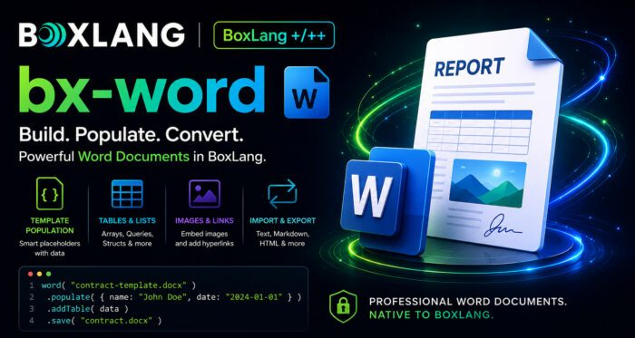

Every enterprise runs on Word documents. Contracts. RFPs. Proposals. Board reports. Offer letters. HR handbooks. Compliance policies. Invoices. Statements of work. Legal memos. Today, we are incredibly proud to announce **bx-word 1.0.0**, a first-class, fluent, production-ready module for creating, populating, and transforming Microsoft Word documents natively in BoxLang. This is not a wrapper. This is not a converter. This is a real document builder designed for the way enterprise teams actually work.

## Why This Matters for the Enterprise

Document generation is one of the quietest bottlenecks in a large organization. Sales teams wait on legal to spin up contracts. HR waits on ops to produce offer letters. Finance manually formats quarterly reports. Every one of those workflows can be automated, but only if the tooling is trustworthy, scriptable, and enterprise-grade.

Here are some use cases for `bx-word`:

* Batch-generating thousands of personalized contracts from a database in seconds
* Emitting branded, compliance-ready quarterly reports on a schedule
* Ingesting Word documents submitted by customers, transforming them, and re-emitting them for archives
* Producing password-protected board packets with watermarks and auto-generated tables of contents
* Building conversion pipelines that bridge Word, HTML, Markdown, and plain text for archival, indexing, and version control  
  If your organization touches Word at any scale, you were probably paying a real hidden tax to keep it working. `bx-word` is designed to make that tax disappear.

## The `word()` BIF: One Entry Point

Everything flows through a single BIF: `word()`. It returns a `WordDocument` builder that supports fluent method chaining, and it can create documents in several ways from a single call.

```java
// A brand new empty document
doc = word()

// Open an existing .docx to modify
doc = word( "/path/to/existing.docx" )

// Create directly from text, Markdown, or HTML
doc = word( text = "Hello World\n\nParagraph two" )
doc = word( markdown = "## Title\n\n**bold** text" )
doc = word( html = "<h1>Title</h1><p>Content</p>" )
```

That is the entire mental model. From here, every method returns the builder so you can chain forever.

## Your First Document in Three Lines

```java
word( "hello.docx" )
    .addHeading( "Hello, BoxLang!", 1 )
    .addParagraph( "This is my first Word document created with BoxLang." )
    .save()
```

Three lines. Real `.docx` on disk. Opens cleanly in Word, Google Docs, or LibreOffice.

## The Building Blocks

The fluent API covers the surface area you need for real business documents.

### Headings and Formatted Paragraphs

```java
word()
    .addHeading( "Q4 Financial Report", 1 )
    .addHeading( "Executive Summary", 2 )
    .addParagraph( "This quarter exceeded projections by 18%." )
    .addParagraph( "Key highlights below.", {
        bold      : true,
        size      : 12,
        color     : "2C3E50",
        alignment : "CENTER",
        spacingAfter : 240
    } )
    .save( "report.docx" )
```

### Tables from Arrays, Queries, or Structs

Tables are one of the most common enterprise needs, and `bx-word` handles all three shapes with automatic header bolding.

```java
// From a 2D array
word().addTable( [
    [ "Product", "Price", "Stock" ],
    [ "Widget A", "$10.00", "150" ],
    [ "Widget B", "$15.00", "200" ]
] )

// From a query (column names become bold headers)
products = queryExecute( "SELECT name, price, stock FROM products" )
word().addTable( products )

// From a struct with explicit headers
word().addTable( {
    headers : [ "Month", "Revenue", "Expenses" ],
    data    : [
        [ "January", "$50,000", "$30,000" ],
        [ "February", "$55,000", "$32,000" ]
    ]
} )
```

### Nested Lists

```java
word().addUnorderedList( [
    "Fruits",
    { text : "Vegetables", items : [ "Carrots", "Broccoli", "Spinach" ] },
    "Grains"
] )
```

Nesting goes as deep as you need.

### Images from Anywhere

Files. Bytes. Base64. Remote URLs. All first-class.

```java
word()
    .addImage( "/assets/logo.png", 5.0, 3.0 )
    .addImageFromUrl( "https://cdn.example.com/hero.jpg", 18.0, 5.0 )
    .addImageBase64( chartBase64, "chart.png" )
    .save( "brochure.docx" )
```

### Page Setup, Headers, Footers, Hyperlinks

```java
word()
    .margins( 1.78, 1.78, 1.78, 1.78 )
    .pageSize( "A4" )
    .orientation( "landscape" )
    .header( "ACME Corp Confidential" )
    .footer( "Q4 2026 Report" )
    .addHyperlink( "Visit BoxLang", "https://boxlang.io" )
    .save( "formatted.docx" )
```

## Template Population at Scale

This is the feature that pays for itself in a week.

Take an existing Word template with `{{placeholder}}` markers designed by your legal, HR, or marketing team, then fill it programmatically from any data source.

```java
word( "/templates/contract-template.docx" )
    .populate( {
        clientName    : "Acme Corp",
        signDate      : "2026-06-15",
        contractValue : "$150,000"
    } )
    .save( "/output/contract_acme.docx" )
```

Batch generation from a database becomes trivial:

```java
employees = queryExecute( "SELECT name, department, start_date, salary FROM new_hires" )

for( row in employees ){
    word( "/templates/offer-letter.docx" )
        .populate( {
            employeeName : row.name,
            department   : row.department,
            startDate    : dateTimeFormat( row.start_date, "yyyy-mm-dd" ),
            salary       : dollarFormat( row.salary )
        } )
        .save( "/output/offers/offer_#row.name#.docx" )
}
```

That loop generates as many personalized, on-brand offer letters as your database can feed it. HR gets their entire hiring cohort processed in seconds instead of hours.

Beyond `populate()`, you also get literal `replaceText()` for legacy templates and `setBookmark()` for named regions.

## Multi-Format Bridge

Documents rarely live in one format. Customers submit HTML from web forms. Editors work in Markdown. Search indexes want plain text. Archives want Word.

`bx-word` bridges all of them.

```java
// Receive HTML from a web form
submittedHtml = form.content

// Convert to Word for the archive
doc = word()
    .setTitle( form.title )
    .setAuthor( form.author )
    .fromHTML( submittedHtml )

doc.save( "/archive/#form.title#.docx" )

// Also emit Markdown for version control
fileWrite( "/archive/#form.title#.md", doc.toMarkdown() )

// And plain text for the search index
searchService.index( form.title, doc.toText() )

doc.close()
```

One document. Four representations. Zero external services.

## Enterprise-Grade Features

The features that matter when a legal or compliance team is looking over your shoulder.

### Watermarks

Every page of a draft or confidential document, marked automatically.

```java
word()
    .addHeading( "Q4 Financial Report", 1 )
    .addParagraph( "Sensitive data." )
    .addWatermark( "CONFIDENTIAL" )
    .save( "confidential-report.docx" )
```

### Password Protection

```java
word()
    .addHeading( "Board Packet", 1 )
    .addParagraph( "Restricted content." )
    .protect( "boardOnly2026!" )
    .save( "board-packet.docx" )
```

### Table of Contents

Insert a TOC field that Word populates automatically from your headings.

```java
word()
    .setTitle( "Employee Handbook 2026" )
    .addTableOfContents()
    .addPageBreak()
    .addHeading( "Company Overview", 1 )
    .addHeading( "Our Mission", 2 )
    .addHeading( "Policies", 1 )
    .save( "handbook.docx" )
```

### Section Breaks for Mixed Layouts

Portrait for the narrative, landscape for the wide financial tables, back to portrait for the appendix.

```java
word()
    .orientation( "portrait" )
    .addHeading( "Executive Summary", 1 )
    .addParagraph( "..." )
    .addSectionBreak()
    .orientation( "landscape" )
    .addHeading( "Financial Detail", 1 )
    .addTable( wideFinancialData )
    .addSectionBreak()
    .orientation( "portrait" )
    .addHeading( "Appendix", 1 )
    .save( "mixed-orientation.docx" )
```

### Compliance Metadata

Document properties that show up in Word's Info panel and travel with the file.

```java
word()
    .setTitle( "Q4 Financial Report" )
    .setAuthor( "Finance Department" )
    .setSubject( "Quarterly financial summary FY2026" )
    .setKeywords( "finance, quarterly, report, 2026" )
```

## Fluent Helpers for Real Workflows

Two small methods that pay off enormously in production code.

### `tap()` for Audit and Logging

Hook into the chain for logging, auditing, or side effects without breaking flow.

```java
word()
    .addHeading( "Contract", 1 )
    .tap( ( doc ) => auditLog.info( "Contract draft initiated for client #clientId#" ) )
    .populate( contractData )
    .tap( ( doc ) => auditLog.info( "Contract populated, #len( doc.toText() )# chars" ) )
    .save( outputPath )
```

### `when() `for Conditional Content

Ship different content for different tiers, roles, or regions in a single fluent expression.

```java
word()
    .addHeading( "Sales Report", 1 )
    .addParagraph( "Standard content for all recipients." )
    .when( user.hasRole( "executive" ), ( doc ) => doc
        .addHeading( "Executive Detail", 2 )
        .addTable( executiveMetrics )
    )
    .when( region == "EU", ( doc ) => doc
        .addParagraph( "GDPR-compliant addendum applies.", { italic : true } )
    )
    .save( "report.docx" )
```

No more branching helper functions. The conditions live where the content lives.

## A Real-World Example

Here is a complete Q4 sales report generated from a live query, with metadata, styled header, table, and a summary section:

```java
salesData = queryExecute( "
    SELECT product_name, units_sold, unit_price,
           ( units_sold * unit_price ) as revenue
    FROM sales
    WHERE quarter = 'Q4'
    ORDER BY revenue DESC
" )

word( "q4-sales-report.docx" )
    .margins( 1.5, 1.5, 1.5, 1.5 )
    .setTitle( "Q4 2026 Sales Report" )
    .setAuthor( "Sales Department" )
    .setSubject( "Quarterly sales summary" )
    .header( "ACME Corp | Q4 2026 Sales Report" )
    .footer( "Confidential" )
    .addHeading( "Q4 2026 Sales Report", 1 )
    .addParagraph( "Generated on " & dateTimeFormat( now(), "yyyy-mm-dd HH:nn" ), {
        italic : true,
        size   : 10,
        color  : "808080"
    } )
    .addParagraph( "The following report summarizes sales performance for Q4 2026.", {
        spacingAfter : 240
    } )
    .addTable( salesData )
    .addPageBreak()
    .addHeading( "Summary", 2 )
    .addParagraph( "All products met or exceeded quarterly targets.", { bold : true } )
    .save()
```

That is a full board-ready document from a live database query, in about twenty lines of BoxLang.

## Licensing and the 60-Day Trial

`bx-word` is a **BoxLang+** module, available under our **Plus** , **Plus Plus** , and **Starter** license tiers. This is a commercial-grade capability with the support and long-term maintenance commitments enterprises need.

I want your team to prove the value before you commit. Every install includes a **60-day free trial** so you can build real workflows, measure the impact, and bring hard numbers to your budget conversation. No feature gating during the trial. Full access to everything.

If you already have a BoxLang+ license, you are ready to go.

## Installation

```java
box install bx-word
```

Requirements:

* BoxLang Runtime 1.14.0 or higher
* BoxLang+ license (or the 60-day trial)

## Get Started

The full documentation lives here: <https://boxlang.ortusbooks.com/boxlang-+-++/modules/bx-word>

Questions, feedback, or want to talk about an enterprise rollout? Reach out to us at [support@ortussolutions.com](support@ortussolutions.com "support@ortussolutions.com") or join the community on our [Slack](https://boxteam.ortussolutions.com/ "Slack").
