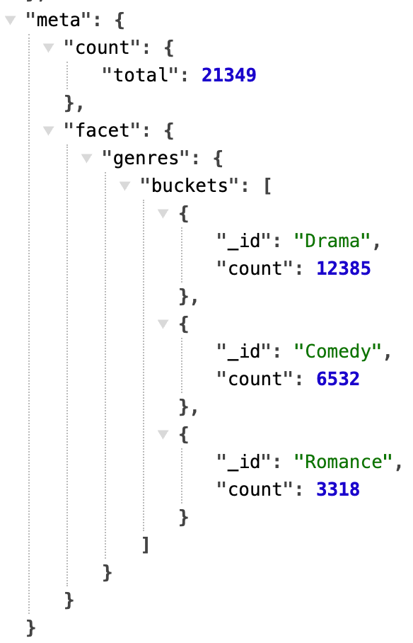
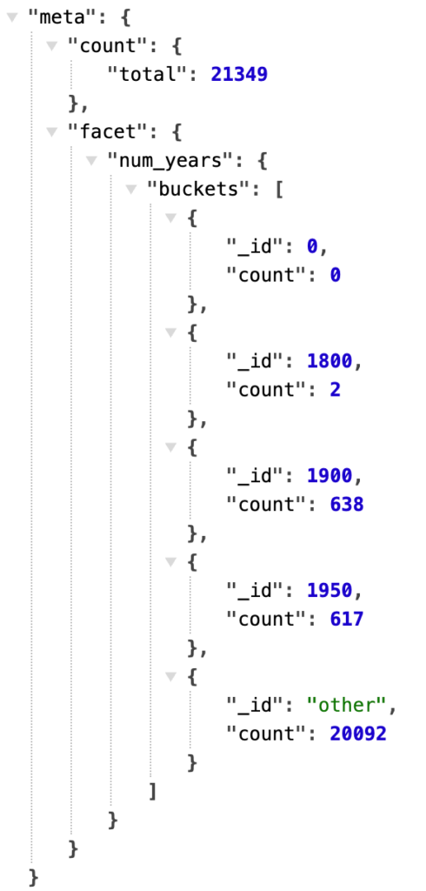
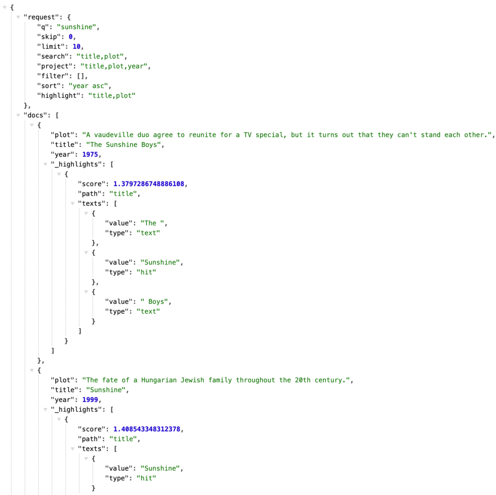
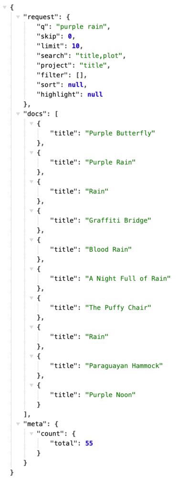
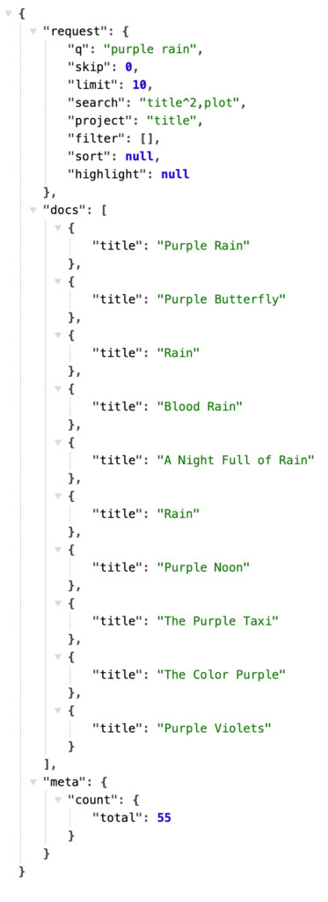

In this article, we're going to revisit and improve the MongoDB Search Server originally described in the article [How to Build a Search Service in Java with MongoDB](https://foojay.io/today/how-to-build-a-search-service-in-java-with-mongodb/).

First, let's remind ourselves why an intermediate search service deserves our attention and effort: Search powers the most important part of your application, getting users to the content they need, fast. The search bar often serves as the main entry point to your services. Search results can be returned with all the information needed to present to the user without querying the source database at all. With search serving this important, heavy load on its own, separating the search service into an independently scalable tier allows us to control, scale, and version the search server as needed. Having a gateway from the application to MongoDB Search also allows us to simplify the interface by passing only the key parameters, without `getting entangled` in the specifics of the aggregation pipeline syntax.

Regardless of whether this search service is warranted in your environment, this article and the service code itself can provide the following benefits:

* Insights into the considerations made (e.g., returning facets with and without search results is very different)
* How to build a sophisticated compound query from a query string and optional filter constraints (querying across several fields, each with customizable weights)
* Basic parameter constraint checking (e.g., ensure $limit has a maximum allowed value)
* For Java coders: how to construct and execute an aggregation pipeline in code using the BSON API. Why not use the search-specific driver conveniences?

## What's new?

Since the initial version of this search service, several new features have been added. The [v1.1 milestone](https://github.com/mongodb-developer/mongodb-search-java-server/milestone/1?closed=1) tracks all the changes made since the original implementation. These major search features were implemented:

* Faceting
* Sorting
* Highlighting
* Weighted search fields
* Negative/exclusion filters

Additionally, these infrastructural and deployment features were added:

* HTTP POST support: commit [ac3b656](https://github.com/mongodb-developer/mongodb-search-java-server/commit/ac3b6561e0afdfac6d854e3236782b7e15b424ae)
* Docker deployment option: commit [c47459b](https://github.com/mongodb-developer/mongodb-search-java-server/commit/c47459b656a0dbd7495794c5b44a0794df72dff2)

And along the way, a few things were adjusted and fixed: response [meta section un-array'd](https://github.com/mongodb-developer/mongodb-search-java-server/commit/688958be951b42e85ccd97e4f9cfcf346eacf15e) (was a single-value array), `q` made optional for full collection faceting, and a bug was fixed when `limit` = 0.

Here are the currently supported parameters, mostly optional:

|                                                                               |                                                                                                                                                                                   |
|-------------------------------------------------------------------------------|-----------------------------------------------------------------------------------------------------------------------------------------------------------------------------------|
| **Parameter**                                                                 | **Description**                                                                                                                                                                   |
| q                                                                             | This is a full-text query, typically the value entered by the user into a search box.                                                                                             |
| search                                                                        | This is a comma-separated list of fields to search across using the query (\`q\`) parameter.                                                                                      |
| skip                                                                          | Return the results starting after this number of results (up to the \`limit\` number of results), with a maximum of 100 results skipped.                                          |
| limit                                                                         | Only return this maximum number of results, constrained to a maximum of 25 results.                                                                                               |
| project                                                                       | This is a comma-separated list of fields to return for each document. Add \`_id\` if that is needed. \`_score\` is a "pseudo-field" used to include the computed relevancy score. |
| filter                                                                        | \<field name\>:\<exact value\> syntax; supports zero or more \`filter\` parameters. A minus sign (-) in front negates the filter.                                                 |
| sort                                                                          | \<field name\> asc/desc\[, \<field name\> asc/desc…\]. Use _score for relevancy score sorting. Default: _score desc                                                               |
| highlight                                                                     | Comma-separated list of (string) field names to highlight with query terms.                                                                                                       |
| debug                                                                         | If \`true\`, include the full aggregation pipeline .explain() output in the response, as well.                                                                                    |
| facet.string.\<label\>=\<field name\>                                         | Facet by string values of \<field name\>; must be indexed as type token.                                                                                                          |
| facet.string.\<label\>.numBuckets                                             | Number of string facet values to return for the associated facet.string.\<label\> field. Default: 10                                                                              |
| facet.number.\<label\>=\<path\> facet.date.\<label\>=\<path\>                 | Facet by numeric or date values of \<field name\>                                                                                                                                 |
| facet.number.\<label\>.boundaries=...facet.date.\<label\>.boundaries=...      | Numeric or date boundaries. Comma-separated list of increasing numbers or dates to use as bucket boundaries.                                                                      |
| facet.number.\<label\>.default=\<name\> facet.date.\<label\>.default=\<name\> | Name of the faceting key to use for facet counts that fall outside of the start/end boundaries. Default: no count returned.                                                       |

## BSON vs. Search-specific driver conveniences

Because this article is primarily for a Java audience, the next topic is important, as it relates to code legibility and gets into the opinionated zone where we can all wax philosophic. Frameworks or libraries that bridge two different languages or protocols often suffer from an impedance mismatch, making a more natural API/interface from one environment, abstracting, hiding, simplifying, and adapting to another. In this case, we're bridging HTTP parameters to a narrow slice of MongoDB Search functionality. This in itself is a mismatch of flat keys/values to ultimately a JSON-like expression of aggregation pipeline stages, search operators, faceting specifications, and so on. We undertake this endeavor to expose a lean, clean API to our application tier that supports query strings and returns search results weighted across a couple of fields, free of deeper syntax and complexity, protected by data guardrails, and so on.

As the code evolved in this milestone, we took some lessons from [Atlas Searching with the Java Driver](https://foojay.io/today/atlas-searching-with-the-java-driver/). This server is written in Java, using MongoDB's robust Java driver to connect to the database and execute queries. The whole process is about taking an HTTP request object (flat keys and values) and building a [BSON](https://www.mongodb.com/docs/php-library/current/reference/bson/?utm_campaign=devrel&utm_source=Third+Party+Content&utm_medium=Call+to+Action+Link&utm_content=mongodb-blog-foojay.io&utm_term=marissa.doherty) representation of an aggregation pipeline. Here's the input and output pieces of code:

```
MongoCollection<Document>
collection = database.getCollection(collectionName);

Document searchStage = new Document(searchMeta ? "$searchMeta" : "$search", searchStageDoc);

List<Bson> pipeline = new ArrayList<>();
pipeline.add(searchStage);

AggregateIterable<Document> aggregationResults = collection.aggregate(pipeline);
```

The rest of the code is about morphing the HttpServletRequest into a pipeline.

\<Sidebar, video zoom in\>Compass/Atlas UI - export pipeline to code "new Document" mania\</Sidebar\>

Initially, this project leveraged as many of the MongoDB Search-specific methods as possible in the Java driver. But as the capabilities evolved and became more dynamic, such as dynamically controlling faceting parameters (not something every project needs), it became increasingly frustrating to maintain two styles of code. Some used syntactic and type-safe search-specific APIs, and some used the cruder but ultimately at-the-bare-"metal" BSON APIs.

As part of adding string faceting, where this API awkwardness got too much, all usage of com.mongodb.client.model.search was factored out. For example, this:

```
   SearchOptions options = SearchOptions.searchOptions()
        .option("scoreDetails", debug)
        .index(indexName)
```

Went to this:

```
Document searchStageDoc= new Document("scoreDetails", debug)
                            .append("index", indexName)
```

The former is parameter-name and type-safe and arguably reads a bit better, but for any parameters that aren't supported by the syntactic sugar that the search package offers, you are back to BSON anyway. (Java) Coding is an opinionated endeavor, and it is *soft-*ware after all, so that it can be easily adjusted; to each their own on exactly how to get to BSON.

It's hard to write an API to adapt to a database or search engine. The API is always behind in supporting the latest features and syntax, and is itself opinionated with [abstractions that leak](https://www.joelonsoftware.com/2002/11/11/the-law-of-leaky-abstractions/).

Structured BSON is the *lingua franca* of MongoDB, and everything else is a means to that end. Going straight BSON requires slightly more discipline to ensure pipelines and parameters are constructed correctly.

Java driver .search convenience methods were replaced with BSON DOM as part of this commit: [6db2903](https://github.com/mongodb-developer/mongodb-search-java-server/commit/6db2903b6f966faa6f02f56b29e9dcfcd3f4c35d).

## Faceting

Over the course of these three commits, all three modes of [facets](https://www.mongodb.com/docs/search/tutorial/facet-tutorial/?deployment-type=atlas&interface=driver&language=nodejs&utm_campaign=devrel&utm_source=Third+Party+Content&utm_medium=Call+to+Action+Link&utm_content=mongodb-blog-foojay.io&utm_term=marissa.doherty) were implemented:

* [6db2903](https://github.com/mongodb-developer/mongodb-search-java-server/commit/6db2903b6f966faa6f02f56b29e9dcfcd3f4c35d): q is optional. string facets implemented
* [532f75b](https://github.com/mongodb-developer/mongodb-search-java-server/commit/532f75b15c4904ba6239494513e0d88a80b6f1f6) add numeric faceting
* [6799ec4](https://github.com/mongodb-developer/mongodb-search-java-server/commit/6799ec4aa21dcf4d1d29b0b05a47084fd8ac82f2) implement date facets

Faceting on supported fields - number, date, and strings mapped as token - is straightforwardly done with a parameter or two. For example, here are the top 3 (by number of films) genres:

**/search?facet.string.genres=genres\&limit=0\&facet.string.genres.numBuckets=3**


The search constrains facet counts; in this case. With no query provided, the facet counts span the entire collection. This no-operator mode (implicitly a match-all-documents query) is a valuable capability worth leveraging.

Internally, if the limit is 0, the pipeline switches from $search to $searchMeta, since no documents need to be returned, only facet counts. The response format does not change from the search service, regardless of limit with this internal optimization.

String faceting is the simplest. All you need is a field name and an optional number of desired buckets to return.

## Number and date faceting

Numbers and dates are faceted in the same way: by specifying a series of increasing boundary values that define the facet buckets. Additionally, when a default label is provided, another facet bucket is returned with that label and the count of documents that fall outside the beginning-to-end boundary range.

**/search?limit=0\&facet.number.num_years=year\&facet.number.num_years.boundaries=0,1800,1900,1950,1960\&facet.number.num_years.default=other**


Interestingly, facets can be used to double-check a dataset across various dimensions or to look for anomalies. For example, there are 2 documents in the year range 1800-1899 (\<= 1900) - for real? Or bad data? Facets shine light into these bucketed corners - what's in your data?

Dates are faceted using the same style as numbers, using boundaries and an optional default bucket label. Dates are currently specified in a simple YYYY-MM-DD date format, using the UTC start of the day as the time component. At the time of writing, date faceting through this service is only at the day-level granularity; [a ticket has been opened to provide full date/time granularity](https://github.com/mongodb-developer/mongodb-search-java-server/issues/17).

## Sorting and highlighting

Two features covered in one request, sorting and highlighting; the digested/default parameters are shown in the request section of the response:

**/search?q=sunshine\&project=title,plot,year\&search=title,plot\&sort=year%20asc\&highlight=title,plot**


The highlight parameter is a comma-separated list of field names used to highlight query terms. Highlighting snippets are returned in a _highlights section of each returned document. See commit [ea58891](https://github.com/mongodb-developer/mongodb-search-java-server/commit/e7ea5889114e58ccf6b677d5bab6683a9e8aa5e6) for details.

The sort parameter uses the syntax "\<field name\> asc/desc", as in the example request: sort=year asc to sort by year in ascending order. Use "desc" for descending. These values map to the 0 and 1 values used in $search.sort. A special "field name" of _score can be used to sort by computed relevancy score. The default is implicitly _score desc. This feature was added in commit [a7a7edf](https://github.com/mongodb-developer/mongodb-search-java-server/commit/a7a7edfb081e12fd890027fa25f8e0b2c7efd893).

## Beyond the basics

So far, we've only described the features of this search service that are fairly straightforward mappings from HTTP query-string parameters to a search pipeline. Let's now take a look at a couple of commonly applied search best practices that go beyond a simple mapping translation of parameters.

### Negative/exclusion filters

Your content has metadata that is useful for filtering, allowing users to quickly and easily navigate to all documents in a particular category, for example. In the first version of this service, drilling into a specific set of documents based on a string field value was implemented using the filter=\<field\>:\<value\> syntax. That filter inclusion translated to a compound.filter.equals clause in the constructed search operator.

It's equally handy to be able to select documents that do NOT fall into a particular category. The mechanism differs, requiring a compound.mustNot.equals clause instead. This common pattern is cleanly handled by adding a minus sign to the query parameter. To find all movies that are not in the Drama genre, use \&filter=-genres:Drama, simple as that.

### Weighted fields

Relevance matters. A lot! But it's not something that comes for free with any search system. The quality of search result relevance is a measure of how well the results work for your users with your data, and it deserves your attention to detail in measuring, monitoring, and tuning. One huge improvement in relevance generally comes from weighting search fields so that query matches, say, in a movie title, weigh higher than the same words that may appear in the plot field.

Here's a side-by-side comparison of adding additional weight (score boost clause) to the title field using the new "\<field\>\^\<weight\>" syntax available for every search field; you can see that just a little extra weight on the title field really improved the search results ordering:  
  


Building weighted fields into your own application, if you aren't using a search server that does so, is highly recommended. Adding this tiny syntax to this server's search field support dramatically improves the flexibility and quality of the results returned.

## Learning opportunity and production readiness

While the code in this service isn't a lot, the security benefits, parameter sanitization, and separation of concerns can play a crucial role in a search-centric production deployment. This service code is a pet project to demonstrate MongoDB Search and Java best practices in a general-purpose, production-ready way. It's as ready to deploy as you want to make it - it functions as designed, and if it fits your needs, give it a try. Maybe there's just a tweak or two needed for your situation, making this a good starting point. And even if this service, as-is, isn't exactly what you need, the ideas and implementation here can be useful food for thought in your own search-interacting applications.

Some useful questions to ask of your search code:

* Are parameters passed from the user/request sanitized?
* How do I combine search results and facets in a single request?
* Can you easily troubleshoot and adjust the generation of the aggregation pipeline?

## Up and running

You can run locally using jettyRun from Gradle with environment variables containing the specific pointers to your system:

**MONGODB_URI="\<\<insert your connection string here\>\>" DATABASE=sample_mflix COLLECTION=movies INDEX=movies_index ./gradlew jettyRun**

Or build a Docker image containing the .war file, and run it with the same designated environment variables. The file movies.env contains the DATABASE, COLLECTION, and INDEX names for the sample movies data setup.

**./gradlew war**

**docker build -t search-server .**

**export MONGODB_URI="\<insert your MongoDB connection string here\>"**

**docker run -d -e MONGODB_URI --env-file ./movies.env -p 8080:8080 search-server**

With the Docker setup, many search servers could be deployed to load balance across the same configuration and/or to run different configurations. Each server deployment is locked to the single INDEX it was deployed with and is read/search-only.

After the service is up and running, the index page at http://\<host\>:8080/includes sample links (HTTP GET) and a search form (HTTP POST) that work with the example configuration and data.

## Search server in action

The succinctness, specifying only the relevant parameters, is evident in this robust example, hitting all the new and improved features. The request to **http://localhost:8080/search?q=purple%20rain\&project=title,year\&search=title\^2,plot\&limit=2\&facet.string.genres=genres\&facet.string.genres.numBuckets=3\&highlight=title\&sort=year%20asc\&filter=-genres:Comedy** is asking for, in English:

*The two most relevant documents that match the query "purple rain" (note this is interpreted as a query for "purple" OR "rain") in either the* *title* *or* *plot* *fields, with title given a bit of a score boost, highlighting query terms in the* *title* *field, sort by* *year* *excluding Comedy movies, and faceting on* *genres* *.*

The search service generates almost 100 lines of (formatted) aggregation pipeline JSON:

```
[
 {
   "$search": {
     "scoreDetails": false,
     "index": "movies_index",
     "count": {
       "type": "total"
     },
     "sort": {
       "year": 1
     },
     "highlight": {
       "path": [
         "title"
       ]
     },
     "facet": {
       "facets": {
         "genres": {
           "type": "string",
           "path": "genres",
           "numBuckets": 3
         }
       },
       "operator": {
         "compound": {
           "mustNot": [
             {
               "equals": {
                 "path": "genres",
                 "value": "Comedy"
               }
             }
           ],
           "should": [
             {
               "text": {
                 "query": "purple rain",
                 "path": "title",
                 "score": {
                   "boost": {
                     "value": 2.0
                   }
                 }
               }
             },
             {
               "text": {
                 "query": "purple rain",
                 "path": "plot"
               }
             }
           ]
         }
       }
     }
   }
 },
 {
   "$skip": 0
 },
 {
   "$limit": 2
 },
 {
   "$facet": {
     "docs": [
       {
         "$project": {
           "title": 1,
           "year": 1,
           "_id": 0,
           "_highlights": {
             "$meta": "searchHighlights"
           }
         }
       }
     ],
     "meta": [
       {
         "$limit": 1
       },
       {
         "$replaceWith": "$$SEARCH_META"
       }
     ]
   }
 },
 {
   "$set": {
     "meta": {
       "$arrayElemAt": [
         "$meta",
         0
       ]
     }
   }
 }
]
```

The response below contains a request section showing the digested parameters being used, a docs section with an array of documents with requested fields projected, and a meta section containing the total number of search results and facets:

```
{
 "request": {
   "q": "purple rain",
   "skip": 0,
   "limit": 2,
   "search": "title^2,plot",
   "project": "title,year",
   "filter": [
     "-genres:Comedy"
   ],
   "sort": "year asc",
   "highlight": "title",
   "facet.string.genres": "genres",
   "facet.string.genres.numBuckets": "3"
 },
 "docs": [
   {
     "title": "The Rains Came",
     "year": 1939,
     "_highlights": [
       {
         "score": 1.3891443014144897,
         "path": "title",
         "texts": [
           {
             "value": "The ",
             "type": "text"
           },
           {
             "value": "Rains",
             "type": "hit"
           },
           {
             "value": " Came",
             "type": "text"
           }
         ]
       }
     ]
   },
   {
     "title": "A Hatful of Rain",
     "year": 1957,
     "_highlights": [
       {
         "score": 1.382846713066101,
         "path": "title",
         "texts": [
           {
             "value": "A Hatful of ",
             "type": "text"
           },
           {
             "value": "Rain",
             "type": "hit"
           }
         ]
       }
     ]
   }
 ],
 "meta": {
   "count": {
     "total": 45
   },
   "facet": {
     "genres": {
       "buckets": [
         {
           "_id": "Drama",
           "count": 30
         },
         {
           "_id": "Adventure",
           "count": 8
         },
         {
           "_id": "Thriller",
           "count": 8
         }
       ]
     }
   }
 }
}
```

## Conclusion and next steps

One simple HTTP request with a handful of parameters yields a single, search-result document, with MongoDB Search best practices, parameter sanitization, and pipeline construction complexity all neatly wrapped in a scalable service.

There are plenty more conveniences and capabilities brainstormed for this project. Follow along at <https://github.com/mongodb-developer/mongodb-search-java-server/> and let us know what features are important to you.
