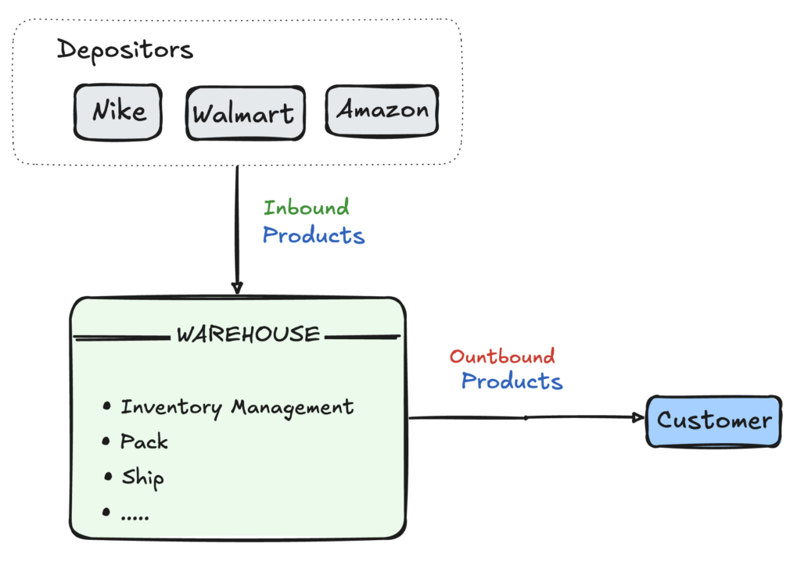
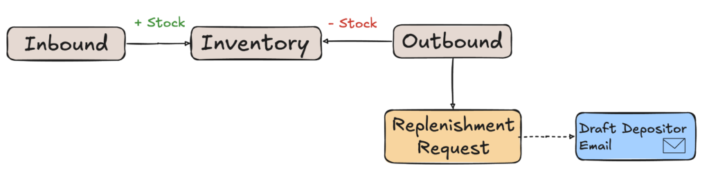
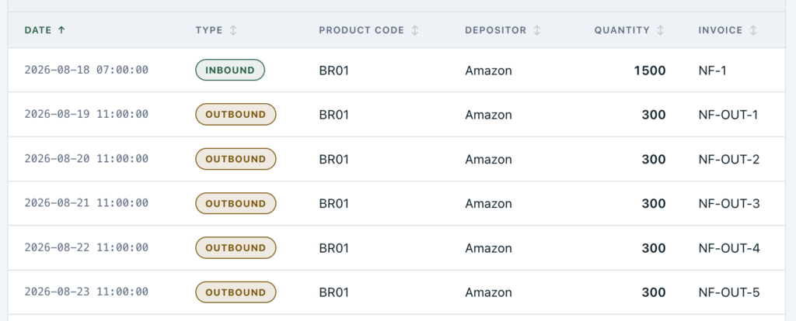
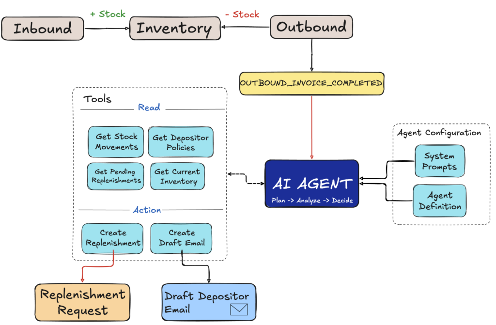

I spent a large part of my career working in banking and logistics. In logistics, I spent more than eight years working across different stages of logistics systems, from development to implementation and production support.

That experience shaped the way I think about technology. Knowing a tool or framework is important, but what interests me most is understanding the business problem behind it and where technology can actually add value.

A few weeks ago, I returned as a speaker to a company where I had worked for many years. Being back there reminded me of several day-to-day logistical challenges and made me wonder how I would approach those problems today.

That is where the **Agentic Warehouse Management System** came from.

With this project, I am not trying to build a complete WMS. Instead, I want to use a logistics scenario I know well to explore how an AI agent can become part of a real business workflow and where it can add value.

In this first part, we will introduce the WMS scenario and identify where an AI agent can help. In **[Part 2](https://foojay.io/today/building-an-agentic-warehouse-management-system-part-2-java-and-spring-ai/)** , we will define and connect the agent using Java and Spring AI. Finally, in **[Part 3](https://foojay.io/today/building-an-agentic-warehouse-management-system-part-3-tools-decisions-and-actions/)**, we will execute the plan, gather context, make the replenishment decision, and act when necessary.

A live version of the Agentic WMS is available [here](https://agentic-wms-39763860545.southamerica-west1.run.app/).

You can start with the Overview page, which walks through the main WMS flow and shows how to interact with the application. The application is built with:

* Java and Spring Boot
* Spring AI for the agent and tool integration
* OpenAI for the language model
* Voyage AI for embeddings
* MongoDB for operational data, agent runs, and vector search

The complete source code is available [here](https://github.com/mongodb-developer/mongodb-jvm-showcase/tree/main/java/use-cases/agentic-wms).

A Warehouse Management System, or simply WMS, is a software system used to manage and control the movement of products inside a warehouse. It typically handles processes such as receiving goods, tracking inventory, shipping products, replenishment, and many others. A warehouse may store products owned by the company operating it, but it may also store products for other companies. In this article, we will call these companies **depositors**:  


A depositor owns the products stored in the warehouse, while the warehouse is responsible for receiving, storing, managing, and shipping them. A single warehouse may serve multiple depositors at the same time. For example, products from *Amazon* , *Nike* , or *Walmart* could be stored and managed in the same warehouse, while the inventory of each depositor remains separated. A real WMS can support many more processes, but for our application, we will focus on a smaller part of this flow:


An **Inbound** operation represents goods entering the warehouse and increases the available inventory for a depositor. An **Outbound** operation represents goods leaving the warehouse and reduces that inventory.

We will also include a simple **Replenishment Request** process. When additional units are needed, the warehouse can create a request indicating which products should be replenished and in what quantities. The depositor can then arrange a new inbound shipment to the warehouse. Once a replenishment request is created, a **Depositor Email Draft** is also prepared for notification.

## Modeling the WMS flow

In the flow above, a traditional implementation would involve a few basic entities such as Inbound, Outbound, Inventory, and Replenishment Request, along with products and depositors. An **Inbound** operation represents products owned by a depositor entering the warehouse. For example:

```
// INBOUND COLLECTION
{ 
  number: 'NF-IN-01',
  depositor: { _id: ObjectId('6a88aaa60aab66cebc2c4e62'), name: 'Amazon' },
  items: [ { productCode: 'BR01', quantity: 1500 } ],
  status: 'COMPLETED' 
}
```

Once completed, those quantities are added to the **Inventory** :  

```
// INVENTORY COLLECTION
{ 
  productCode: 'BR01', 
  depositor: { _id: ObjectId('6a88aaa60aab66cebc2c4e62'), name: 'Amazon' }, quantity: 1500 
}
```

An **Outbound** operation does the opposite. Products leave the warehouse, and their quantities are reduced from the inventory:  

```
// OUTBOUND COLLECTION
{
  number: 'NF-OUT-01',
  depositor: { _id: ObjectId('6a88aaa60aab66cebc2c4e62'), name: 'Amazon' },        items: [ { productCode: 'BR01', quantity: 1480 } ],
  status: 'COMPLETED'
 }
```

After this operation, the inventory for product BR01 belonging to the depositor Amazon would contain only 20 units. At this point, a **Replenishment Request** may be needed. In practical terms, the warehouse is essentially saying:

*"Amazon, your product BR01 is down to only 20 units. Could you arrange a new inbound shipment before we run out of stock?"*

In our WMS, this request can be represented by a document like the following:

```
// REPLENISHMENT COLLECTION
{
  depositor: { _id: ObjectId('6a88aaa60aab66cebc2c4e62'), name: 'Amazon' }, 
  items: [ { productCode: 'BR01', quantity: 1500 } ],
  message: 'Replenishment is required for product BR01 due to low stock.', 
  status: 'PENDING'
}
```

## Deciding when to replenish

Creating a Replenishment Request is straightforward. The more interesting question is deciding when one should be created. Consider the following stock movements for product **BR01**:

On August 18, Amazon sent 1,500 units of the product to the warehouse. Over the following days, the warehouse processes outbound operations of 300 units per day.


After each outbound operation, the available inventory becomes:

**1,500 → 1,200 → 900 → 600 → 300 → 0**

If this consumption pattern continues, the warehouse will completely run out of BR01 on the **fifth** outbound operation.

A common way to automate this process is to define a minimum stock threshold. For example, whenever fewer than 500 units are available, a replenishment request could be created:

```
if (inventory.getQuantity() < 500) {

replenishmentService.create(productCode, quantity, depositor);

}
```

This is a perfectly reasonable rule. Once the inventory reaches 300 units, the WMS detects that the stock is below the threshold (500) and requests more products.

However, consider that the depositor takes, on average, **7 days** to deliver new products to the warehouse. If we wait until the stock falls below 500 units, the request may come too late, and the warehouse may run out of BR01 before the new shipment arrives.

We can account for this by adding the remaining days of stock to the decision:

```
int daysOfStock = inventory.getQuantity() / dailyConsumption;

if (inventory.getQuantity() < 500

        || daysOfStock < depositor.getLeadTimeDays()) {

    replenishmentService.create(productCode, quantity, depositor);

}
```

Now the WMS can react to low stock while also anticipating replenishment when the remaining inventory is not enough to cover the depositor's delivery lead time.

These are deterministic rules, and they work well when the decision can be clearly expressed through known conditions and calculations. As the business evolves, however, new rules and exceptions may continue to appear.

At some point, the challenge is no longer just adding another condition.

The problem becomes more interesting when deciding what to do requires more than evaluating a predefined condition. Let's go back to the same example.

Amazon sent 1,500 units of BR01, and the warehouse has been shipping 300 units per day. After three days, only 600 units remain.

Using the rule we created earlier, the calculation is straightforward:

* Current inventory: 600 units
* Recent consumption: 300 units per day
* Remaining stock: 2 days
* Amazon lead time: 7 days

Since two days of stock are not enough to cover a seven-day lead time, our code will create a replenishment request.

But consider two different situations:

1. **Scenario A:** The recent consumption of 300 units per day is part of the normal demand range for BR01. There is no indication that it will slow down. In this case, creating a replenishment request makes sense.
2. **Scenario B:** The same 300-unit outbound operations came from a short promotion that has already ended. Previous movements show that BR01 typically consumes only around 50 units per day. In this case, immediately requesting the same replenishment may not be necessary.

Our deterministic rule sees the same values in both situations: 600 units in stock, 300 units of recent daily consumption, and a seven-day lead time, so it produces the same result.

But the situations **are not the same.**

To make a better decision, the system needs more context. It may need to inspect previous stock movements, understand whether the recent consumption represents the normal behavior of the product, retrieve relevant depositor policies, and then decide whether action is actually necessary.

This is where an AI agent starts to add value.

The agent does not replace deterministic operations such as inventory calculations, validations, persistence, or the creation of a replenishment request. Those operations remain regular application logic.

Instead, the agent can use controlled tools to look beyond the values used by the fixed rule. It can inspect previous stock movements, check pending replenishments, retrieve depositor policies, and gather additional information that helps explain the current situation.

The question is no longer only:

*Is the inventory below 500 units, or is the remaining stock not enough to cover the depositor's lead time?*

It becomes:

*What does this situation actually mean, and do we need to act now?*

That is the role of the agent in our WMS: gather the relevant information, understand the current situation, decide whether replenishment is necessary, and determine what should happen next, while keeping well-defined business operations in deterministic code.

In our application, the agent enters the flow after an outbound operation is successfully completed. At that point, the inventory has already been updated, and the agent receives a goal:

*Determine whether this outbound operation created a need for replenishment.*

Before looking at the flow, it is useful to clarify what we mean by an AI agent.

In simple terms, an AI agent receives a **goal** , follows a set of **instructions** , interacts with the application through **tools**, observes the information it retrieves, and decides what to do next.

In our WMS, these elements have clear responsibilities:

1. **Goal:** defines what the agent needs to accomplish. In this case, determine whether the completed outbound operation created a need for replenishment.
2. **Instructions:** define how the agent should behave, what it should consider, and the boundaries it must respect.
3. **Tools:** provide controlled access to the WMS. The agent can use them to inspect inventory and stock movements, retrieve depositor policies, check pending replenishments, or perform actions such as creating a replenishment request.

The important point is that the agent does not replace the existing WMS services or take control of the entire application. Inbound processing, outbound processing, inventory updates, validations, and persistence continue to be handled by regular Java code.

Instead, the agent acts as an **orchestrator**, deciding which available tools to use based on the goal and the context it gathers.

The following diagram shows where the agent becomes part of the WMS flow:


The diagram may look like a sequence of steps, but this is not a traditional hard-coded workflow where the application defines every decision in advance.

The application defines the agent's **configuration, instructions, boundaries, and available tools**. Within those boundaries, the agent determines what information it needs, uses the results it collects as context, decides whether action is necessary, and determines what should happen next.

For one outbound operation, the agent may conclude that replenishment is required and create a request. For another, after analyzing the available context, it may decide that no action is necessary.

This is an important distinction: the WMS controls what the agent is allowed to do, while the agent is responsible for deciding what to do within those boundaries.

Once the outbound invoice is completed, the OUTBOUND_INVOICE_COMPLETED event triggers the agent. From there, the workflow can be summarized in four steps:

1. **Plan:** Based on the goal, instructions, and available capabilities, the agent determines what information and actions may be required.
2. **Analyze:** The agent uses read-only tools to inspect information such as inventory, stock movements, pending replenishments, and depositor policies.
3. **Decide:** Using the information collected, the agent determines whether replenishment is actually necessary.
4. **Act:** If action is required, the agent can use controlled tools to create the replenishment request and prepare the depositor notification. If no action is required, the workflow ends without changing anything.

In this first part, we focused on where an AI agent can add value inside a Warehouse Management System and, just as importantly, where it should not replace deterministic application logic.

In [Part 2](https://foojay.io/today/building-an-agentic-warehouse-management-system-part-2-java-and-spring-ai/), we will translate this design into Java and Spring AI by defining the agent, connecting it to the WMS workflow, and creating its execution plan.

Then, in [Part 3](https://foojay.io/today/building-an-agentic-warehouse-management-system-part-3-tools-decisions-and-actions/), we will see how the agent executes those tasks using controlled tools, gathers the necessary context, makes the replenishment decision, and acts when required.

The complete source code is available [here](https://github.com/mongodb-developer/mongodb-jvm-showcase/tree/main/java/use-cases/agentic-wms).
