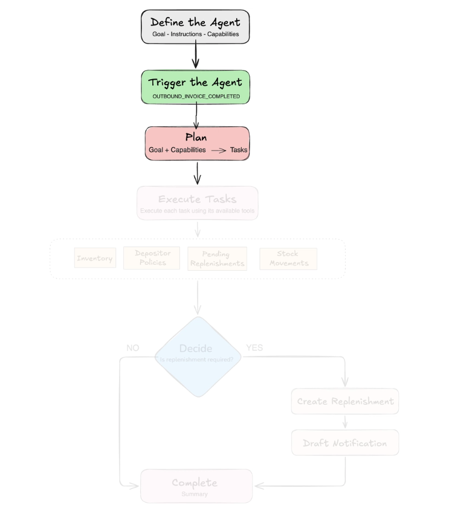

If you arrived here without reading the first part, I recommend starting with **[Agentic WMS — Part 1: Where AI Agents Add Value](https://foojay.io/today/building-an-agentic-warehouse-management-system-part-1-where-ai-agents-add-value/).** There, we introduced the WMS scenario, explored the replenishment problem, and discussed where an AI agent can add value without replacing deterministic application logic.

In this second part, we will move from the design to the first steps of the implementation.

We will look at how the agent is built with **Java and Spring AI**, how its capabilities and boundaries are defined, how it is triggered by the WMS, and how the planner turns the agent's goal into an execution plan.

In **[Part 3](https://foojay.io/today/building-an-agentic-warehouse-management-system-part-3-tools-decisions-and-actions/)**, we will continue from that plan and see how the agent executes tasks using controlled tools, gathers the context it needs, makes the replenishment decision, and takes action when necessary.

A live version of the Agentic WMS is available[here](https://agentic-wms-39763860545.southamerica-west1.run.app/), and the complete source code is available[here](https://github.com/mongodb-developer/mongodb-jvm-showcase/tree/main/java/use-cases/agentic-wms).

From this point on, we will focus on the main parts of the agent implementation using Java and Spring AI. Rather than covering Spring AI from the ground up, we will concentrate on the components directly relevant to this part of our agent: prompts, capabilities, triggering, and planning. For a broader introduction to Spring AI, see this [article](https://dev.to/mongodb/how-to-build-rag-applications-with-spring-ai-and-mongodb-5gaj) by my colleague [Tim Kelly](https://timotheekelly.com/).

In [Part 1](https://foojay.io/today/building-an-agentic-warehouse-management-system-part-1-where-ai-agents-add-value/), we established an important boundary: the WMS defines what the agent is allowed to do, while the agent decides what to do within those boundaries. Now we can translate that design into code.

Before diving into the implementation, the following diagram summarizes the complete agent flow across Parts 2 and [3](https://foojay.io/today/building-an-agentic-warehouse-management-system-part-3-tools-decisions-and-actions/). In this part, we will focus on **defining the agent, triggering its execution, and creating the plan.**  


## Define the Agent

The agent is triggered after an outbound operation is completed, with the goal of determining whether that operation created a need for replenishment.

The first step is to define how the agent should behave and what it is allowed to do.

In our implementation, we organize the agent around three main components:

1. **planner**
2. **executor**
3. **reporter**.

The planner receives the goal and determines the tasks required to achieve it:

```
private static final String PLANNER_PROMPT = """

   - You are the planning agent for a WMS. 

   - Create a short execution plan for the provided goal using the available capabilities. 

   - Do not execute tasks, call tools or make business decisions. 

   - Assign exactly one capability to each task. """;
```

The executor will receive one task at a time and perform it using the tools available for that task:

```
private static final String EXECUTOR_PROMPT = """

   - You are an AI agent specialized in Warehouse Management Systems.

   - Analyze inventory after outbound operations and anticipate replenishment needs.

   - Execute only the task you receive, using its available tools.

   - Apply the depositor policies and avoid unnecessary replenishments.""";
```

Finally, the reporter summarizes what happened during the execution:

```
private static final String REPORTER_PROMPT = """
    - Summarize the outcome of the agent execution.
    - Explain what was decided and why.
    - Do not repeat the task list.""";
```

These are simplified versions of the prompts used in the [complete application](https://github.com/mongodb-developer/mongodb-jvm-showcase/blob/5051a4953b2d8f41528fb4bba024b78263f96095/java/use-cases/agentic-wms/src/main/java/com/devrel/wms/config/AgentConfig.java#L19), but they show the responsibility of each component. Together, these components become part of our agent definition:

```
public record AgentDefinition(

        String trigger,

        String goal,

        ChatClient planner,

        ChatClient executor,

        ChatClient reporter,

        List<AgentCapability> capabilities

) {}
```

The definition also contains the **capabilities** available to the agent. In our replenishment workflow, we use five:

* **Analysis:** access invoices, inventory, and stock movements.
* **Policy:** retrieve depositor policies.
* **Decision:** determine whether replenishment is required.
* **Replenishment:** create a replenishment request.
* **Notification:** draft the related email.

Each capability defines a type of operation and the tools that can be used while performing it:

```
public record AgentCapability(

        String name,

        String description,

        List<Object> tools

) {}
```

This gives us a simple boundary around each task. An ANALYSIS task, for example, can access inventory and stock movement tools, but it cannot create a replenishment request. A DECISION task does not expose any tool and uses the results collected by the previous tasks.

Finally, we can connect these pieces when defining the replenishment agent:

```
return new AgentDefinition(

        "OUTBOUND_INVOICE_COMPLETED",

        "Outbound invoice %s has just been completed.",

        planner,

        executor,

        reporter,

        List.of(

                new AgentCapability(

                        "ANALYSIS",

                        "Read inventory, stock movements and invoice movements.",

                        List.of(inventoryAnalysisTool)

                ),

                new AgentCapability(

                        "DECISION",

                        "Decide whether replenishment is required.",

                        List.of()

                ),

                new AgentCapability(

                        "REPLENISHMENT",

                        "Create a replenishment request.",

                        List.of(replenishmentTool)

                )

                // Other capabilities: POLICY and NOTIFICATION

        )

);
```

At this point, we have defined **what the agent can do and the boundaries around those operations**. Before looking at how the plan is created, let's see how the agent execution starts.

## Trigger the Agent

The agent starts after an outbound operation has been [successfully completed](https://github.com/mongodb-developer/mongodb-jvm-showcase/blob/ea5c87c042867a0ea0c71f9ca80c41b466bd2981/java/use-cases/agentic-wms/src/main/java/com/devrel/wms/service/OutboundInvoiceService.java#L128). Once the transaction is committed, the application publishes the OUTBOUND_INVOICE_COMPLETED event:

```
public void execute(String invoiceNumber) {
   //  registerStock()
   // saveOutboundInvoice()
   eventPublisher.publishEvent(new OutboundInvoiceCompleted(number));
}
```

A listener receives that event and starts the agent using the outbound invoice number as the reference:

```
@Async
@TransactionalEventListener(phase = TransactionPhase.AFTER_COMMIT)
public void onOutboundInvoiceCompleted(OutboundInvoiceCompleted event) {
    agentRunner.run(
        replenishmentAgentDefinition,
        event.invoiceNumber()
    );
}
```

Using AFTER_COMMIT ensures that the agent starts only after the outbound operation has been persisted and the inventory already reflects the latest state. From there, the agent receives its goal and can begin planning how to accomplish it.

## Plan

Once the agent is triggered, the first responsibility of the [AgentRunner](https://github.com/mongodb-developer/mongodb-jvm-showcase/blob/main/java/use-cases/agentic-wms/src/main/java/com/devrel/wms/agent/AgentRunner.java) is to create an execution plan.

The application does not define this list of tasks in advance. Instead, the planner receives the **goal** together with the **capabilities available to the agent** and determines which tasks are required for its execution.

Each planned task contains two pieces of information: what needs to be done and which capability should be responsible for it:

```
public record PlannedTask(String description, String capability) {}
```

Based on this information, the planner generates an ordered list of tasks:

```
private List<AgentRun.AgentTask> plan(

        AgentDefinition definition,

        String goal

) {

    List<PlannedTask> planned = definition.planner()

            .prompt()

            .user("""

                %s

                Available capabilities:

                %s

                Create the execution plan required to accomplish this goal.

                Assign exactly one capability to each task.

                """.formatted(goal, capabilityCatalog(definition)))

            .call()

            .entity(new ParameterizedTypeReference<>() {});

  return planned.stream()

            .map(task -> new AgentRun.AgentTask(

                    task.description(),

                    AgentRun.TaskStatus.PENDING,

                    task.capability(),

                    null,

                    null,

                    null

            ))

            .toList();

}
```

Here, Spring AI maps the model response directly to our PlannedTask objects through structured output, giving the application a typed execution plan instead of requiring us to parse generated text manually.

Once the planner returns the tasks, we persist the initial state of the execution as an AgentRun in MongoDB.

At this point, the execution is marked as RUNNING, and every task generated by the planner starts with the PENDING status:

```
String goal = definition.goal().formatted(reference);

List<AgentRun.AgentTask> tasks =

        new ArrayList<>(plan(definition, goal));

AgentRun agentRun = agentRunService.save(new AgentRun(

        null,

        definition.trigger(),

        reference,

        AgentRun.Status.RUNNING,

        null,

        LocalDateTime.now(),

        null,

        List.copyOf(tasks)

));
```

This gives us a persistent representation of the execution from the beginning, including the tasks that were planned. At this point, the document may look like this:

```
{

  _id: ObjectId('6a8f5973315f4506564a6f5b'),

  trigger: 'OUTBOUND_INVOICE_COMPLETED',

  reference: 'NF-OUT-01',

  status: 'RUNNING',

  startedAt: ISODate('2026-08-27T17:04:03.350Z'),

  tasks: [

    {

      description: 'Identify the products affected by the outbound invoice.',

      status: 'PENDING',

      capability: 'ANALYSIS'

    },

    {

      description: 'Check the current inventory of the affected products.',

      status: 'PENDING',

      capability: 'ANALYSIS'

    },

    {

      description: 'Analyze recent stock movements and consumption.',

      status: 'PENDING',

      capability: 'ANALYSIS'

    },

    {

      description: 'Read the replenishment policies for the depositor.',

      status: 'PENDING',

      capability: 'POLICY'

    },

    {

      description: 'Determine whether replenishment is required.',

      status: 'PENDING',

      capability: 'DECISION'

    },

    {

      description: 'Create a replenishment request if required.',

      status: 'PENDING',

      capability: 'REPLENISHMENT'

    },

    {

      description: 'Draft the notification if a request was created.',

      status: 'PENDING',

      capability: 'NOTIFICATION'

    }

  ]

}
```

The plan is now ready, and the execution has been registered.

In this second part, we translated the agent design into the first pieces of the implementation. We defined its responsibilities and capabilities, connected it to the WMS workflow, and used the planner to turn the agent goal into a persistent execution plan.

At this point, the agent knows what needs to be done and which capability is responsible for each task. In [Part 3](https://foojay.io/today/building-an-agentic-warehouse-management-system-part-3-tools-decisions-and-actions/), we will focus on how that plan is executed: using controlled tools, gathering operational and business context, making the replenishment decision, and acting when necessary.
