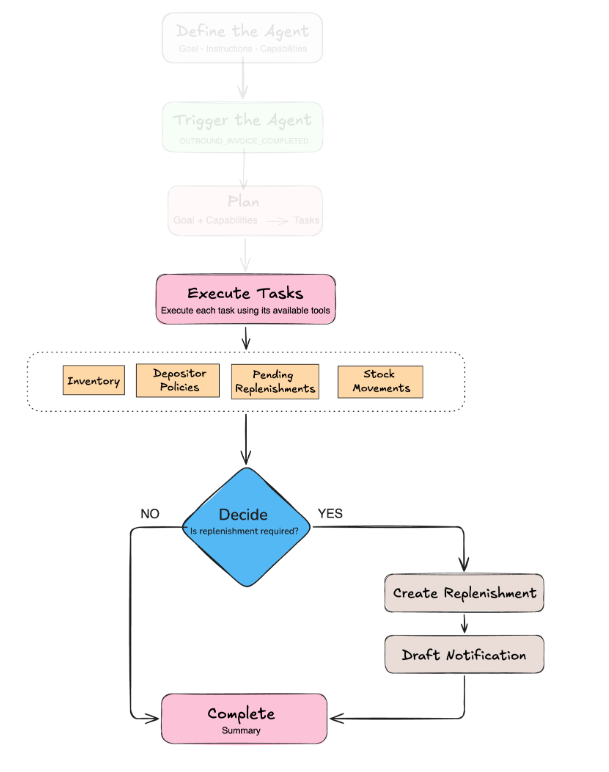
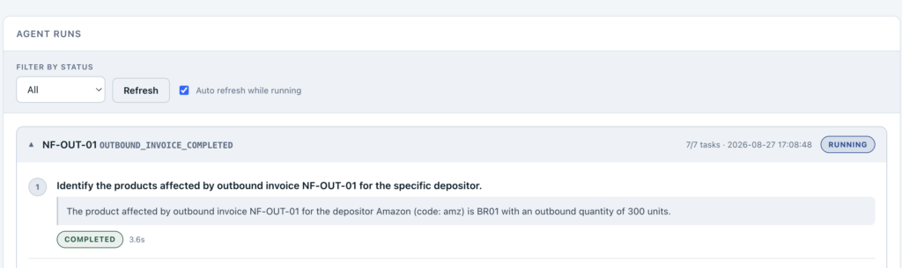
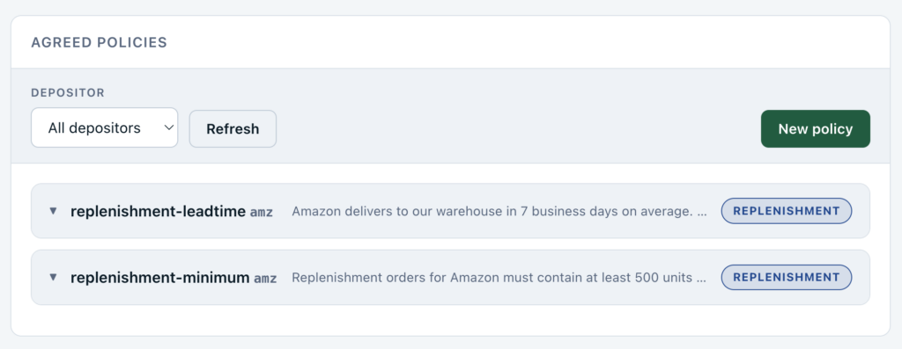
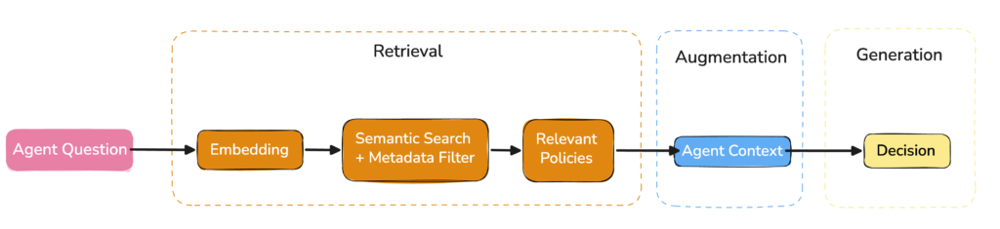
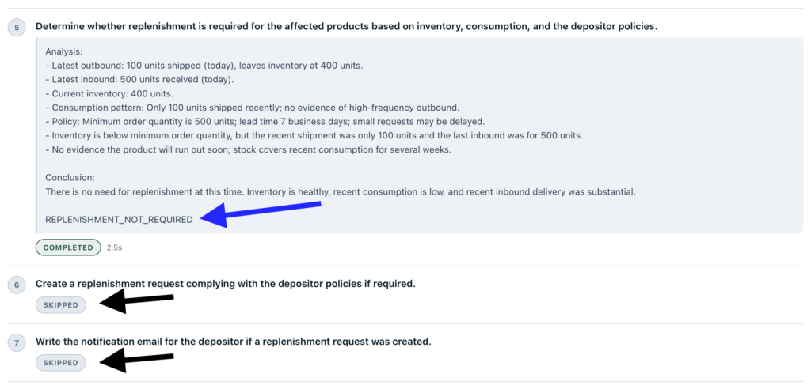
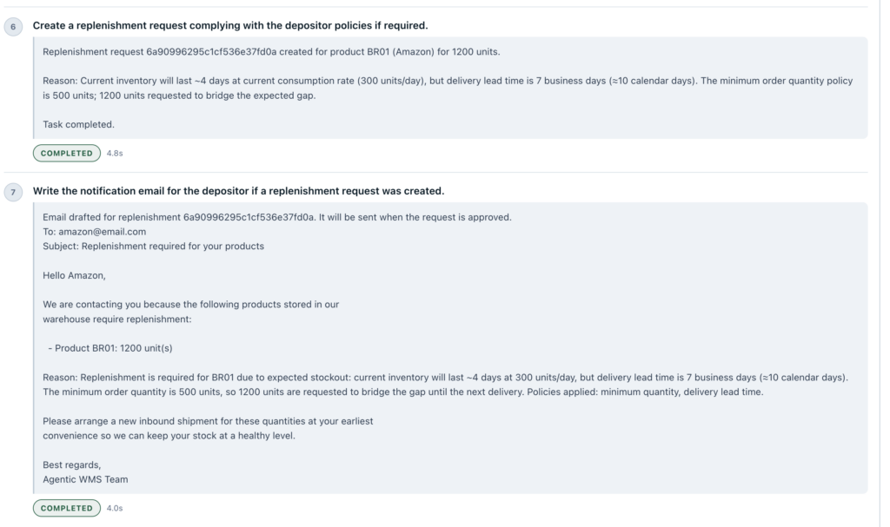
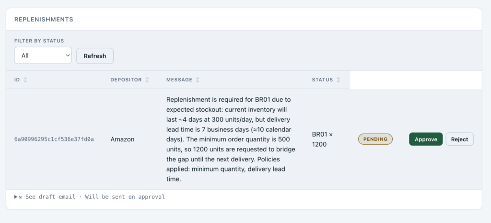

If you haven't read the first two parts yet, I recommend starting with **[Part 1: Where AI Agents Add Value](https://foojay.io/today/building-an-agentic-warehouse-management-system-part-1-where-ai-agents-add-value/)** and **[Part 2: Designing and Planning the Agent](https://foojay.io/today/building-an-agentic-warehouse-management-system-part-2-java-and-spring-ai/)**. There, we introduced the WMS scenario, discussed where an AI agent can add value, and built the first stages of the implementation with Java and Spring AI.

In this third and final part, we will build on the execution plan created in [Part 2](https://foojay.io/today/building-an-agentic-warehouse-management-system-part-2-java-and-spring-ai/) and focus on the remaining stages of the agent workflow. We will see how each task is executed using controlled tools, how operational and business context is gathered, how the replenishment decision is made, and how the agent acts on that decision when necessary.

A live version of the Agentic WMS is available[here](https://agentic-wms-39763860545.southamerica-west1.run.app/), and the complete source code is available[here](https://github.com/mongodb-developer/mongodb-jvm-showcase/tree/main/java/use-cases/agentic-wms).

Let's revisit the complete agent flow. The first stages: **Define the Agent, Trigger the Agent, and Plan,** were covered in the previous article. Now we will focus on executing the tasks, using the available tools, gathering context, and making the replenishment decision.  


With the execution plan created in [Part 2](https://foojay.io/today/building-an-agentic-warehouse-management-system-part-2-java-and-spring-ai/), the [AgentRunner](https://github.com/mongodb-developer/mongodb-jvm-showcase/blob/ea5c87c042867a0ea0c71f9ca80c41b466bd2981/java/use-cases/agentic-wms/src/main/java/com/devrel/wms/agent/AgentRunner.java#L56) starts processing the tasks one at a time. For each task, the runner reads its description and capability, executes it, stores the result, and then continues with the next task:

```
for (int index = 0; index < tasks.size(); index++) {
    String description = tasks.get(index).description();

    String capability = tasks.get(index).capability();

    LocalDateTime startedAt = LocalDateTime.now();

    String result = executeTask(definition, goal, description, capability, tasks);

    tasks.set(index, new AgentRun.AgentTask(

            description,

            AgentRun.TaskStatus.COMPLETED,

            capability,

            result,

            startedAt,

            LocalDateTime.now()

    ));

    agentRunService.save(withTasks(agentRun, tasks));
}
```

Before executing a task, the runner selects only the tools associated with its capability:

```
private Object[] toolsOf(

        AgentDefinition definition,

        String capability

) {

    return definition.capabilities().stream()

            .filter(candidate ->

                    candidate.name().equalsIgnoreCase(capability))

            .map(AgentCapability::tools)

            .filter(Objects::nonNull)

            .flatMap(List::stream)

            .toArray();

}
```

When the task is executed, the executor receives the current goal, the results produced by previous tasks, the current task, and only the tools available for its capability:

```
return definition.executor()

        .prompt()

        .tools(tools)

        .user("""

            %s

            Results of the previous tasks:

            %s

            Execute only this task:

            %s

            Use the available tools autonomously.

            """.formatted(

                goal,

                previousResults(tasks),

                description

        ))

        .call()

        .content();
```

The result of each completed task becomes part of the context available to the tasks that follow. This allows the agent to progressively gather the information it needs before making the replenishment decision.

At the same time, the capability assigned to each task defines which tools are available during its execution. This preserves the boundaries we established earlier: an ANALYSIS task, for example, can inspect information from the WMS, but it does not have access to tools that create a replenishment request.


## Accessing operational data

During ANALYSIS tasks, the agent can use controlled tools to retrieve operational data from the WMS, such as inventory, invoice movements, stock movements, and pending replenishments.

For example, [one](https://github.com/mongodb-developer/mongodb-jvm-showcase/blob/ea5c87c042867a0ea0c71f9ca80c41b466bd2981/java/use-cases/agentic-wms/src/main/java/com/devrel/wms/tool/InventoryAnalysisTool.java#L80) of the available tools retrieves the stock movements generated by an outbound invoice:

```
@Tool(description = """
    Get the stock movements generated by a specific invoice.
    Use this tool to discover which products and quantities were affected
    by a completed outbound invoice.
""")

public List<StockMovement> getStockMovementByInvoiceNumber(
        @ToolParam(description = "Outbound invoice number")
        String invoiceNumber
) {
    return stockMovementService.findByInvoiceNumber(invoiceNumber);
}
```

With Spring AI, methods like this can be exposed to the model using annotations such as @Tool and @ToolParam. The executor can then call them when the current task requires that information.

The complete application exposes [additional tools](https://github.com/mongodb-developer/mongodb-jvm-showcase/tree/main/java/use-cases/agentic-wms/src/main/java/com/devrel/wms/tool) for retrieving inventory, invoice movements, pending replenishments, and other operational data. We will not cover each one here, but they follow the same idea.

## Retrieving depositor policies

The depositor policies are also accessed through a dedicated tool exposed by the POLICY capability. In our application, each depositor can register business rules through the [Depositor Policies page](https://agentic-wms-39763860545.southamerica-west1.run.app/#policies). For example, a policy may define a seven-day lead time or require at least 500 units per replenishment request:


These policies are stored as natural-language documents, which allows us to retrieve them using semantic search instead of relying solely on exact keywords. For example:

```
new DepositorKnowledgeEntry(

 "amz",

  "replenishment-minimum",

  KnowledgeType.REPLENISHMENT,

 "Replenishment orders for Amazon must contain at least 500 units per product."

);
```

When a policy is stored, its text is converted into an embedding using the configured [Voyage AI embedding](https://github.com/mongodb-developer/mongodb-jvm-showcase/blob/6eb6dc81b5eb60976d198b92ff5ec2ff5e2dd165/java/use-cases/agentic-wms/src/main/java/com/devrel/wms/config/VoyageEmbeddingModel.java#L17) model and added to the vector store. During a POLICY task, the agent can ask a question based on the context collected so far:

*What minimum quantities, packaging rules and lead times*

*apply to replenishing product BR01?*

This gives us a simple [Retrieval-Augmented Generation (RAG](https://www.mongodb.com/docs/vector-search/tutorials/rag/?utm_campaign=devrel&utm_source=third-party-content&utm_medium=cta&utm_content=agentic-wms&utm_term=ricardo.mello)) flow: the question is used to retrieve the most relevant policies, which are then added to the execution:


The retrieval uses [semantic search](https://github.com/mongodb-developer/mongodb-jvm-showcase/blob/6eb6dc81b5eb60976d198b92ff5ec2ff5e2dd165/java/use-cases/agentic-wms/src/main/java/com/devrel/wms/knowledge/DepositorKnowledgeStore.java#L46):

```
return vectorStore.similaritySearch(

        SearchRequest.builder()

                .query(question)

                .topK(3)

                .filterExpression(filter)

                .build()

);
```

and is filtered by depositor and knowledge type:

```
String filter =

        "depositorId == '" + depositorId + "'"

        + " && type in ['REPLENISHMENT', 'INBOUND', 'GENERAL']";
```

Together with the results from the ANALYSIS tasks, these policies give the agent the operational and business context required to decide whether replenishment is needed.

After the ANALYSIS and POLICY tasks are completed, the DECISION task uses the collected context to determine whether replenishment is required. The result ends with one of two tokens:

```
REPLENISHMENT_REQUIRED 

REPLENISHMENT_NOT_REQUIRED
```

This gives the AgentRunner a simple way to determine whether the remaining tasks should continue:

```
private boolean decidedToStop(String capability, String result) {

    return DECISION_CAPABILITY.equals(capability)

            && result != null

            && result.contains("REPLENISHMENT_NOT_REQUIRED");

}
```

If replenishment is not required, the remaining REPLENISHMENT and NOTIFICATION tasks are marked as SKIPPED, and the execution is completed:


The runner marks those tasks as SKIPPED and completes the execution:

```
if (decidedToStop(capability, result)) {

    skipRemaining(tasks, index + 1);

    return agentRunService.save(finish(

            agentRun,

            tasks,

            AgentRun.Status.COMPLETED,

            summarize(definition, goal, tasks)

    ));

}
```

If replenishment is required, the execution continues with the next tasks in the plan.

## Act

Once replenishment is required, the agent can use the [action tools](https://github.com/mongodb-developer/mongodb-jvm-showcase/blob/ea5c87c042867a0ea0c71f9ca80c41b466bd2981/java/use-cases/agentic-wms/src/main/java/com/devrel/wms/tool/ReplenishmentTool.java#L41) exposed by the application.

The REPLENISHMENT task can create a replenishment request:

```
@Tool(description = """

    Create a replenishment request when one or more products

    need to be replenished.

""")

public String createReplenishment(

        String depositorCode,

        List<Replenishment.ReplenishmentItem> items,

        String message

) {

    // Validate the request ..

    replenishmentService.save(....)

}
```

**Again**: The tool does not replace the existing WMS logic. It gives the agent a controlled way to request the operation, while validation and persistence remain inside the application services.

Once created, the replenishment ID can be used by the NOTIFICATION task to prepare the depositor email draft:

```
@Tool(description = """
    Draft and store the notification email for a replenishment request.
    The email is not sent by this tool.
""")

public String draftDepositorEmail(
        @ToolParam(description = ReplenishmentIds.ID_PARAM)
        String id
) {
....  
}
```

At this point, the agent has made the decision and performed the actions required by it.

## Complete

When there are no more tasks to execute, the agent run is completed and a summary is generated:


If a replenishment request was created, it is now available on the[Replenishments](https://agentic-wms-39763860545.southamerica-west1.run.app/#replenishment) page for review:


This completes the flow: the agent gathers context through controlled tools, decides whether replenishment is necessary, and acts only when required.

During a single execution, the agent uses the results of previous tasks as context for the tasks that follow. A natural next step would be to give the agent memory across different executions.

For example, before creating a new replenishment request, the agent could look at previous AgentRun records and use relevant outcomes from similar situations:

*The last three requests for 500 units of this product were rejected. Approved requests were usually between 200 and 300 units. Based on the current consumption, I will request 250 units.*

This would allow the agent to use not only the context of the current execution, but also relevant information from previous ones. One possible evolution would be to retrieve similar past executions and add them to the agent context before making a new decision.

There are many other directions in which this agent could evolve, but this is a good example of how the same design can gradually become more context-aware over time.

The main goal of this series was to show how an AI agent can add value in scenarios where business decisions depend on multiple sources of context and increasingly complex rules. Our replenishment example is only a small glimpse of what this approach can support in a real Warehouse Management System.

In [Part 1](https://foojay.io/today/building-an-agentic-warehouse-management-system-part-1-where-ai-agents-add-value/), we explored where an AI agent can add value in a WMS. In [Part 2](https://foojay.io/today/building-an-agentic-warehouse-management-system-part-2-java-and-spring-ai/), we translated that design into Java and Spring AI by defining the agent, its capabilities, and its execution plan.

In this third and final part, we completed the flow: tasks were executed through controlled tools, operational data and depositor policies were added to the context, and the agent used that information to decide whether replenishment was required and act when necessary.

The main idea remains the same: the application defines what the agent is allowed to do, while the agent decides what to do within those boundaries.

Explore our[MongoDB JVM Showcase](https://github.com/mongodb-developer/mongodb-jvm-showcase) repository for more Java examples and use cases. If you find it useful, consider giving it a ⭐.
