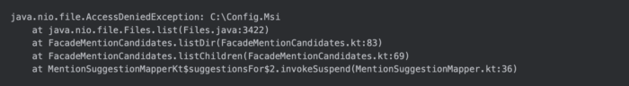
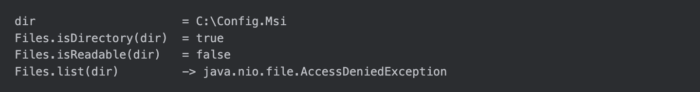
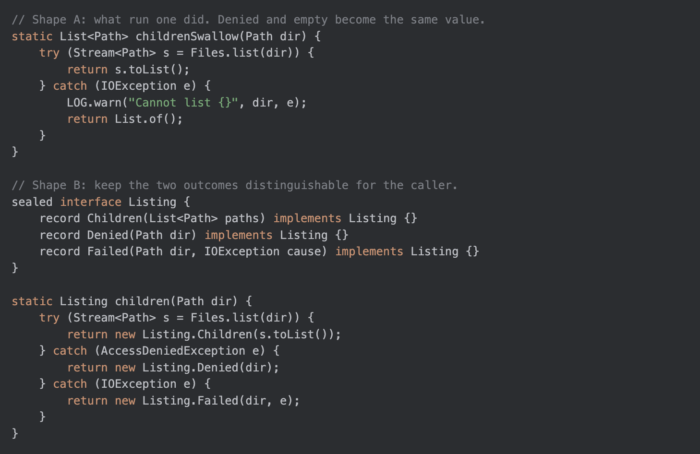

Java developers reach for the debugger without thinking about it. Set a breakpoint, run the failing test, look at the variables, then decide what to change.

Most AI coding agents I have watched skip that step. They read the stack trace, read the source, and propose a patch. The reasoning can look excellent and still be a guess about a program nobody ran.

I wanted to know what that guess costs. So I took one real JVM bug, one model, one prompt, and ran it twice with two debugging workflows. Here is what the two transcripts show.

The failure came from a Kotlin project running inside a JetBrains IDE on Windows. If you write Java, every line of the trace will look familiar, because it is plain `java.nio.file`:  

`C:\Config.Msi `is a protected Windows Installer directory. The code checked `Files.isDirectory(path)`, got `true`, and then called `Files.list(path)`. The listing threw.

The function belongs to an autocomplete feature: typing @ in a chat lets the user mention a file or folder, and the suggestion list is built by walking the filesystem from a root such as C:. Nothing caught the exception at the boundary of that flow, so it surfaced as an unhandled coroutine exception and the IDE blamed the plugin.

A small function with one unguarded NIO call and more than one way to fail. A good test case.

## The method under test

A systematic debugging method has four steps: gather facts, form a hypothesis, run an experiment, change the code. The order matters, and the third step is the one I see agents skip.

[Superpowers](http://https://github.com/obra/superpowers "Superpowers"), a skills collection created by [Jesse Vincent](http:/https://blog.fsck.com/ "Jesse Vincent") and the [Prime Radiant](http://https://primeradiant.com "Prime Radiant") team and popularized by Matt Pocock, ships a [systematic-debugging skill](http://https://www.skills.sh/obra/superpowers/systematic-debugging "systematic-debugging skill") that encodes exactly those steps as instructions for the model.

[Explyt, the JetBrains plugin](https://explyt.ai/t/l/vzJhcPvhttp:// "Explyt, the JetBrains plugin") I work on, has a built-in Debug skill that gives the model the IDE debugger as a tool: it can set breakpoints, run a test under the debugger, and read variables and call stacks.

**Setup for both runs:**

**Model: Opus 5.**   

Same repository, same IDE log, same prompt.  

Only difference: the Superpowers skill in run one, the Explyt Debug skill in run two.  

One bug, two runs. Treat it as a case study. A benchmark would need more bugs and more repetitions, and I will come back to what a single case can and cannot show.

**Run one: the checklist without the experiment**   

The Superpowers run did the reading part well. It grepped the log instead of dumping it, followed the trace into `FacadeMentionCandidates`, found the unguarded `Files.list`, and wrote down a plausible root cause: a protected directory that passes the `isDirectory check`.

Then it went straight to code. It never set a breakpoint or ran anything, so it never saw a single value from the failing execution.

The patch wrapped the listing in try/catch, logged the exception, and returned `emptyList()`.

That makes the trace go away. It also changes the contract of the function. A folder that is empty and a folder the process is not allowed to read now return the same value, and the UI cannot tell the user which one happened.

The regression test inherited the same assumption: "an unreadable directory has no children." On Windows the test could not set POSIX permissions, so the first version was skipped. To force the exception the agent added a readDirectory function parameter to the production constructor and injected a throwing fake from the test.

Seven tests passed at the end. Honestly, on a busy day I might have merged that. What they proved was that the fallback returns an empty list. They said nothing about whether the behavior the user sees was right, and nothing in the run had touched a paused JVM.

I dropped the patch. It hid a distinction the feature needs and left a test-only seam in the public API.

**Run two: breakpoint first, then the fix**   

The Explyt run started from the same log and source. The difference was what it did after forming the hypothesis.

It wrote a minimal reproducer, put a line breakpoint on the Files.list call, and started the test under the JetBrains debugger. When the JVM paused, the model evaluated:  
  

The call stack in the debugger matched the production trace frame for frame: `listDir `→ `listChildren` → `MentionSuggestionMapper.suggestionsFor`, inside the coroutine that builds suggestions.  

\`  

At that point the hypothesis stopped being a hypothesis. The directory check passes, the process cannot read the directory, and the enumeration kills the flow. Three facts, all read off a paused JVM.

The fix stayed at the filesystem boundary, kept the normal listing path unchanged, and came with a focused regression test. It needed no `println` calls, no new constructor parameter, and no change to the mention protocol. It passed review and is in production.

It also used a try/catch. The difference was timing. The catch came after the agent had watched the failure and knew which exception to expect and what the caller needed from the result.

Strip away the agents for a moment. The bug itself is a classic NIO trap that applies to any JVM language.

Files.isDirectory answers "is this a directory?" It does not answer "may I list it?" On Windows, ACLs make those two questions independent, and Files.list is where the second one gets asked.

Two shapes of handling are possible. The following Java sketch is illustrative; it is not the production patch:  

Which shape is right depends on the caller. That is the decision the first run made blind and the second run made with the failing state on screen.

Two small reminders while we are here. Files.list returns a Stream that holds a directory handle, so close it with try-with-resources. And AccessDeniedException extends FileSystemException, which extends IOException, so a bare catch (IOException e) will swallow it together with everything else unless you order the clauses.

**What the token counts say, and what they do not**   
[Explyt](http://https://explyt.ai/t/l/vzJhcPv "Explyt ")finished this case in about 67k tokens. The Superpowers run used about 132k.

The transcripts explain the gap. In run two the decisive fact arrived early, from the debugger. In run one the same budget went into speculative code, a skipped test, a second test, and a constructor refactor.

Read that as one measurement of one bug. Generalizing from it to either tool would be a stretch. Superpowers can be paired with a debugger, and the debugger depth available to Explyt depends on the IDE, language, and run configuration.

JetBrains has been publishing paired A/B tests on "token-saving" skills, and the pattern there is worth knowing before you trust any single number:

The [Caveman test](http://https://blog.jetbrains.com/ai/2026/07/speak-to-ai-agents-like-cavemen-tosave-tokens/ "Caveman test"): a README claim of 65% fewer tokens turned into 8.5% fewer output tokens on real agentic tasks, with activation forced.  

The [rtk test](http:https://blog.jetbrains.com/ai/2026/07/rtk-claude-code-token-savings/// "rtk test"): the with-rtk arm cost a median 7.6% more per task at low reasoning effort, and nothing changed at high effort.  

The [Ponytail test](// "Ponytail test"): a 10.3% cost reduction on its own benchmark.  

Their conclusion, and mine: measure the whole agent run, on your own bugs, and treat a skill's self-reported counter as marketing until you do.

## A checklist you can apply with any agent

Any agent can be held to this standard. The part to insist on is the experiment step. Before accepting a runtime fix from an agent, ask:

**Did it reproduce the failure, or only read about it?**   

Which runtime fact did it observe: a variable value, a call stack, a branch taken?  

Does the fix change the meaning of a return value, and does the caller know?  

Did any production API change exist only to make a test possible?  

Do the new tests prove the behavior, or only that the workaround runs?  

If the answers are "read about it", "none", and "yes, twice", you are looking at run one.

Where Explyt fits, and a disclosure  

I work at Explyt, so weigh this paragraph accordingly. Explyt is an AI agent that runs inside JetBrains IDEs. Its Debug workflow starts the code under the IDE debugger and reads breakpoints, variables, call stacks, and execution paths before editing. The IDE supplies the evidence; you still review the hypothesis and the diff.

Supported IDE, language, and run-configuration combinations are listed in the feature matrix. If you want to reproduce this kind of comparison, take a failing test you already have, ask the agent to confirm the cause at a breakpoint before it edits anything, and read the diff with the checklist above.
