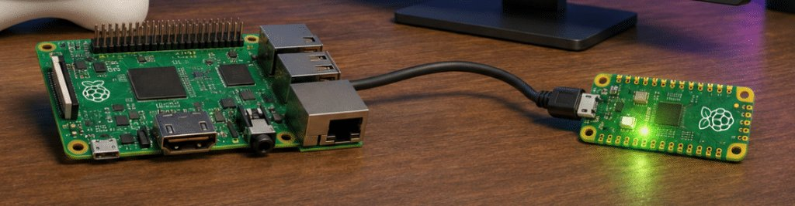
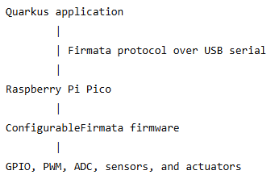
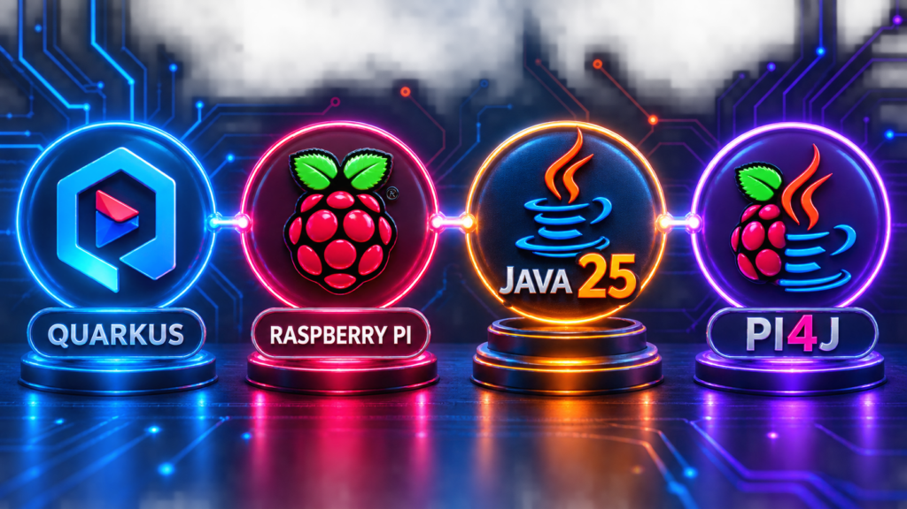
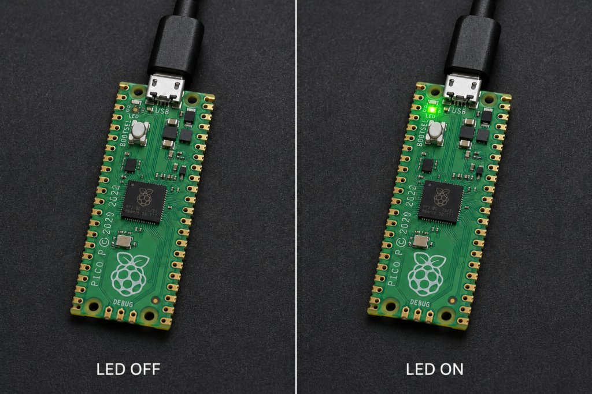
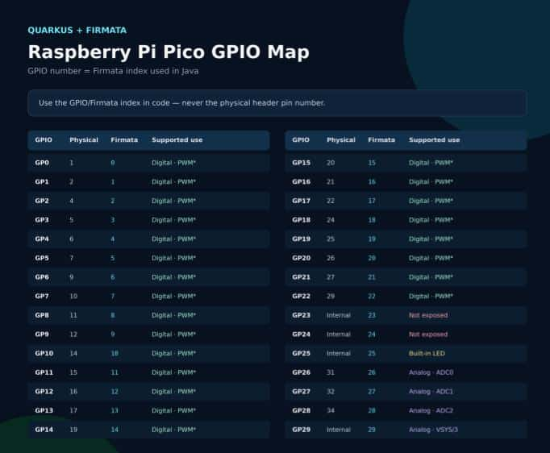

Java applications are usually associated with APIs, databases, messaging systems, and cloud infrastructure. But Java can also interact with the physical world—reading sensors, controlling LEDs, driving motors, and communicating with microcontrollers.

That is the goal of [Quarkus Firmata](https://github.com/igfasouza/quarkus-firmata "Quarkus Firmata"), a new Quarkus extension that connects Quarkus applications to Firmata-compatible boards such as the Raspberry Pi Pico.

The project combines three technologies:

* Quarkus for application development and dependency injection
* [firmata4j](https://github.com/kurbatov/firmata4j "firmata4j") as the Java implementation of the Firmata client protocol
* [ConfigurableFirmata](https://github.com/firmata/ConfigurableFirmata "ConfigurableFirmata") running on the microcontroller

The initial version focuses on a practical MVP: digital input and output, analog input, PWM output, and USB serial communication with a Raspberry Pi Pico.

## What is Firmata?

Firmata is a protocol that allows software running on a computer to communicate with a microcontroller.

Instead of compiling and uploading a new firmware every time an application needs to change a pin, the board runs a generic Firmata firmware. The host application then sends commands to configure pins, write values, and receive input updates.

A simplified architecture looks like this:


Firmata uses a MIDI-inspired binary message format and supports feature discovery through capability queries. This means the host can ask the board which modes each pin supports instead of relying entirely on hard-coded board definitions. More details are available in the [official Firmata protocol documentation](https://github.com/firmata/protocol "official Firmata protocol documentation").

## Why create a Quarkus extension?

It is already possible to use firmata4j directly inside a Java application. A Quarkus extension, however, provides a more natural application-development experience.

Quarkus Firmata manages:

* Creation of the Firmata device
* Serial connection initialization
* CDI registration
* Application startup and shutdown
* Configuration through application.properties
* Validation of pin capabilities
* Translation of checked I/O errors into a consistent API

Applications only need to inject FirmataClient and interact with the board.

The project follows the standard Quarkus extension layout:

quarkus-firmata  

├── runtime  

├── deployment  

├── integration-tests  

└── examples

The runtime module contains the API, configuration, and connection lifecycle. The deployment module registers the extension during Quarkus augmentation. The project also includes hardware-independent tests and a Raspberry Pi Pico example.

## Java 25 and Quarkus

Quarkus Firmata targets Java 25 or newer.

Full Java 25 support arrived in Quarkus 3.31, including support for Java 25 runtime images and native builds with Mandrel. The extension currently targets JVM execution while native-image compatibility with firmata4j is investigated separately. See the [Quarkus 3.31 announcement](https://quarkus.io/blog/quarkus-3-31-released/ "Quarkus 3.31 announcement") for details about Java 25 support.

To build the project, you need:

* JDK 25 or newer
* Maven 3.9 or newer
* A Raspberry Pi Pico
* ConfigurableFirmata 2.11 or newer
* A USB cable capable of data transfer

  
*Image created with AI - logos representing the technology stack used to control a Raspberry Pi Pico from a Java application.*

## Building the extension

Clone the repository and install the extension locally:

```
git clone https://github.com/igfasouza/quarkus-firmata.git
cd quarkus-firmata
mvn verify install
```

The verification tests do not require a physical board because the Firmata integration is disabled in the test configuration.

After installation, add the extension to a Quarkus application:

```
<dependency>
    <groupId>io.quarkiverse.firmata</groupId>
    <artifactId>quarkus-firmata</artifactId>
    <version>1.0.0-SNAPSHOT</version>
</dependency>
```

## Configuring the serial connection

A Raspberry Pi Pico connected through USB commonly appears as */dev/ttyACM0* on Linux.

Configure the extension in *application.properties*:

```
quarkus.firmata.enabled=true
quarkus.firmata.port=/dev/ttyACM0
quarkus.firmata.connect-on-startup=true
```

On Windows, use the corresponding *COM* port:

```
quarkus.firmata.port=COM4
```

On macOS, the device normally appears under \*/dev/cu.\*\*.

When *connect-on-startup* is enabled, the extension opens the serial connection during Quarkus startup and waits for Firmata capability discovery to finish. The connection is closed automatically when the application stops.

If the board may be connected later, automatic connection can be disabled:  

quarkus.firmata.connect-on-startup=false

The application can then call:

```
firmata.connect();
```

## Controlling the Raspberry Pi Pico

The main entry point is the FirmataClient CDI bean:

```
import jakarta.enterprise.context.ApplicationScoped;
import jakarta.inject.Inject;

import io.quarkiverse.firmata.FirmataClient;

@ApplicationScoped
public class PicoService {

    @Inject
    FirmataClient firmata;

    public void turnLedOn() {
        firmata.digitalWrite(25, true);
    }

    public void turnLedOff() {
        firmata.digitalWrite(25, false);
    }
}
```

ConfigurableFirmata identifies the Pico's built-in LED as logical pin 25.


It is important to distinguish logical GPIO numbers from physical header positions. The RP2040 support documentation describes 30 logical pins, four analog inputs, and 16 PWM-capable pins. The analog inputs use logical indexes 26 through 29. See the official [ConfigurableFirmata board-support documentation](https://github.com/firmata/ConfigurableFirmata/blob/master/BoardSupport.md "ConfigurableFirmata board-support documentation") for the complete mapping.


Reading an analog input is equally simple:

```
long value = firmata.analogRead(26);
```

PWM accepts an 8-bit value between 0 and 255:

```
firmata.pwmWrite(15, 128);
```

Before performing an operation, the extension verifies that the selected pin supports the requested Firmata mode. Attempting to use PWM on a pin that does not advertise PWM support results in a clear exception instead of silently sending an invalid command.

## Accessing firmata4j directly

The high-level API deliberately starts small, but advanced users can access the underlying firmata4j device:

```
IODevice device = firmata.unwrap();
```

This escape hatch makes it possible to experiment with features that are not yet represented by the extension API, including I²C communication, event listeners, low-level messages, and custom SysEx commands.

Future versions can promote these capabilities into dedicated Quarkus APIs once their behavior and configuration are established.

## A note about serial communication on Java 25

jSerialComm relies on native code to access operating-system serial ports. Starting with recent Java versions, the JVM may require applications to explicitly allow native access.

If necessary, start the application with:

```
java --enable-native-access=ALL-UNNAMED -jar target/quarkus-app/quarkus-run.jar
```

The same option can be added to the VM configuration when running the application from an IDE.

The project currently pins jSerialComm 2.9.3 because version 2.10 changed binary method descriptors used by the published firmata4j 2.3.9 artifact. Moving to newer jSerialComm versions will require adapting or replacing firmata4j's serial transport layer.

## Preparing the Pico firmware

The Raspberry Pi Pico must run a compatible ConfigurableFirmata sketch.

The firmware should enable the modules required by the first extension release:

* Digital input
* Digital output
* Analog input
* Analog output or PWM
* Capability queries
* Pin-state queries
* Analog mapping

firmata4j requires the firmware to answer*REPORT_FIRMWARE, CAPABILITY_QUERY, PIN_STATE_QUERY, and ANALOG_MAPPING_QUERY* during initialization.

ConfigurableFirmata supports the RP2040 family from version 2.11 onward.

## What comes next?

The first release establishes the foundation for using Firmata as a Quarkus-managed hardware interface. Several features are natural candidates for future development:

* Pin-change events
* Servo control
* I²C devices
* Custom SysEx modules
* Health checks
* Metrics
* Automatic reconnection
* Multiple boards
* Dev UI integration
* GraalVM native-image support

The larger goal is to make physical computing feel like a normal part of Quarkus development: configure a device, inject a client, and interact with hardware through a concise Java API.

Quarkus Firmata is open source and available on GitHub:  
[github.com/igfasouza/quarkus-firmata](https://github.com/igfasouza/quarkus-firmata "github.com/igfasouza/quarkus-firmata")

The project is available on [GitHub](https://github.com/igfasouza/quarkus-firmata "GitHub"), but I have not submitted it as an official Quarkus or Quarkiverse extension because I do not want to commit to its long-term maintenance. Nevertheless, anyone interested is welcome to use the repository as a starting point, adapt it to their own projects, extend the API, or add support for additional Firmata features and hardware.

That said, contributions, experiments with other Firmata-compatible boards, bug reports, and API suggestions are welcome.

And here is a fun thought to end on: I may well be the first person to use Quarkus to control a microcontroller or, at the very least, the first to use it with a Raspberry Pi Pico. I cannot prove it, but until someone shows me an earlier example, I am happy to claim this tiny piece of Java and IoT history! Interestingly, one of my most-viewed [blog posts](https://foojay.io/today/control-your-arduino-with-spring/ "https://foojay.io/today/control-your-arduino-with-spring/") is about using Firmata4j with Spring and Arduino, so I am genuinely curious to see how this Quarkus and Raspberry Pi Pico adventure will be received.
