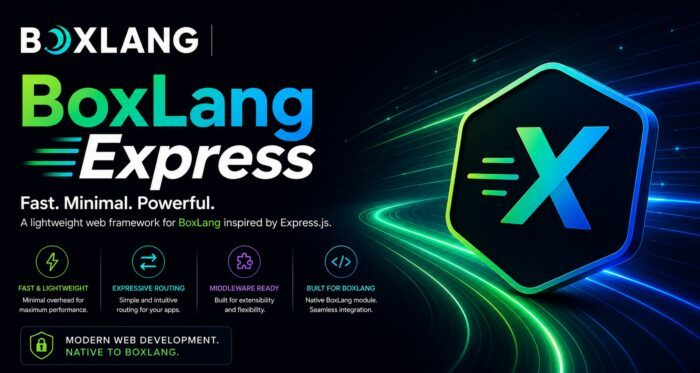

If you've spent years in Spring Boot, Micronaut, or Jakarta EE, "web framework" usually means a servlet container, an embedded Tomcat or Netty, a build step, and a fat jar before anything answers a request. What if you could skip all of that and still be on the JVM?

**BoxLang Express** , a new community module built entirely by developer [Robert Zehnder of KISDigital](https://kisdigital.com/posts/2026/08/introducing-boxexpress--express-js-ergonomics-for-boxlang "Robert Zehnder of KISDigital"), does exactly that. It's built directly on `com.sun.net.httpserver.HttpServer`, a class that's been sitting in the JDK since Java 6, so there's no embedded server to configure and nothing extra on the classpath for the HTTP layer itself. `boxlang server.bxs` is the whole deployment story.

It's also a genuinely modern take on that old JDK class: every request runs on its own virtual thread, so a slow handler or a blocking downstream call doesn't tie up a worker pool the way it would on platform threads. That's Project Loom-era concurrency without any framework asking you to opt in or rewire anything. And because BoxLang runs on the JVM with full Java interop, none of your existing Java libraries are off the table. Reach for your JDBC driver, your logging framework, your existing service classes, directly from route handlers, no adapter layer required. For a JVM developer who wants Express-level iteration speed for a small service, an internal tool, or a prototype, without giving up the runtime and libraries already trusted in production, that combination is hard to find elsewhere.

This is exactly the kind of community contribution we want to spotlight as BoxLang continues to evolve.

## The itch that started it

Robert's own framing says it best: every time he needed a quick HTTP endpoint, he missed how fast this is in Node.

```java
const app = require( 'express' )()
app.get( '/', ( req, res ) => res.send( 'Hello World' ) )
app.listen( 3000 )
```

BoxLang didn't have an equivalent. But it does have the JVM underneath it, and the JVM has shipped `com.sun.net.httpserver.HttpServer` since Java 6, a standalone HTTP server with no servlet container needed. Robert built the fifteen-second version on top of it, and BoxLang Express was born:

```java
app = boxExpress()

app.get( "/", ( req, res ) => {
    res.send( "Hello World" )
} )

app.listen( 3000 )
```

Routing, middleware, mountable sub-routers, view rendering, all running as a plain BoxLang process. No servlet, no WAR, nothing to deploy but a script.

## What's inside

Install it from [ForgeBox](https://forgebox.io/view/boxlang-express "ForgeBox") like any other module:

```java
box install boxlang-express
```

Once BoxLang discovers the module, `boxExpress()` is available globally, `no require()` equivalent needed. From there the API will feel immediately familiar to anyone who has shipped a Node service:

* **Routing and params** — `app.get`, `app.post`, `:id`-style path params, and query parsing that map directly to what Express developers already know
* **Middleware** — the same `( req, res, next )` shape, with `next( err )` jumping straight to error handling middleware, detected the same way Express does it
* **Mountable routers** — `new bxModules.boxexpress.models.Router()`, mounted with `app.use( "/api", apiRouter )`, path scoping and all
* **Built-in middleware factories** — `boxExpressJSON()`, `boxExpressUrlencoded()`, `boxExpressStatic()`, `boxExpressUpload()`, and `boxExpressSession()` for cookie-based sessions, each capped and hardened by default rather than left as a footgun
* **View rendering** — BoxLang's native `.bxm` templates alongside a bundled Handlebars engine, picked per view by extension
* **Static files and downloads** — `res.sendFile()` and `res.download()`, complete with `ETag`/`Last-Modified` conditional requests so browser caching just works

It's also opinionated where the platforms genuinely differ. Node keeps a CLI process alive through its event loop; BoxLang's CLI runtime has none, so `listen()` blocks the calling thread by default rather than asking every script to remember its own keep-alive loop. A plain `boxlang server.bxs` just stays up.

Every request runs on its own virtual thread, so a slow handler doesn't stall the rest of the app, and the route table is expected to be fully registered before `listen()` is called.

## Middleware, the way you already know it

If you've written Express middleware, this reads exactly the way you'd expect. Handlers are `( req, res, next )`, and error handlers are just the same shape with an extra parameter in front, detected the same way Express does it: four arguments instead of three.

```java
app.use( boxExpressJSON() )

app.post( "/echo", ( req, res ) => {
    res.json( { youSent: req.body } )
} )

app.use( ( err, req, res, next ) => {
    res.status( 500 ).json( { error: true, message: err.message } )
} )
```

`boxExpressJSON()` caps request bodies at 100KB by default, and the upload middleware caps at 10MB, both overridable with a `limit` option. That default-safe posture shows up throughout the module rather than being bolted on afterward.

Mounting a sub-router works the same way you'd reach for it in Node too:

```java
apiRouter = new boxexpress.models.Router()

apiRouter.get( "/ping", ( req, res ) => {
    res.json( { pong: true } )
} )

app.use( "/api", apiRouter )
```

Inside the router, `req.path` is scoped to `/ping`, the mount prefix stripped and restored around it, exactly like `express.Router()`.

## Two view engines, your choice

Not every BoxLang team wants to write `#data.name#` for every view, so res.render() supports BoxLang's native `.bxm` templates and a bundled Handlebars engine side by side, picked per file by extension:

```java
app.set( "views", expandPath( "./views" ) )

app.get( "/greet/:name", ( req, res ) => {
    res.render( "greeting", { name: req.params.name } )
} )

app.get( "/greet-hbs/:name", ( req, res ) => {
    res.render( "greeting.hbs", { data: { name: req.params.name } } )
} )
```

```java
<h1>Hello, {{data.name}}!</h1>
```

Set a default engine app-wide with `app.set( "view engine", "hbs" )` if Handlebars is the primary format for a project, or mix both per view. No separate install for Handlebars either, it's vendored in.

## Built with a defensive posture

* Static file and `sendFile()` paths are resolved against the real, symlink-resolved directory before serving, so a symlink dropped inside a public folder can't be used to walk out of it
* Uploaded files are written to disk under a generated name, never the client's original filename, closing off path traversal and collision risks
* A caller-supplied filename used to be interpolated unescaped into the `Content-Disposition `header; that was identified and fixed so it can no longer break out of the quoted token and inject extra headers
* The default `500` handler no longer echoes raw exception messages to unauthenticated clients, a fix that closed off a real path for leaking internal file paths and driver errors; the real message still logs to stdout, and opting into `app.set( "env", "development" )` brings it back for local debugging only

That kind of iteration, catching and fixing real security issues in a young project, is exactly what you want to see from a module before you build on it.

## Express Test App

You can also checkout the [express-test](https://github.com/robertz/express-test "express-test"): a real-time chat app built entirely on top of the module, using Pulsely for pub/sub messaging and `bx-esapi` to sanitize user input before it's signed and published. It's a small app, but it exercises the framework the way a real one would: routing, request bodies, view rendering, and a front end talking to a live backend the whole way through.

## Why this matters

BoxLang Express is a good example of what an open, JVM-native language makes possible. Robert didn't need to wait on a core team feature request or fork anything, he reached for a JDK class that had been sitting there the whole time, designed the API, wrote the code, and shipped it to ForgeBox for anyone to use. Now we get to support Robert and his initiatives!

If you're building HTTP services in BoxLang and want Express-style ergonomics without pulling in a servlet container, give it a try.

```java
box install boxlang-express
```

* Module: [github.com/robertz/boxlang-express](https://github.com/robertz/boxlang-express "github.com/robertz/boxlang-express")
* Sample app: [github.com/robertz/express-test](https://github.com/robertz/express-test "github.com/robertz/express-test")
* ForgeBox: [boxlang-express](https://www.forgebox.io/ "boxlang-express")

Have you built something on top of BoxLang we should be highlighting? Let us know, we love shining a light on what this community is building.
