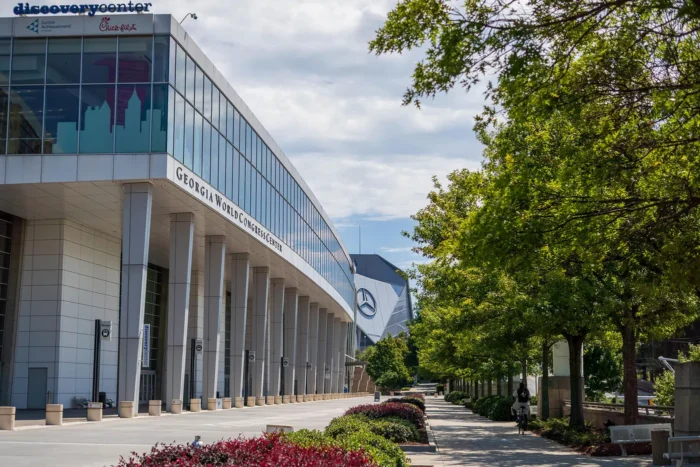
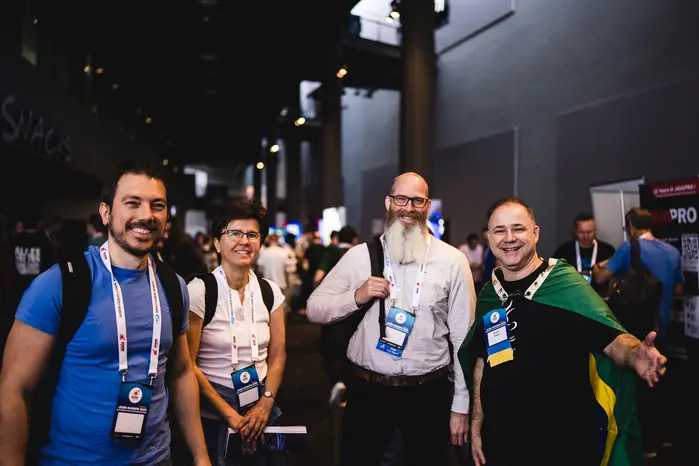
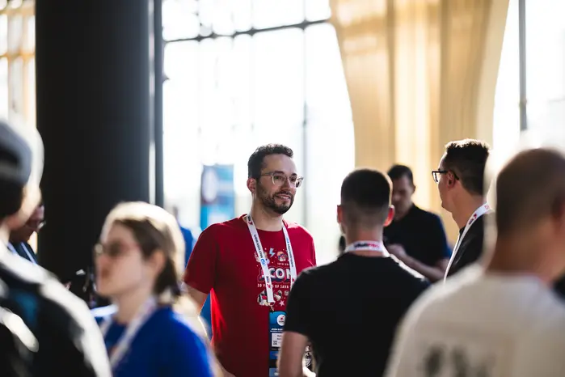
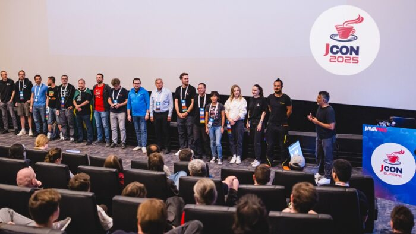

JCON USA returns inside IBM TechXchange 2026 with two rooms of deep Java content, a dedicated community home, and direct access to one of the years biggest technical conferences.

## From Orlando to Atlanta

Last year, we tried something new. We brought JCON USA into IBM TechXchange and created a Java community conference inside a much larger technology event. The result showed us that these two worlds fit together remarkably well. JCON brought the independent, developer-to-developer spirit of the Java community. TechXchange provided the scale, infrastructure, learning opportunities, and access to experts that only a major international conference can offer.

In 2026, we are taking the next step. JCON USA comes to Atlanta from October 26 to 29 at the Georgia World Congress Center. JCON USA is the Java community conference within IBM TechXchange 2026.

For me, this creates a pretty cool combination. You can spend your morning in a deep Java session, join a hands-on lab afterwards, explore the Sandbox, talk with an IBM engineer, meet people working in AI, data, infrastructure, security, or hybrid cloud, and then return to the JCON Community Hub to continue the Java conversation. You do not have to choose between JCON and TechXchange. You get both.

## Three ways to experience JCON USA

The structured technical program is the backbone of the event. From Tuesday through Thursday, two dedicated JCON rooms will host 23 breakout sessions. Each session has 45 minutes, including Q\&A. The speakers include Java Champions, Java User Group leaders, experienced developers, architects, and other respected voices from across the ecosystem. The focus is practical: Java, Jakarta EE, architecture, AI, cloud native development, open source, developer productivity, and the technologies shaping our daily work.

But a good conference is more than a sequence of presentations. That is why the JCON Community Hub matters so much. It is our home base inside TechXchange and the place where the Java crowd comes together throughout the conference. You can meet speakers, Java Champions, JUG leaders, fellow developers, and the engineers behind IBM's Java technologies. There will be Tech Talks, Meet the Experts sessions, office hours, and informal discussions. You can also simply come over, sit down, and talk. Even with thousands of technologists around you, you will always know where to find the Java community.

The third part is the JCON Mentorship Hub. Sometimes you do not need another presentation. You need a conversation. The Mentorship Hub gives you direct access to experienced people who are willing to discuss a technical problem, an architectural decision, open source, career development, leadership, community work, or another topic that matters to you. There is no sign-up and no complicated process. Check the schedule, find a mentor or topic, walk up, and join the conversation.

## Session highlights

The 2026 program reflects a Java ecosystem that is modernizing without losing its engineering foundations. AI is an important part of that story, but the sessions do not treat it as a collection of demos or vague promises. They ask what it takes to make AI useful, maintainable, observable, and safe in real Java systems.

Emily Jiang and Ivar Grimstad bring the perspective of people who help shape enterprise Java standards. Both are Java Champions. Emily is a long-time MicroProfile and Jakarta EE specification leader; Ivar is Jakarta EE Developer Advocate and EE4J PMC Lead. In "AI in Java: No Python Required," they connect that standards experience with a practical question: how can teams add AI through Jakarta EE, MicroProfile, and langchain4j-cdi while staying within familiar Java patterns?

Spencer Gibb brings a similarly direct connection to his subject. As co-founder and lead of Spring Cloud, he has helped build the tools teams use for distributed systems. His session "Of Microservices and Monoliths" draws on that experience to explore when distribution is worth the complexity, and when an application and its team are better served by a monolith.

Open source itself is also part of the conversation. Brian Fox, Sonatype co-founder and CTO and former chair of the Apache Maven project, uses Maven Central as a real-world case study in "Free Isn't Free: Moving From Open Source Abuse to Alignment." The session examines how everyday build and cloud practices can create enormous hidden load for shared infrastructure, and what responsible engineering teams can do about it.

These highlights reflect the JCON approach: useful technical content from people who build, operate, and improve the technologies we depend on. The full breakout and Tech Talk program offers many more opportunities to learn from that experience and continue the discussion in person.

## A complete technical conference around JCON

JCON USA is included in the IBM TechXchange conference pass. There is no separate JCON pass. Attendees can join hands-on labs, technical breakouts, live demos, Meet the Experts sessions, Tech Talks, certification testing, and activities in the Sandbox Expo. The conference spans topics well beyond Java, including AI, data, hybrid cloud, infrastructure, security, and governance. This wider context is valuable because Java rarely exists in isolation in real organizations.

The IBM TechXchange conference pass includes two complimentary onsite certification exam attempts. Breakfast and lunch are provided during the conference, and the shared program includes the Opening Night Block Party in the Sandbox on Monday evening and the TechXchange Networking Event on Wednesday evening.

JCON's community kickoff is the Block Party on Monday, October 26. The two JCON rooms and Hub program begin on Tuesday and continue through Thursday. This rhythm gives attendees a natural way to meet first, then spend three days learning and exchanging ideas.

## A home for the Java community

Large conferences create opportunities that smaller events cannot. You meet people from different fields, gain access to a much wider program, and discover technologies you did not expect to encounter. But scale can also feel anonymous. JCON USA solves that problem by giving Java developers and architects a clear home inside the larger event.

That home is not defined only by rooms, stages, or signs. It is defined by the people who gather there. JCON is organized by the community, for the community. The sessions are important, but so are the questions after a talk, the discussion over lunch, the introduction to an open-source maintainer, and the honest conversation with someone who has already faced the problem you are working on.

Last year proved that the Java community can bring its own energy into a major technology conference without losing what makes it special. In Atlanta, we want to build on that foundation with more Java content, a stronger home base, and more opportunities for direct exchange.

If you work with Java, Jakarta EE, Spring, Quarkus, the JVM, cloud native systems, open source, or AI-assisted development, join us in Atlanta. Come for Java. Get a whole lot more.

## Event information

**Event:** JCON USA @ IBM TechXchange 2026

**Dates:** October 26-29, 2026

**Venue:** Georgia World Congress Center, Atlanta, Georgia

**Website:** <https://2026.usa.jcon.one/>

**Sessions:** <https://2026.usa.jcon.one/sessions>

**Registration:** <https://www.ibm.com/events/techxchange>
