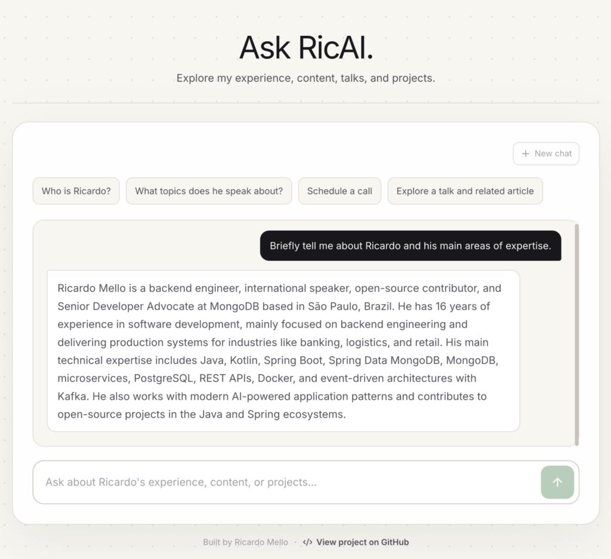
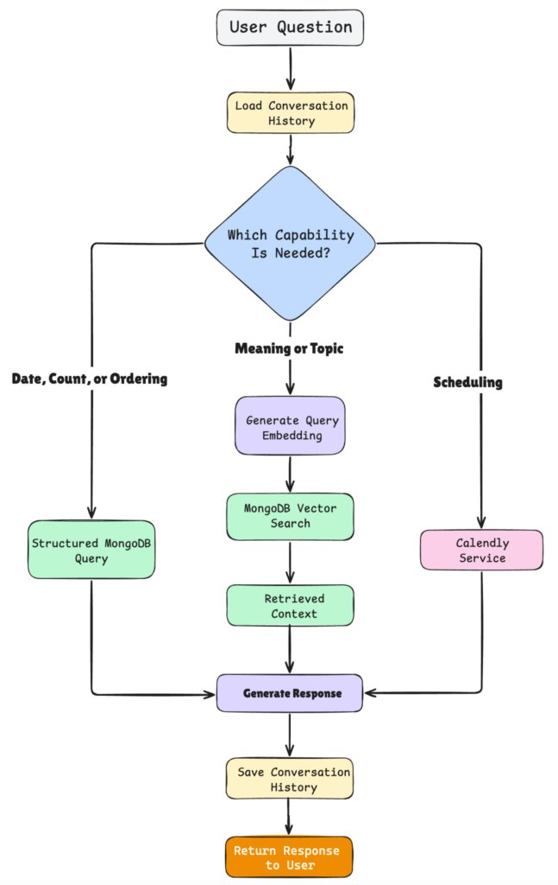
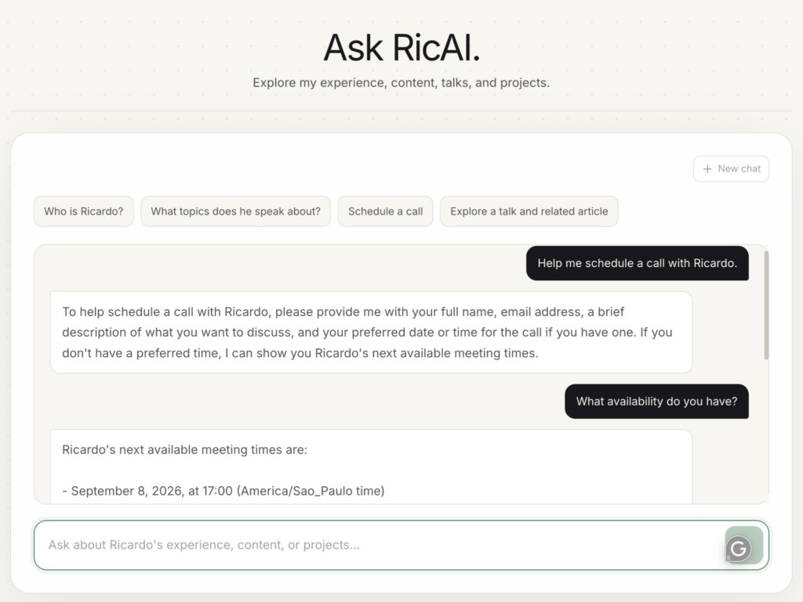
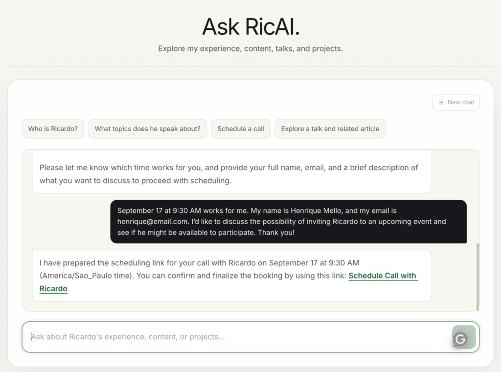

The best way to learn a technology is by putting it into practice in a real system.

A few months ago, I decided to build a virtual assistant that could answer questions about my career, help people learn more about my articles, videos, talks, and projects, and even schedule a call on my calendar.


At first, the idea was simple: give the assistant access to my content and let people ask questions about it. But as the project evolved, I realized that not every question should be handled in the same way. Some questions can be answered with a direct query to the database, while others benefit from semantic search. In other cases, the assistant may need to use a tool or execute multiple steps before reaching an answer.

This is how [**RicAI**](https://www.ricardohsmello.com/ask-ai) evolved from a simple RAG application into a personal AI assistant that can search, remember context, and use external services. In this article, I'll show you how I built it and how you can build your own.

## How RicAI Works

Before jumping into the implementation, let's first understand what happens when someone sends a question to RicAI:


1. **Receive the question** – The user asks anything about my career, content, projects, or talks.
2. **Load conversation history** – RicAI checks whether there is previous context for that conversation and loads it so the AI can understand what was discussed before.
3. **Choose the right capability** – Based on the question and context, RicAI decides how to handle the request:
   1. structured MongoDB query for dates, counts, or ordering;
   2. Vector Search for semantic questions;
   3. Calendly for scheduling requests.
4. **Generate the response** – The result from the selected capability is used to generate the final answer.
5. **Save the conversation** – The new interaction is stored so the context can be reused in the next question.
6. **Return the response** – The answer is sent back to the user.

## Built With

* Java 21
* Spring Boot 4
* Spring AI
* MongoDB Vector Search

I'll focus on the main ideas and architecture throughout the article rather than every implementation detail. The complete source code is available on [GitHub](https://github.com/ricardohsmello/ricai-personal-content-agent).

## Modeling My Career as Data

The first thing I needed was a knowledge base about my own career. Articles, videos, talks, events, and projects are stored as documents containing the information RicAI may need to retrieve later. Each document contains the actual content together with metadata such as its title, category, and date.

For example, an event can be represented like this:

```
new Document(
    """
    Event: DevNexus 2026.
    Talk: Real-Time Fraud Detection in Java with Kafka Streams and Vector Similarity.
    Ricardo Mello presented this session at DevNexus 2026 in Atlanta.
    The talk explored Java, Kafka Streams, Spring Boot, MongoDB, and Vector Search.
    """,
    Map.of(
        "title", "DevNexus 2026",
        "category", "event",
        "createdAt", "2026-03-01"
    )
)
```

An article follows the same idea:

```
new Document(
    """
    Article: Clean and Modular Java: A Hexagonal Architecture Approach.
    Published on Foojay.io in June 2025.
    Topics: Java, Architecture.
    """,
    Map.of(
        "title", "Clean and Modular Java: A Hexagonal Architecture Approach",
        "category", "article",
        "createdAt", "2025-06-01"
    )
)
```

I intentionally keep both textual content and structured metadata. The text is useful for semantic search, while metadata gives me another way to filter, sort, and query the content directly (we will see it later).

These are just two examples. [The knowledge base](https://github.com/ricardohsmello/ricai-personal-content-agent/blob/main/src/main/java/br/com/ricas/config/SeedContent.java) also contains documents for articles, videos, talks, projects, and other parts of my career.

## Storing the Knowledge Base with Spring AI VectorStore

Creating the documents is only the first step. Since I also want RicAI to understand questions based on meaning, I need to generate vector embeddings for this content and store them in MongoDB.

For this, I use Spring AI's [VectorStore](https://docs.spring.io/spring-ai/reference/api/vectordbs/mongodb.html) abstraction with MongoDB Atlas as the vector store and OpenAI as the embedding model. MongoDB also provides an official Spring AI integration for this use case. First, I add the Spring AI starters for OpenAI and MongoDB Atlas Vector Store to the [pom.xml](https://github.com/ricardohsmello/ricai-personal-content-agent/blob/ce1cd5bdb32512e5f83c895ccd75a8c214e454ca/pom.xml#L46):

```
<dependency>
    <groupId>org.springframework.ai</groupId>
    <artifactId>spring-ai-starter-model-openai</artifactId>
</dependency>

<dependency>
    <groupId>org.springframework.ai</groupId>
    <artifactId>spring-ai-starter-vector-store-mongodb-atlas</artifactId>
</dependency>
```

Then I configure the OpenAI API key and the MongoDB Vector Store to the [application.yml](https://github.com/ricardohsmello/ricai-personal-content-agent/blob/ce1cd5bdb32512e5f83c895ccd75a8c214e454ca/src/main/resources/application.yaml#L17):

```
spring:
  ai:
    openai:
      api-key: ${OPENAI_API_KEY}
    vectorstore:
      mongodb:
        collection-name: content_kb
        index-name: vectorstore_index
        initialize-schema: true
```

The OpenAI starter provides the embedding model, while the MongoDB starter configures the `VectorStore` backed by MongoDB Atlas. Spring AI handles most of this configuration automatically, so I don't need to manually create the embedding model or the vector store for this flow.

With everything configured, storing my career content becomes very simple:

```
vectorStore.add(documents);
```

When this method is called, Spring AI uses the configured embedding model to generate a vector representation for each document and stores the content, metadata, and embedding in the `content_kb` collection. The MongoDB integration supports this flow directly, including automatic Vector Search index initialization when `initialize-schema` is enabled.

**Note** : *This is convenient for development and demos; in production, the Vector Search index is typically managed explicitly rather than initialized by the application.*

A stored document looks conceptually like this:

```
// content_kb collection
{ 
  _id: "5dde34df-28ed-4837-bcc4-3a3481d2e79e",
  content: "Talk: Real-Time Fraud Detection...",
  metadata: {
    title: "Dev/nexus",
    category: "event",
    createdAt: "2026-03-01"
  },
  embedding: [
    0.0123,
    -0.0342,
    ...
  ]
}
```

In this project, Spring AI uses OpenAI's `text-embedding-ada-002` model, which generates vectors with 1536 dimensions.

At this point, the same MongoDB document gives RicAI two different ways to retrieve information: it can use fields such as `category` and `createdAt` for direct queries, or use the embedding with MongoDB Vector Search to find content based on semantic meaning. MongoDB Vector Search is designed specifically for retrieving data based on meaning rather than exact text matches.

## Adding Conversation Memory

## The Problem

Memory is a very important part of an AI application because LLM calls are stateless. In other words, the model does not automatically remember what happened in a previous request.

For example, imagine that you first ask:

***What articles has Ricardo written about Spring AI?***

The model may answer:

***Ricardo Mello has written the following articles about Spring AI:*** ***….***

Then, right after that, you ask:

***Which one is the most recent?***

By itself, this second question is incomplete. The assistant needs the previous conversation to understand that *"which one"* refers to the articles returned earlier. The model may answer:

***Which options are you referring to?***

This happens because the second request does not contain the context from the first one. To keep a conversation, we basically need to store the previous messages and send the relevant conversation history together with the new request.

## The Solution

The basic idea is simple: send the conversation history along with the user's new message, so the AI has the context it needs to understand what is happening.

There are different ways to implement this in an AI application. In RicAI, I decided to persist the conversation in MongoDB. For each interaction, I want to keep both sides of the conversation: what the user asked:

```
{
  id: "001", 
  message: "What articles has Ricardo written about Spring AI?",
  timestamp: "2026-09-07"
  type: "USER"
}
```

And the assistant response:

```
{
  id: "001", 
  message: "Ricardo Mello has written the following articles about Spring AI:...",
  timestamp: "2026-09-07"
  type: "ASSISTANT"
}
```

So, in practice, we are storing what the user asked and what the LLM answered, grouping those messages by conversation.

Of course, we could implement this ourselves: create a collection, build a service to save messages, retrieve the previous conversation, and call that service before and after every interaction. But that would add some extra work.

Spring AI already provides abstractions for this, and MongoDB can be used as the underlying [ChatMemoryRepository](https://docs.spring.io/spring-ai/reference/api/chat-memory.html#_mongochatmemoryrepository). To enable it, I add the following dependency to the [pom.xml](https://github.com/ricardohsmello/ricai-personal-content-agent/blob/ce1cd5bdb32512e5f83c895ccd75a8c214e454ca/pom.xml#L56):

```
<dependency>
    <groupId>org.springframework.ai</groupId>       
<artifactId>spring-ai-starter-model-chat-memory-repository-mongodb</artifactId>
</dependency>
```

Then I configure the `ChatClient` with a `MessageChatMemoryAdvisor`:

```
@Bean
ChatClient chatClient(
        OpenAiChatModel chatModel,
        ChatMemory chatMemory) {
    return ChatClient.builder(chatModel)
          .defaultSystem("...")
          .defaultAdvisors(
                MessageChatMemoryAdvisor.builder(chatMemory).build()
          )
          .build();
}
```

The advisor is responsible for retrieving the previous messages from memory and adding them to the next request as conversation context

The last piece is telling Spring AI which conversation we are working with. For that, I pass the `conversationId` when calling the [ChatClient](https://github.com/ricardohsmello/ricai-personal-content-agent/blob/884b718910986070304932a2202af3e2718f5844/src/main/java/br/com/ricas/chat/ChatService.java#L33):

```
return chatClient.prompt(chatRequest.message())
      .advisors(advisor -> advisor
            .param(ChatMemory.CONVERSATION_ID, chatRequest.conversationId()))
      .call()
      .content();
```

And that's it! From this point on, calls made through this `ChatClient` with a conversation ID can use the previous conversation as context. For regular chat interactions, the `MessageChatMemoryAdvisor` manages the conversation memory automatically. In the multi-step planning flow, the application explicitly records the final user message and assistant response using `chatMemory.add()`. In both cases, the messages are persisted in the `ai_chat_memory` collection. For example:

```
{
  conversationId: "daaac627-5d35-4545-b9f9-4bae4d5c53ca",
  message: {
    content: "Briefly tell me about Ricardo....",
    type: "USER",
    metadata: {
      messageType: "USER"
    }
  },
  timestamp: ISODate("2026-09-05T11:31:56.190Z"),
  sequence: 0
}
```

And the assistant response:

```
{
  conversationId: "daaac627-5d35-4545-b9f9-4bae4d5c53ca",
  message: {
    content: "Ricardo Mello is a backend engineer, international speaker...",
    type: "ASSISTANT"
  },
  timestamp: ISODate("2026-09-05T11:31:56.190Z"),
  sequence: 1
}
```

## Defining RicAI's Role

Now that RicAI can keep the conversation context, we also need to define what kind of assistant it is and what it is allowed to do. Earlier, when configuring the `ChatClient`, we used:

```
.defaultSystem("...")
```

This is where I define RicAI's role, scope, and some rules about how it should behave.

```
.defaultSystem("""
    You are Ricardo Mello's virtual assistant, specialized in
    his professional background, employment history, articles,
    videos, events, talks, projects, and meeting scheduling.

    Answer only questions related to Ricardo Mello using
    information returned by the available capabilities.

    Prefer structured capabilities for filtering, ordering,
    counting, comparison, and exact lookup.

    Prefer semantic search for natural-language retrieval
    and discovery by meaning or topic.

    Reply in the same language as the user.
""")
```

The [complete](https://github.com/ricardohsmello/ricai-personal-content-agent/blob/ce1cd5bdb32512e5f83c895ccd75a8c214e454ca/src/main/java/br/com/ricas/config/ChatConfig.java#L36) system prompt also includes rules for security, scheduling, and tool usage. You can check the full version in the project repository.

## Choosing the Right Capability

Now that we have configured memory and populated our knowledge base, the next step is to let the assistant decide which capability should be used to answer the user's question.

For example, a user might ask:

***How many articles does Ricardo have?***

We could use semantic search to answer this question, but it is designed to retrieve relevant content based on similarity, not to calculate exact values such as counts. In this case, a structured query is a much better fit because it gives us a deterministic and exact result.

We can simply execute a count against our MongoDB collection and return the exact number of articles.

On the other hand, imagine the user asks:

***Has Ricardo created any content about AI agents and memory?***

Here, semantic search makes much more sense. The user is not asking for an exact field or value, but for content related to a specific meaning or topic.

And there is another type of request:

***Help me schedule a call with Ricardo.***

In this case, neither a regular MongoDB query nor Vector Search can answer the question. RicAI needs to interact with an external service, in this case Calendly.

This is where tools become important.

## Exposing Capabilities as Tools

Tools enable the model to invoke functions or actions to accomplish a task. In RicAI, these tools are regular Java methods that the assistant can call to retrieve information or perform an action before building the final response.

### Structured MongoDB Query

For example, we already have a [method](https://github.com/ricardohsmello/ricai-personal-content-agent/blob/884b718910986070304932a2202af3e2718f5844/src/main/java/br/com/ricas/content/KnowledgeBaseService.java#L45) that retrieves my professional experience from the knowledge base:

```
/public List<CatalogContentResult> findProfessionalExperience() {
    var pageable = PageRequest.of(
          0,
          EXPERIENCE_LIMIT,
          Sort.by(Sort.Direction.DESC, "metadata.createdAt")
    );

    return contentKbRepository
          .findByMetadataCategory("experience", pageable)
          .stream()
          .map(CatalogContentResult::from)
          .toList();
}
```

There is nothing AI-specific about this method. It simply queries the `content_kb` collection we created earlier, filters the documents by the `experience` category, and returns the results ordered by date.

Now we can expose this operation to the model as a [tool](https://github.com/ricardohsmello/ricai-personal-content-agent/blob/884b718910986070304932a2202af3e2718f5844/src/main/java/br/com/ricas/content/ContentTools.java#L63):

```
@Tool(description = """
    Retrieves Ricardo Mello's professional experience,
    ordered from the most recent to the oldest.
    Use it for questions about companies, roles,
    employment periods, and career history.
    """)
public List<CatalogContentResult> findProfessionalExperience() {
    return knowledgeBaseService.findProfessionalExperience();
}
```

The `@Tool` annotation makes the method available to the model, while the description helps the model understand when this capability should be used.

RicAI has several structured operations like this inside the[ContentTools](https://github.com/ricardohsmello/ricai-personal-content-agent/blob/main/src/main/java/br/com/ricas/content/ContentTools.java) class. They are useful when we need exact operations such as filtering, ordering, counting, or retrieving a complete list.

### Semantic Search

Structured queries are not the best option for every question. Sometimes the user is looking for information by meaning or topic rather than an exact field or value.

For these cases, RicAI exposes a semantic search [tool](https://github.com/ricardohsmello/ricai-personal-content-agent/blob/884b718910986070304932a2202af3e2718f5844/src/main/java/br/com/ricas/content/ContentTools.java#L141):

```
@Tool(description = """
    Searches Ricardo Mello's knowledge base using semantic similarity.
    Use it for natural-language questions, summaries,
    topic discovery, and finding content by meaning.
    """)
public List<ContentResult> searchKnowledgeBase(
      @ToolParam(description = "The information the user wants to find")
      String query,

      @ToolParam(description = "Maximum number of results")
      int limit
) {
    return knowledgeBaseService.searchKnowledgeBase(query, limit);
}
```

Behind this tool, we use the same VectorStore configured earlier:

```
return vectorStore.similaritySearch(searchRequest)
      .stream()
      .map(ContentResult::from)
      .toList();
```

So now RicAI has two different ways to access the same knowledge base.

For a question such as:

***Which companies has Ricardo worked for?***

A structured MongoDB query is a better fit.

But for something like:

***Has Ricardo created content related to AI agents and memory?***

Semantic search makes more sense because the goal is to find relevant content based on meaning.

### External Service with Calendly

Besides answering questions about my career, RicAI can also help users schedule a call with me.

Normally, the user could simply open my[Calendly page](https://calendly.com/ricardohsmello/30min), choose an available time, and continue with the scheduling process.

But RicAI can help with this flow directly from the conversation. For example, the user can simply ask to schedule a call and then request my next available meeting times.


As the conversation continues, the user can select one of the available times and provide the information required for the meeting. RicAI then uses that context to prepare the scheduling link.


To make this possible, RicAI needs access to the Calendly API. I will not include the complete integration code here, but you can find it in the [project repository](https://github.com/ricardohsmello/ricai-personal-content-agent/tree/main/src/main/java/br/com/ricas/scheduling).

The important part for our flow is, once again, the tool exposed to the model. One of the scheduling tools retrieves the available meeting times:

```
@Tool(description = """
    Lists available times for a meeting with Ricardo.
    Use it when the user needs to select a meeting time.
    """)
public List<AvailableMeetingTime> findAvailableMeetingTimes(
      @ToolParam(description = "Future range start as an ISO-8601 UTC instant")
      String startTime,

      @ToolParam(description = "Range end as an ISO-8601 UTC instant")
      String endTime,

      @ToolParam(description = "Maximum number of times to return")
      int limit
) {
    return calendlyService.findAvailableTimes(startTime, endTime, limit);
}
```

This is only one part of the scheduling flow. RicAI can call other scheduling tools as the conversation continues, using the selected time and user information to complete the process and prepare the final booking link.

You can check the complete set of scheduling tools [here](https://github.com/ricardohsmello/ricai-personal-content-agent/blob/main/src/main/java/br/com/ricas/scheduling/SchedulingTools.java).

Finally, we need to make these tools available to the model. With Spring AI, we can register them with `.defaultTools()` directly in the `ChatClient`:

```
return ChatClient.builder(openAiChatModel)
      .defaultSystem("...")
      .defaultAdvisors(
            MessageChatMemoryAdvisor.builder(chatMemory).build()
      )
      .defaultTools(contentTools, schedulingTools)
      .build();
```

With this configuration, the model has access to both content and scheduling capabilities and can decide which tool to use based on the user's request and the conversation context.

Conclusion

In this tutorial, we explored how to turn a simple idea into a real application that can actually be useful in day-to-day interactions.

RicAI started as a way to make my career content easier to explore, but it evolved into an assistant that can search structured data, perform semantic search, remember conversations, and even interact with external services such as Calendly.

You can explore the complete project on [GitHub](https://github.com/ricardohsmello/ricai-personal-content-agent/tree/main) and use it as a starting point to build your own personal AI assistant.
