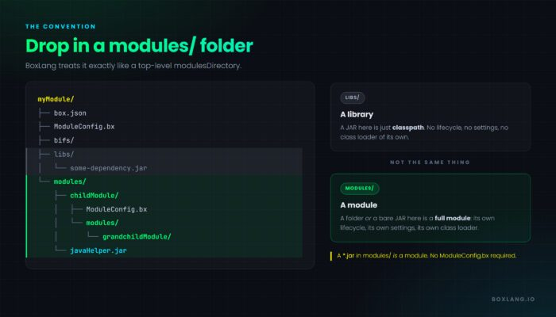
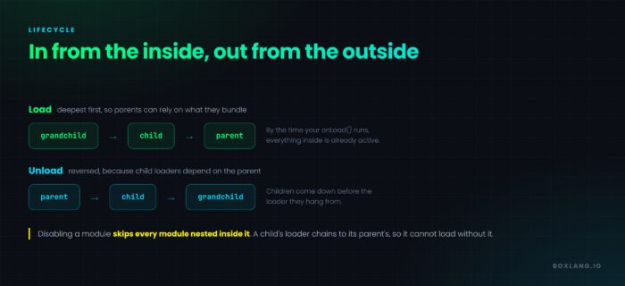
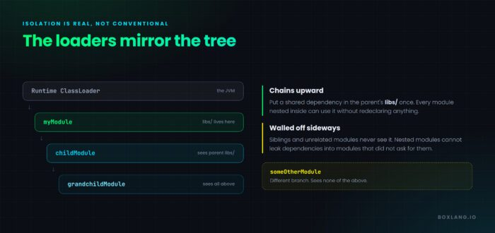
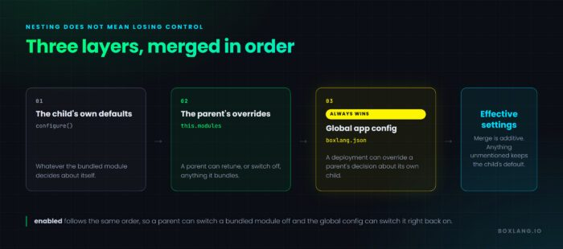

**BoxLang has always been an extensible language. As of 1.17.0, it is a hierarchically extensible one.**


Modules can now contain other modules; **aka Module Inception** . Recursively. To any depth. Each nested module gets its own class loader, chained to its parent's, and BoxLang's own `ModuleService` discovers, registers, activates, and unloads that entire tree itself. No package manager. No build tool. No install ordering. Drop in one artifact and everything it depends on comes with it, already wired up and already isolated. **Not only that, you can now package modules into a single jar.**


That is the headline, and it changes what a BoxLang module fundamentally is. A module is no longer a leaf in a flat list that something outside the language has to resolve for you. It is a tree, and the runtime owns the whole thing.

The rest of 1.17.0 is aimed squarely at the people building on top of that. `boxlang check` validates syntax without executing or compiling anything, and speaks JSON, which turns it into a correction signal for editors, CI pipelines, and AI agents alike. `bxsecret:` gets your datasource passwords out of plain-text config with a single CLI command. `include` and `xmlParse()` are hardened against whole classes of injection attack. JARs are no longer locked on Windows, so hot reload finally works the way it always should have. `writeDump()` gets real output control with `depth` and the new `maxRows`. And a background watchdog reclaims the hundreds of megabytes of parser cache that long-running servers used to accumulate and never release.

**32 issues** closed: 5 new features, 12 improvements, 15 bug fixes.

## Module Inception

Every other module ecosystem you have worked in is **flat**. You declare a list of dependencies and something outside the language, a package manager or a build tool, resolves and downloads and orders them. The language itself has no opinion about the shape of the graph.

BoxLang 1.17.0 changes that. Drop a `modules/` folder into your module, and BoxLang treats it exactly like a top-level `modulesDirectory`.



The practical outcome: **one self-contained artifact**, a single module folder or a single JAR, that brings every module it depends on along with it, fully isolated from the host application's own modules, working the moment it is dropped in.

The distinction that matters most is the one on the right of that diagram. `libs/` and `modules/` are not the same thing. A JAR in `libs/` is a **library** added to your module's classpath. A JAR in `modules/` is a **module**, with its own lifecycle, its own settings, and its own class loader.

### Load Order

Nested modules load from the inside out and unload from the outside in.



Registering or activating a parent cascades down the whole tree first, so by the time your module's `onLoad()` runs, everything it bundles is already active and usable. Unloading reverses it, because a child's class loader depends on its parent's.

### Class Loader Chaining

Isolation here is real, not conventional. The class loader hierarchy mirrors the module hierarchy: a nested module's loader is parented to **its parent module's** loader, chaining upward until a top-level module, whose loader is parented to the runtime.



Put a shared dependency in the parent's `libs/` once and every module nested inside it can use it without redeclaring anything, while remaining invisible to siblings and unrelated modules.

One implementation detail worth knowing if you are working from Java: module class loaders create a real isolation boundary, so they pass `null` as the standard `ClassLoader` parent and track the real one themselves. Walk the chain with `DynamicClassLoader.getDynamicParent()`, because the standard `getParent()` returns `null` for a module loader.

### JAR Modules

The other half of Inception is that a bare `*.jar` sitting in a `modules/` folder **is** a module. No `ModuleConfig.bx`, no `box.json`, no surrounding folder at all. Its descriptor is a Java `IModuleConfig` registered through `META-INF/services/ortus.boxlang.runtime.modules.IModuleConfig`, and its metadata comes from a `@BoxModule` annotation.

```java
@BoxModule(
    name        = "javaHelper",
    version     = "1.0.0",
    author      = "Ortus Solutions",
    description = "A module shipped as a single JAR"
)
public class JavaHelperModule implements IModuleConfig {

    @Override
    public void configure( IBoxContext context, ModuleRecord moduleRecord ) {
        moduleRecord.settings.put( Key.of( "mode" ), "fast" );
    }

}
```

Without `name`, a JAR module is named after the JAR file itself, so `javaHelper.jar` becomes `javaHelper`. Declaring `name` lets the module name stand independent of the filename, which matters when your build stamps versions into JAR names.

A JAR that exposes no `IModuleConfig` is disabled with a warning rather than failing the runtime, so a stray JAR dropped into a modules folder logs a complaint instead of breaking startup.

This is what makes bundled dependencies practical. A pure-Java library your module needs can ship as a first-class module in its own right, without a `.bx` file anywhere in sight.

### A Parent Can Override What It Bundles

Nesting a module does not mean losing control over it. A parent declares a `this.modules` struct mirroring the `boxlang.json` shape.

```java
// myModule/ModuleConfig.bx
class {

    this.version = "1.0.0"

    /**
     * Per-child overrides for the modules nested inside this one
     */
    this.modules = {
        "childModule" : {
            enabled  : true,
            settings : {
                timeout  : 60,
                endpoint : "https://internal.example.com"
            }
        }
    }

}
```

The Java equivalent, for JAR modules:

```java
@Override
public IStruct modules() {
    IStruct childSettings = new Struct();
    childSettings.put( Key.of( "timeout" ), 60 );
    childSettings.put( Key.of( "endpoint" ), "https://internal.example.com" );

    IStruct childOverrides = new Struct();
    childOverrides.put( Key.enabled, true );
    childOverrides.put( Key.settings, childSettings );

    IStruct overrides = new Struct();
    overrides.put( Key.of( "childModule" ), childOverrides );
    return overrides;
}
```

Those overrides land in the middle of a three-layer precedence chain.



The global app config is applied last and always wins, so a deployment can override anything, including a parent's decision about its own child. The merge is additive: settings the parent does not mention keep the child's own defaults.

### Walking the Tree

Nested modules live in the same flat registry as everything else, so they stay globally addressable by name and their BIFs, components, and mappings work exactly as they would at the top level. The relationship is recorded on both `ModuleRecord` objects, so either end can find the other.

|          Member           |   On   |                         Description                          |
|---------------------------|--------|--------------------------------------------------------------|
| `nestedModules`           | parent | Array of names of modules nested directly inside this one    |
| `getNestedModule( Key ) ` | parent | The record for one direct child, or `null`                   |
| `hasNestedModule( Key )`  | parent | Whether a module is a direct child of this one               |
| `parentModule`            | child  | The `Key` of the module this one is nested inside, or `null` |
| `isJarModule()`           | either | Whether this module is packaged as a single JAR              |

```java
// From a parent module's ModuleConfig.bx
var child = moduleRecord.getNestedModule( createObject( "java", "ortus.boxlang.runtime.scopes.Key" ).of( "childModule" ) )
log.info( "Child version: #child.version#" )
```

To see the hierarchy from outside any one module's own code, from a script, an admin dashboard, or a debug session, the new `getModuleTree()` BIF returns every top-level module as a struct, and every node carries a `children` struct of the modules nested inside it, recursively.

```java
tree = getModuleTree()

for ( moduleName in tree ) {
    node = tree[ moduleName ]
    writeOutput( "#moduleName# (v#node.version#)" )
    for ( childName in node.children ) {
        writeOutput( "  ↳ #childName#" )
    }
}
```

Pass a module name to get the subtree rooted at that module instead of the whole forest:

```java
subtree = getModuleTree( "myModule" )
// subtree.children holds myModule's direct nested modules, each with its own .children
```

An unregistered module name returns an empty struct rather than throwing. Note that nested modules never appear at the top level of the result, so find them under their parent's `children` entry. `getModuleList()` and `getModuleInfo()` still address every module by name in one flat collection, nested or not. `getModuleTree()` is the one that shows the shape.

### Why This Matters

Module authors no longer have to choose between one giant module that does everything and many small modules the user has to install in the right order. A module can be exactly as granular as makes sense internally while presenting as a single install to the outside world. Because the class loader isolation is real, nested modules never leak their dependencies into modules that did not ask for them.

One known limitation: shutdown ordering across unrelated modules is not dependency-aware, since `unloadAll()` visits the registry in unspecified order. Nesting order itself is handled, and a module's children always unload before it does.

Full documentation, including the shutdown-ordering caveat, is at [Module Inception](https://boxlang.ortusbooks.com/boxlang-framework/module-development/module-inception "Module Inception").

## `boxlang check`: A Syntax Checker Built for Agents

The new `check` action command parses one or more source files and reports syntax errors **without executing the code or compiling it to bytecode** . It is the BoxLang equivalent of `bash -n script.sh` or `node --check file.js.`

It works across `.bx`, `.bxs`, `.bxm`, `.cfm`, `.cfc`, and `.cfs`, and because it runs on the real BL AST and the actual ANTLR parsers, results are accurate for both BoxLang and CFML source.

```java
# One or more explicit files
boxlang check myapp.bx myComponent.cfc

# An entire directory, walked recursively
boxlang check --source ./src

# Machine-readable output
boxlang check --source ./src --format json
```

A valid file produces minimal output and exits `0`:

```html
$ boxlang check good.bxs
✅ good.bxs

───────────────────────────────
✅ 1 valid   ❌ 0 invalid   (1 files checked)
```

An invalid file reports the file, line, column, and message, and exits `1`:

```html
$ boxlang check bad.bxs
❌ bad.bxs
   bad.bxs: Line: 1 Col: 3 - Unclosed parenthesis [(] on line 1
if ( true {
   ^

───────────────────────────────
✅ 0 valid   ❌ 1 invalid   (1 files checked)
```

### The Part That Matters for AI Agents

This is where `check` earns its place in this release rather than in a tooling footnote.

An LLM writing BoxLang has no reliable way to know whether what it just produced is real syntax. It will confidently emit a construct that does not parse, because a plausible-looking token sequence and a valid one are not the same thing, and nothing in the generation process distinguishes them. Without a checker in the loop, that error surfaces at runtime: in a stack trace, possibly during a test run, possibly in production, possibly never during the agent's own working session at all.

`boxlang check --format json` closes that loop. The agent writes a file, runs the checker, and gets back a structured array of `{file, valid, issues}` records with line, column, and message per issue.

```java
[ {
  "file" : "/path/to/demo/bad.bxs",
  "valid" : false,
  "issues" : [ {
    "message" : "Unclosed parenthesis [(] on line 1\nif ( true {\n   ^",
    "line" : 1,
    "column" : 3
  } ]
}, {
  "file" : "/path/to/demo/good.bxs",
  "valid" : true,
  "issues" : [ ]
} ]
```

That is a machine-readable correction signal, which means an agent can repair its own hallucination before the code is ever executed. The loop is simple enough to wire into any harness:

* Generate the file
* Run `boxlang check --format json` against it
* Non-zero exit means parse the `issues` array, feed line, column, and message back to the model, and regenerate
* Empty `issues` means proceed to the next step

Because the check never executes the code, running it against generated output is safe by construction. There is no risk that validating a hallucinated file also runs it. And because it never compiles to bytecode, it is fast enough to run on every write without the agent's iteration loop slowing to a crawl.

The same mechanism serves three consumers at once. Humans get a pre-commit hook. CI gets a fast fail-early step before the full test suite. Agents get a correction signal. The CLI options cover all three:

* `--source [PATH]` walks a directory recursively
* `--format [text|json]` switches between human and machine output
* `-q, --quiet` suppresses per-file success output, though failures are always reported
* Exit `0` for all valid, exit `1` for any syntax error or usage error

Full reference: [BoxLang Syntax Check](https://boxlang.ortusbooks.com/getting-started/ide-tooling/boxlang-syntax-check "BoxLang Syntax Check").

## Encrypted Configuration Secrets

1.17.0 introduces first-class encryption for sensitive values inside `boxlang.json` and `Application.bx` settings. Instead of committing a plain-text datasource password, or relying entirely on environment variable substitution, you can encrypt a value once and drop the **ciphertext** straight into your config. You can find much more information here: <https://boxlang.ortusbooks.com/getting-started/ide-tooling/boxlang-generatesecret>

Generate an encrypted value with the new `generatesecret` CLI action, using the runtime's active secret seed. Every BoxLang installation has a unique random secret seed for added security and entropy:

```java
boxlang generatesecret "s3cr3tPassw0rd"
# => bxsecret:AbCdEf123...==
```

Then use it anywhere a config value is read. BoxLang decrypts it automatically at load time.

```java
{
    "datasources": {
        "myDS": {
            "driver": "mysql",
            "properties": { "host": "localhost", "database": "myapp" },
            "username": "app_user",
            "password": "bxsecret:AbCdEf123...=="
        }
    }
}
```

**It is not limited to datasources. Any config value can be encrypted, for example a third-party API key:**

```java
{
    "api": {
        "key": "bxsecret:wfYldsN1NOxSAC6k6H4RKg=="
    }
}
```

A `bxsecret`: value can also live inside a `${Setting: ... not found}` placeholder, so encryption and environment-driven overrides compose in the same config tree:

```java
"password": "${Setting: env.DB_PASSWORD:bxsecret: AbCdEf123...== not found}"
```

This is opt-in per value, not an all-or-nothing switch. Plain-text values elsewhere continue to work unchanged. Supported locations include `boxlang.json` anywhere in the tree, `Application.bx `datasource definitions and other `this.*` settings, environment variable overrides and JSON placeholders, application component attributes, and nested settings such as caches and mappings.

### The Secret Seed

Decryption uses a symmetric key, the seed. BoxLang generates a unique seed per install and persists it at `{boxlang-home}/config/.seed`.

**This file must be retained and protected.** Losing it makes every `bxsecret`: value in your config permanently undecryptable. Anyone who obtains it can decrypt them. Treat it with the same care as the secrets it protects: keep it out of source control, and back it up the way you would any other production credential.

Because the seed is generated per install, the same plaintext encrypted on two different runtimes produces two different `bxsecret`: values, and a value encrypted with one seed cannot be decrypted with another. For a cluster, share one seed across runtimes:

```java
export BOXLANG_SECURITY_SECRETSEED=my-shared-seed-value
```

```java
-Dboxlang.security.secretSeed=my-shared-seed-value
```

You can also copy the same `.seed` file to each runtime. There is a `security.secretSeed` setting in `boxlang.json`, but it is discouraged, since that setting is itself stored in plain text, which undermines the point of encrypting the rest of your config. The algorithm is controlled by `security.secretAlgorithm`, defaulting to `AES`.

The underlying placeholder resolver was improved in this same release ([BL-2648](https://ortussolutions.atlassian.net/browse/BL-2648 "BL-2648")) so both mechanisms compose cleanly. Bare environment variable names now resolve alongside the existing `env.` prefix, JVM system properties take precedence for bare names, and placeholder resolution now runs against struct **keys** in nested config, not just values.

Full reference: [Encrypted Configuration Secrets](https://boxlang.ortusbooks.com/getting-started/configuration/security "Encrypted Configuration Secrets").

## Security Hardening

Three changes make the default runtime meaningfully safer.

### `include` Is Now Enforced Relative

`include` and `bx:include` can no longer escape your application's mappings to read arbitrary files off the filesystem. Previously an absolute-looking path, whether hardcoded or built from user input, could be resolved directly against the OS filesystem.

```java
// Before 1.17.0: resolved directly against the OS filesystem
include "/etc/example.conf"

// 1.17.0: forced relative, resolved against your configured
// mappings and webroot, so it throws MissingIncludeException
// rather than reading the OS file
include "/etc/example.conf"
```

This closes a template-injection and local-file-inclusion class of bug where a dynamically built include path could reach outside the application. Ordinary relative includes such as include `"partials/header.bxm"` are completely unaffected.

### XML Security for `xmlParse()` and `xmlTransform()`

CFML compatibility mode gains explicit control over XML parsing security. External entity resolution, DOCTYPE declarations, and secure processing can now be configured globally or per call, closing off XXE-style attack vectors in code that parses untrusted XML.

Configure the defaults once, application-wide:

```java
{
    "xml": {
        "secureProcessing": true,
        "disallowDoctypeDeclaration": true,
        "allowExternalEntities": false,
        "lenientProcessing": false
    }
}
```

Or override per call by passing a struct as the `validator` argument:

```java
xmlDoc = xmlParse(
    xml = untrustedXmlString,
    validator = {
        secureProcessing           : true,
        disallowDoctypeDeclaration : true,
        allowExternalEntities      : false
    }
)
```

`validator` still accepts the original XSD path or URL string for schema validation. Passing a struct instead switches it to security-settings mode.` xmlTransform()` automatically picks up the same application-level defaults when handed a raw XML string.

## Memory and Class Loading

Two changes here address problems that only show up in long-running processes.

### No More Locked JARs

Prior to 1.17.0, a JAR loaded via `this.javaSettings.loadPaths`, or bundled with a module, stayed locked by the JVM for as long as its classloader was alive. On Windows in particular this meant you could not rebuild, replace, or delete that JAR, including as part of `reloadOnChange`, without restarting the runtime first, which defeated the entire purpose of hot reload.

As of 1.17.0, BoxLang copies each JAR to a temp file **before** loading it, so the original is never held open.

```java
bx:application
    name = "myApp"
    javaSettings = {
        loadPaths : [ "/path/to/libs/helloworld.jar" ]
    }
// The original helloworld.jar is no longer held open by the runtime
```

Copies land at `{java.io.tmpdir}/boxlang-jars/{originalFilename}-{hashOfPath}-{lastModified}.jar`, each paired with a `.origin` sidecar recording the source path, so BoxLang can validate the cached copy and avoid collisions between JARs that share a filename. Stale copies are cleaned up in three places: when a classloader closes, on runtime startup via a one-pass sweep, and when a stale classloader is garbage collected.

This is enabled by default via `jarTempFileCaching` and is what finally makes `reloadOnChange` usable on Windows. Disable it only if you have a specific reason to load JARs from their original path:

```java
"jarTempFileCaching": false
```

```java
export BOXLANG_JARTEMPFILECACHING=false
```

### Automatic Parser Cache Eviction

ANTLR, the parser generator BoxLang's compiler is built on, caches per-parser DFA state to speed up repeated parses. Those structures persist indefinitely in heap memory until the JVM restarts, and in a large long-running application can accumulate **400MB** to **1GB** of cached data that serves no ongoing purpose, creating GC pressure and, on constrained systems, a real risk of out-of-memory failures.

A background watchdog now evicts the cache automatically using three independent triggers, whichever fires first:

|    Trigger    |                                                    Condition                                                    |
|---------------|-----------------------------------------------------------------------------------------------------------------|
| Heap pressure | The DFA cache's estimated size exceeds one third of the JVM's maximum heap                                      |
| Idle          | No parsing activity for 3 minutes                                                                               |
| Max age       | The cache exceeds 100MB **and** 10 minutes have passed since the last clear, even under continuous parsing load |

This requires no tuning in the common case. The watchdog is lazy, consuming no resources in precompiled deployments that never parse, and each eviction is logged at `TRACE` for diagnostics. Clearing the cache does not change application behavior. It just means the next parse of a given template rebuilds its DFA state instead of reusing a cached one.

```java
"experimental": {
    "clearParserCache": true
}
```

```java
export BOXLANG_EXPERIMENTAL_CLEARPARSERCACHE=false
```

Two related fixes: an `Application` object memory leak where applications and their `ApplicationScope` could remain reachable and un-collectable after shutdown ([BL-2645](https://ortussolutions.atlassian.net/browse/BL-2645 "BL-2645")), and consolidation of Java interop method, constructor, and field lookups onto a single shared method-handle cache per class loader, improving consistency and reducing memory overhead ([BL-2642](https://ortussolutions.atlassian.net/browse/BL-2642 "BL-2642")).

## Taking Control of `writeDump()`

Dumping a large object has always been an all-or-nothing proposition. You call `writeDump()` on an ORM entity or a deep config struct, and the browser grinds while it renders thousands of nested rows you did not want to see. The usual workaround is to reach in and dump a sub-key instead, which means editing your debugging code to debug your code.

1.17.0 fixes that with two independent knobs, and they compose.

`depth` controls **how far down** the dump recurses. It is 1-based: `-1` is unlimited and the default, `0` shows nothing, `1` shows the top level with no recursion, `2` recurses once.

```java
// Just the top level, no recursion at all
writeDump( var = complexObject, depth = 1 )

// Top level plus two levels down
writeDump( var = complexObject, depth = 3 )
```

`maxRows` is the new one, and it controls **how wide** each level goes: the maximum number of keys, array elements, or query rows shown per level. Same 1-based semantics.

```java
// First 10 items of a 50,000 row array
writeDump( var = bigArray, maxRows = 10 )
```

The point is that these are orthogonal. Depth and breadth were previously tangled together, and now they are not, so you can slice a huge object down to exactly the shape you want to look at:

```java
// Three levels deep, five entries per level.
// A readable window into an object that would otherwise
// render tens of thousands of rows.
writeDump(
    var     = orm.getEntity( "Customer", 1 ),
    depth   = 3,
    maxRows = 5,
    label   = "Customer aggregate, trimmed"
)
```

Both arguments apply to HTML output only.

### `top` Is Deprecated

`top` is superseded by `maxRows`. It still works for backwards compatibility, and when `maxRows` is not also passed its value is used as `maxRows`, but it logs a deprecation warning when used.

```java
{
    "globalErrorTemplate": "/errors/global-error.bxm"
}
```

If you are writing new BoxLang, use `depth` and `maxRows`. Reach for `top` only where you are maintaining older code that already had it.

One behavior note while you are updating dump calls: `depth` is now 1-based to align with Lucee ([BL-1862](https://ortussolutions.atlassian.net/browse/BL-1862 "BL-1862")). If you were passing explicit depth values before upgrading, re-check them.

Full reference: [writeDump().](https://boxlang.ortusbooks.com/boxlang-language/reference/built-in-functions/system/WriteDump "writeDump().")

## Other New Features

### Global Error Template

A new `globalErrorTemplate` runtime setting points at a `.bxm `template rendered for unhandled errors, as a runtime-wide fallback distinct from a per-`Application.bx onError()` listener.

```java
{
    "globalErrorTemplate": "/errors/global-error.bxm"
}
```

Leave it empty, the default, to keep BoxLang's built-in error page.

### HTTP Request Debug Logging

Every `bx:http `request now logs its start and completion at `DEBUG` through the dedicated `http` logger category, including status code and elapsed time. No component attribute required, just raise the logger's level.

```java
{
    "logging": {
        "loggers": {
            "http": { "level": "DEBUG" }
        }
    }
}
```

```java
bx:http url="https://api.example.com/users" method="GET" result="res"
// DEBUG  Starting HTTP REQUEST ... {URL='https://api.example.com/users', method='GET'}
// DEBUG  HTTP REQUEST ... completed {Status Code=200, Time taken=142ms}
```

## Fixes

### Dump and Debugging

`dump()` now renders a `java.lang.Character `using the same compact template as a `String` rather than a generic object dump ([BL-2638](https://ortussolutions.atlassian.net/browse/BL-2638 "BL-2638")).

```java
dump( "Alice".charAt( 1 ) )
// Dumps like a one-character string, not a raw Character object
```

### File and I/O

* `BoxFile` no longer throws when opening a file directly in a Windows drive root such as `C:\file.txt`, where the parent path resolves to null ([BL-2619](https://ortussolutions.atlassian.net/browse/BL-2619 "BL-2619"))
* `fileReadBinary()` on a file path now reliably returns true binary content ([BL-2620](https://ortussolutions.atlassian.net/browse/BL-2620 "BL-2620"))
* `fileRead()` now honors `bufferSize` when called on an open `BoxFile` from `fileOpen()`, reading exactly that many bytes instead of always reading to EOF ([BL-2621](https://ortussolutions.atlassian.net/browse/BL-2621 "BL-2621"))

### CFML Compatibility and Transpiler

* Mutating CFML functions such as `arrayAppend()`, `arrayClear()`, `arrayInsertAt()`, `arrayPrepend()`, `structInsert()`, and `queryDeleteRow()` now recursively transpile their own arguments when wrapped for compatibility return semantics. Previously, some CF-only syntax could remain untranspiled inside a nested call and fail at runtime. See [BL-2635](https://ortussolutions.atlassian.net/browse/BL-2635 "BL-2635") for details.
* Accessing a query column at a row index beyond the record count now returns an empty string instead of throwing, matching Adobe and Lucee leniency ([BL-2641](https://ortussolutions.atlassian.net/browse/BL-2641 "BL-2641"))
* Member-function lookup by type now correctly matches a custom BoxLang class as the receiver type, not just built-in types ([BL-2639](https://ortussolutions.atlassian.net/browse/BL-2639 "BL-2639"))
* An Adobe-compat option permits leading zeros in JSON numeric literals such as `{ "foo": 01 }` ([BL-2622](https://ortussolutions.atlassian.net/browse/BL-2622 "BL-2622"))
* `bx-orm`'s `EntityToQuery()` now includes inherited properties from parent entities ([BL-2612](https://ortussolutions.atlassian.net/browse/BL-2612 "BL-2612"))
* Query of Queries numeric-to-string casting during string comparisons no longer fails on values with decimals ([BL-2637](https://ortussolutions.atlassian.net/browse/BL-2637 "BL-2637"))
* Fixed PDF rendering compatibility issues in the generation pipeline ([BL-2614](https://ortussolutions.atlassian.net/browse/BL-2614 "BL-2614"))

### Scheduled Tasks

* Tasks combining `every()` with `startOnTime()` or `between()` no longer fire immediately on registration, and now wait for the next valid interval boundary ([BL-2633](https://ortussolutions.atlassian.net/browse/BL-2633 "BL-2633"))
* The `Schedule` component's health-check URL no longer forces a default port, letting the URL's own scheme determine it. An explicit `port` attribute still overrides ([BL-2643](https://ortussolutions.atlassian.net/browse/BL-2643 "BL-2643"))

### Caching

`BoxCacheProvider.get()` now updates a cache entry's `hits` count and `lastAccessed` timestamp on every successful read. Previously per-entry metadata was never updated on a hit ([BL-2640](https://ortussolutions.atlassian.net/browse/BL-2640 "BL-2640")).

### Tooling

* The formatter no longer strips `@annotations` from BoxLang classes, and aligns them instead ([BL-2624](https://ortussolutions.atlassian.net/browse/BL-2624 "BL-2624"))
* The formatter no longer inserts an extra space between annotations and comments on classes ([BL-2625](https://ortussolutions.atlassian.net/browse/BL-2625 "BL-2625"))
* The `boxlang` runner's shebang-line detection no longer consumes CLI arguments it should not touch ([BL-2626](https://ortussolutions.atlassian.net/browse/BL-2626 "BL-2626"))
* The `Content` component no longer rejects an empty `variable` attribute ([BL-2630](https://ortussolutions.atlassian.net/browse/BL-2630 "BL-2630"))

## Breaking Changes

Three items to check before upgrading:

* `evaluate()` **and** `precisionEvaluate()` are no longer in the core. Install `bx-unsafe-evaluate` if your code uses them.
* `include` **is now enforced relative**. Absolute paths that previously resolved against the OS filesystem now throw. Relative includes are unaffected.
* `writeDump()`**'s** `depth` **argument is now 1-based** to match Lucee, and `top` is deprecated in favor of `maxRows`. Explicit depth values will behave differently, and `top` now logs a deprecation warning.

## Release Snapshot

* **Release Date:** August 28, 2026
* **Total Issues:** 32
* **Distribution:** 5 new features, 12 improvements, 15 bugs
* **Primary Focus:** Module Inception, syntax checking, encrypted configuration secrets, `writeDump()` output control, `include` and XML security hardening, CFML compatibility correctness

BoxLang 1.17.0 is the recommended update for module authors who want to bundle their dependency modules into a single self-contained artifact, for teams that want datasource and application secrets out of plain-text config, and for anyone running BoxLang generation through an AI agent loop.

Installation and upgrade instructions for every supported runtime are in the [BoxLang installation guide.](https://boxlang.ortusbooks.com/getting-started/installation "BoxLang installation guide.")

## Want to Go Deeper?

This release overview only scratches the surface. If you want to explore the main BoxLang 1.17.0 features in more detail, we published four dedicated deep dives on the Ortus Solutions blog:

[Part 1: Module Inception](https://www.ortussolutions.com/blog/boxlang-117-series-part1-module-inception "Part 1: Module Inception")  
[Part 2: BoxLang Check — Syntax Validation Your AI Agent Can Read](https://www.ortussolutions.com/blog/boxlang-117-series-part2-boxlang-check-syntax-validation-your-ai-agent-can-read "Part 2: BoxLang Check — Syntax Validation Your AI Agent Can Read")  
[Part 3: Encrypted Config Secrets](https://www.ortussolutions.com/blog/boxlang-117-series-part-3-encrypted-config-secrets "Part 3: Encrypted Config Secrets")  
[Part 4: writeDump() Enhanced](https://www.ortussolutions.com/blog/boxlang-117-series-part-4-writedump-enhanced "Part 4: writeDump() Enhanced")

Each article focuses on the design, implementation, and practical use cases behind one of the major additions in BoxLang 1.17.0.

## Resources

* [Full 1.17.0 changelog](https://boxlang.ortusbooks.com/readme/release-history/1.17.0 "Full 1.17.0 changelog")
* [Module Inception documentation](https://boxlang.ortusbooks.com/boxlang-framework/module-development/module-inception "Module Inception documentation")
* [BoxLang Syntax Check](https://boxlang.ortusbooks.com/getting-started/ide-tooling/boxlang-syntax-check "BoxLang Syntax Check")
* [Encrypted Configuration Secrets](https://boxlang.ortusbooks.com/getting-started/configuration/security "Encrypted Configuration Secrets")
* [writeDump() reference](https://boxlang.ortusbooks.com/boxlang-language/reference/built-in-functions/system/WriteDump "writeDump() reference")
* [Community forum](https://community.ortussolutions.com/ "Community forum")
* [BoxLang+ plans](https://boxlang.io/plans?_gl=1*17yess6*_gcl_au*MTY3OTk4MjQwNS4xNzgyMTI1MTI4Li0uLS4xNzg0NTY3NDQ1LjUxOTc1NTIyOC4xNzg4NDQxMTg2LjE3ODg0NDI3MTg.*_ga*NzIzNTM2MjY0LjE3NzYwOTE0MjI.*_ga_D1P6P1YYT0*czE3ODk2NDE1OTUkbzE1NCRnMCR0MTc4OTY0MTU5NSRqNjAkbDAkaDA.*_ga_663JFQ7YGX*czE3ODk2NDE1OTUkbzE2NSRnMCR0MTc4OTY0MTU5NSRqNjAkbDAkaDA. "BoxLang+ plans")
