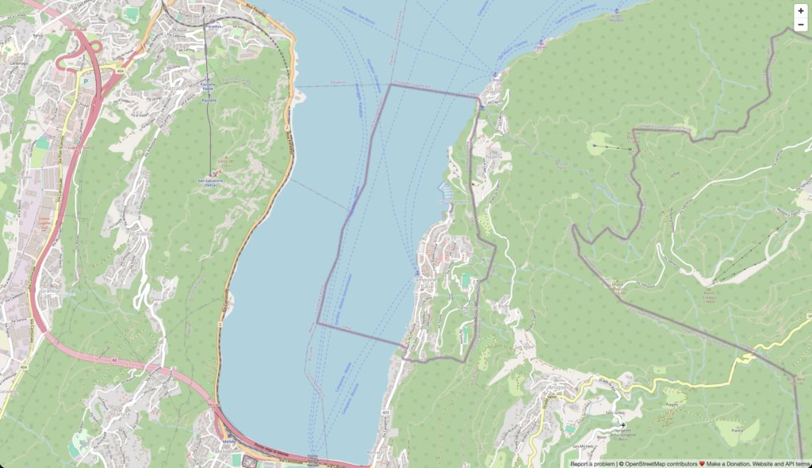

Years ago, a colleague of mine told me about two pockets of foreign land surrounded by Switzerland: [Campione d'Italia](https://osm.org/go/0Ck2o6xg-) and [Büsingen am Hochrhein](https://osm.org/go/0C1ZlDk), respectively Italy and Germany. Both are *enclaves* of their respective country in Swiss territory:
> An enclave is a part of the territory of a state that is enclosed within the territory of another state. To distinguish the parts of a state entirely enclosed in a single other state, they are called true enclaves. A true enclave cannot be reached without passing through the territory of a single other state that surrounds it.
>
> —- [Enclave and exclave](https://en.wikipedia.org/wiki/Enclave_and_exclave#True_enclaves)

Enclaves can be seen from different perspectives. From a bird's-eye view, they are fun:

If the enclave and its surrounding country are at odds (or worse), the life of its inhabitants can be hell. However, this post is about software, so let's focus on that. Imagine having to design systems for one of these two towns. Take Campione, for example. This is what you could have to deal with, depending on the domain you tackle:

|         Domain          |                                                                                                                  Quirk                                                                                                                  |                                                 Impact on systems                                                  |
|-------------------------|-----------------------------------------------------------------------------------------------------------------------------------------------------------------------------------------------------------------------------------------|--------------------------------------------------------------------------------------------------------------------|
| Taxation and customs    | Since 2020, Campione has been part of the EU customs territory, but it stays outside the EU VAT area. A local consumption tax applies instead, with Swiss VAT rates. Before 2020, the town was de facto in the Swiss customs territory. | Online shops and accounting software need one exception for customs and another for tax.                           |
| Public services         | Italian law applies, but firefighters, ambulances, and healthcare come from Switzerland. The Carabinieri, the Italian police, provide security.                                                                                         | Systems for the police, emergency services, and hospitals apply Italian law to services that Switzerland delivers. |
| Currency                | The Swiss franc is the main operating currency, though the euro is officially legal tender. Salaries are paid in Swiss francs.                                                                                                          | Payment and banking systems handle two currencies, and payroll crosses the border.                                 |
| Address and geolocation | Campione uses Swiss postal codes (CH-6911) and Swiss phone numbers (+41), except for the town hall, which has an Italian +39 number. Poste Italiane processes the mail.                                                                 | Address validation, shipping, and phone systems see a Swiss postal code and a Swiss prefix on an Italian address.  |
| Vehicle registration    | Vehicles must be registered in Italy, in Como, and carry Italian license plates. Some used to have Swiss Ticino plates, but this is no longer allowed.                                                                                  | Plate validation fails if it derives the country from the address.                                                 |
| Data privacy            | Campione falls under the GDPR and the Italian Privacy Code, but many services, such as healthcare and utilities, are Swiss. Data flows across the border.                                                                               | Any system that stores personal data falls under both Italian and Swiss privacy law.                               |
| Healthcare              | Residents can get Swiss hospital care through bilateral agreements, but insurance contracts must comply with Italian law.                                                                                                               | Health insurance systems check eligibility on the Swiss side and contracts on the Italian side.                    |
| Education               | Schools are Italian, but students may attend Swiss schools because they are closer.                                                                                                                                                     | Student and scholarship systems enroll pupils in a school across the border and follow two curricula.              |

Enclaves are an extreme case, but gotchas are common.

* [Livigno](https://en.wikipedia.org/wiki/Livigno), a few valleys east, is Italian and outside both the EU customs territory and the VAT area.
* The Canary Islands are Spanish and in the EU, but outside the VAT area. Currency, tax, customs, mail, phone, and law are separate attributes: none of them follows from a country code.

## Conclusion

Wherever you work, chances are high that you'll have to deal with this kind of thing when designing software. There are [plenty of enclaves](https://en.wikipedia.org/wiki/List_of_enclaves_and_exclaves#National_level) to start with. The real world is much more complex than we expect. Be sure to research first.

**To go further:**

* [National enclaves that are also exclaves](https://en.wikipedia.org/wiki/List_of_enclaves_and_exclaves#National_level)
* [Campione d'Italia](https://en.wikipedia.org/wiki/Campione_d'Italia)
* [Büsingen am Hochrhein](https://en.wikipedia.org/wiki/B%C3%BCsingen_am_Hochrhein)
* [Date and time gotchas](https://blog.frankel.ch/date-time-gotchas/)

*Originally published at [A Java Geek](https://blog.frankel.ch/world-geography-gotchas/) on September 13^th^, 2026.*
