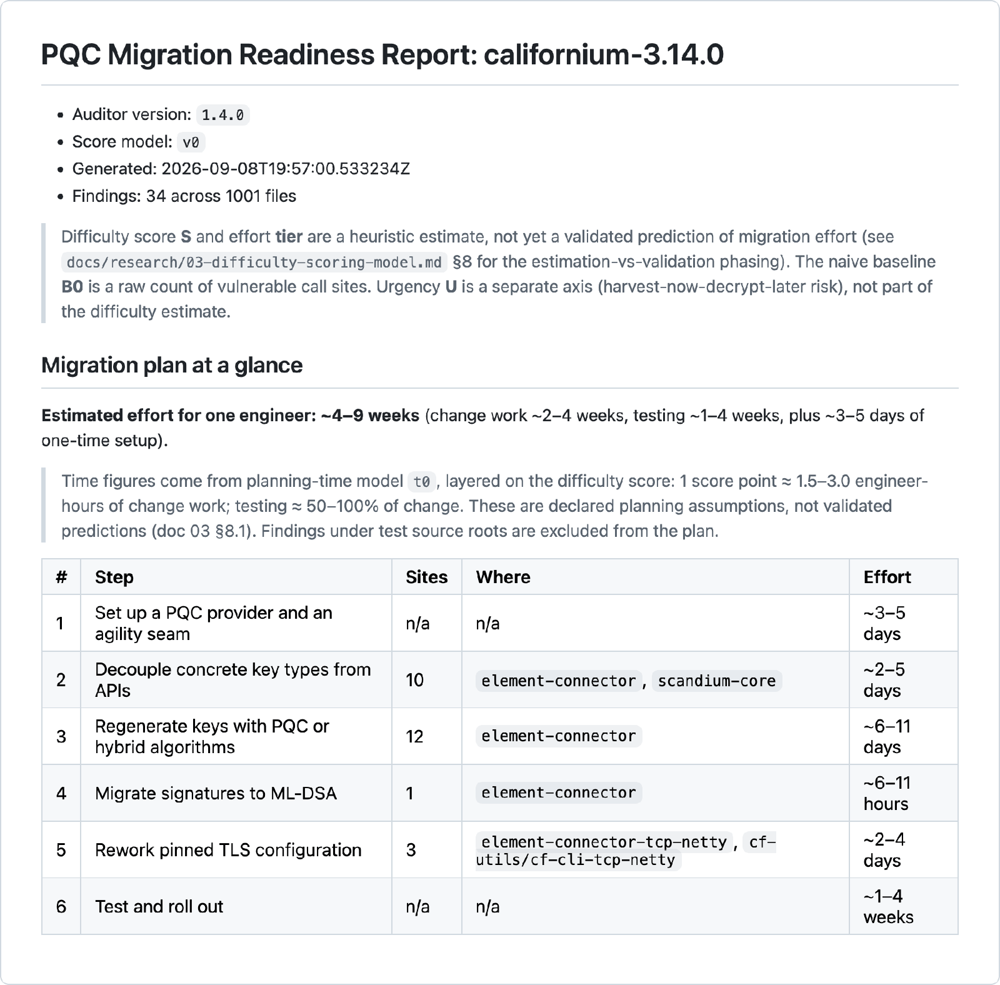

The post-quantum transition has stopped being a research topic and become a set of dates. NIST finalized ML-KEM (FIPS 203), ML-DSA (FIPS 204) and SLH-DSA (FIPS 205) in August 2024. NIST IR 8547 deprecates RSA, ECDSA, (EC)DH and the rest after 2030 and disallows them after 2035, and similar timelines are turning up in government guidance elsewhere.

So the destination is settled. For most Java teams the hard question is not *what* to migrate to. It is *how much* the migration will cost for their specific codebase, and where the expensive parts are hiding. That question has been oddly hard to answer, and most of the post-quantum migration tooling I could find targets C, C++ and Rust, even though a great deal of enterprise cryptography runs on the JVM.

I built an open-source tool to answer it for Java, and then I ran it across the ecosystem. This article is about what it found, and what it cannot see.

## From inventory to effort estimate

Existing crypto scanners tell you *what* algorithms a codebase uses. That is a necessary inventory, but it does not tell you what a migration will take. Two codebases can each make a hundred RSA calls and be a week apart in migration effort, because the cost is not in the call sites. It is in the code around them: the buffers sized to a 256-byte RSA signature, the method signatures typed to `RSAPublicKey` instead of `PublicKey`, the key stores and wire formats that assume classical sizes.

[pqc-migration-readiness](https://github.com/Arpan0995/pqc-migration-readiness) (Apache-2.0) is a static auditor that reads Java source, with no build and no classpath, and does three things:

1. **Detects** quantum-vulnerable JCA usage: `Cipher`, `KeyPairGenerator`, `KeyFactory`, `KeyAgreement` and `Signature` calls on RSA, DSA, EC and Diffie-Hellman.
2. **Scores** the difficulty using structural fragility indicators alongside the raw call sites: concrete key-type coupling, fixed-size buffers, pinned TLS versions and persisted key material. The scoring weights were fixed before any effort data was collected, which is the point of the study.
3. **Plans**: it emits an ordered migration plan for the scanned codebase, with an engineer-time range per step, plus JSON and SARIF so findings show up in GitHub code scanning.

It runs in a few seconds on a mid-sized project:

```bash
curl -L -o auditor.jar \
  https://repo1.maven.org/maven2/io/github/arpan0995/pqc-readiness-auditor/1.4.0/pqc-readiness-auditor-1.4.0-all.jar
java -jar auditor.jar /path/to/java/project --out audit-out
```

The first screen of the Markdown report it writes, here for Eclipse Californium 3.14.0, is the migration plan:



The artifacts are also on Maven Central under `io.github.arpan0995`, so you can add the libraries to a build or run the bundled Maven plugin instead of downloading the jar.

## What it found across 27 projects

I ran the auditor (version 1.4.0, on JDK 21) over the latest release of 27 widely used open-source Java projects: security and identity frameworks, web servers, HTTP clients, messaging systems and protocol libraries. Here are the top 12 by estimated one-engineer effort; the [full ranking is in the repository](https://github.com/Arpan0995/pqc-migration-readiness/blob/main/docs/ecosystem-scan.md), including the projects that come back clean.

| Project | Domain | Findings | Top tier | Est. effort |
|---|---|---:|---|---|
| Apache MINA SSHD | SSH | 337 | CRITICAL | ~5–12 months |
| jjwt | JWT / JOSE | 193 | CRITICAL | ~3–9 months |
| WildFly Elytron | Security framework | 178 | CRITICAL | ~3–9 months |
| Keycloak | Identity / SSO | 185 | HIGH | ~3–8 months |
| Apache CXF | Web services | 159 | CRITICAL | ~3–7 months |
| Spring Security | Auth framework | 251 | CRITICAL | ~8–21 weeks |
| webauthn4j | WebAuthn / FIDO2 | 125 | CRITICAL | ~7–19 weeks |
| Quarkus | App framework | 80 | MEDIUM | ~7–19 weeks |
| Netty | Network / TLS | 53 | CRITICAL | ~5–13 weeks |
| Eclipse Californium | CoAP / DTLS, IoT | 38 | HIGH | ~4–10 weeks |
| pac4j | Security engine | 63 | HIGH | ~4–9 weeks |
| Apache Tomcat | Servlet container | 14 | MEDIUM | ~4–9 weeks |

The effort column is the auditor's own range for one engineer, and its unit scales with size, so read the ordering rather than the unit. Two patterns stand out.

First, the dominant cost almost everywhere is **concrete key-type coupling**, not the algorithm calls themselves. Code written against `RSAPublicKey` or `ECPrivateKey` in method signatures, fields and casts has to be widened to `PublicKey` and `PrivateKey`, or to an opaque handle, before a post-quantum key can even flow through it. In mature libraries that API churn, not the `getInstance` swap, is the bulk of the work.

Second, a high number is usually not an indictment. jjwt shows 193 findings because it is a JOSE library: it is *supposed* to know about every key type, so the count measures the surface a new algorithm has to be threaded through, not sloppy code. At the other end, Apache Shiro and Apache PDFBox come back clean, because they leave asymmetric crypto to the JDK, Bouncy Castle and their integrations. A Shiro committer [confirmed exactly that](https://github.com/apache/shiro/discussions/2886) when I posted the result.

## Where the estimate is honest about itself

A tool like this is only useful if it tells you what it is not measuring. Three limits matter when you read the table.

**The effort figures are a heuristic, not a validated prediction.** They scale with the difficulty score through a declared planning-time model. Turning them into validated predictions, by correlating the score against measured migration effort, is the open research question, and it is the reason the whole thing is public.

**Algorithms chosen through configuration or a wrapper API are invisible.** The scan reads source, not runtime wiring. A project that picks its algorithm from a properties file, or behind a framework abstraction, will look lighter than it really is. When I posted the Quarkus scan, a Quarkus maintainer [pointed out](https://github.com/quarkusio/quarkus/discussions/56506) that the real work also lives in Vert.x, Netty and Elytron call sites the source scan never sees. That is the correct critique, and it is why the number is a floor.

**Algorithm names routed through a registry or enum are missed.** jjwt is the sharp example: the auditor reports zero *call sites* for it, because its signing flows through an algorithm registry rather than literal `getInstance("SHA256withRSA")` calls, even though it uses RSA and ECDSA throughout. The 193 findings are all the structural coupling; the call sites are hidden. Teaching the scanner to follow registries is a [tracked issue](https://github.com/Arpan0995/pqc-migration-readiness/issues/5).

None of that makes the ranking useless. It makes it a lower bound with a known shape, which is a far more honest starting point than a single confident number.

## Run it on your own code

The fastest way to try it is a GitHub Codespace: open the repository, and the dev container builds the auditor and checks out a sample project. Then run the scan on the bundled study or your own tree:

```bash
./scan.sh /path/to/your/project
```

For CI, upload the SARIF report and the findings appear as code-scanning alerts on pull requests.

## Help validate it

The most useful response is to disagree with it in public. If you run it on a codebase you know and the ranking does not match reality, that is exactly the signal the project needs, and there is a [discussion thread](https://github.com/Arpan0995/pqc-migration-readiness/discussions/16) for scan results. If you have already migrated a Java system to hybrid or post-quantum algorithms, the commit history of that work is real effort data, which is what turns the heuristic into something measured.

The deadlines are fixed and the destination is known. Every Java team still needs a credible per-codebase estimate of the migration effort ahead, backed by data rather than a gut feeling. That is the gap this is trying to close, and it will close faster with more eyes on it.

---

If you found PQC Migration Readiness interesting, a star on the repository helps others working on Java PQC migration find it ⭐ https://github.com/Arpan0995/pqc-migration-readiness
