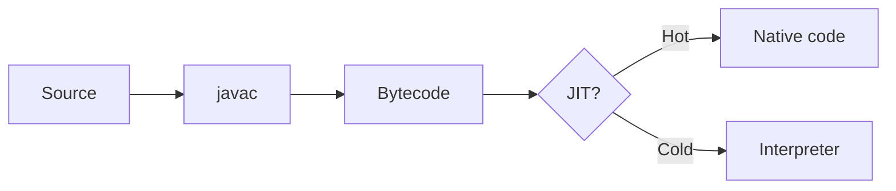
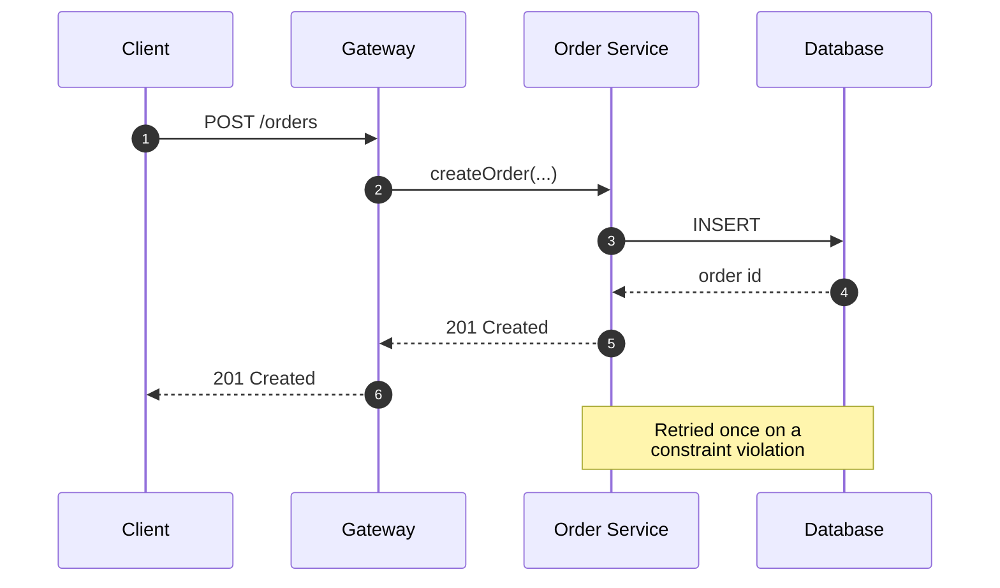
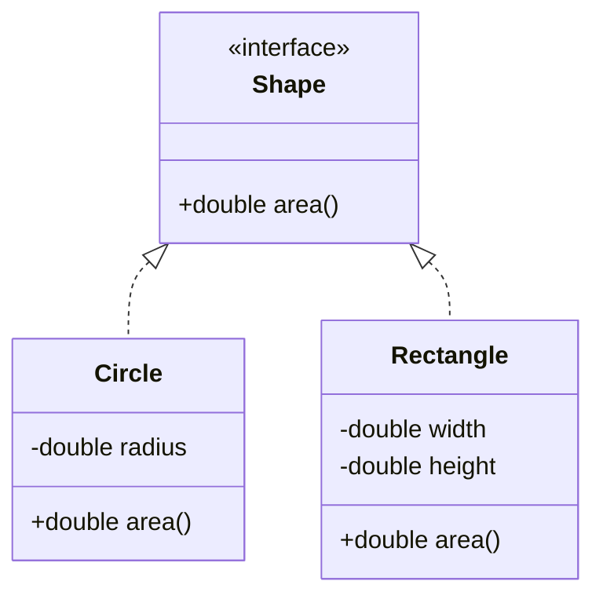
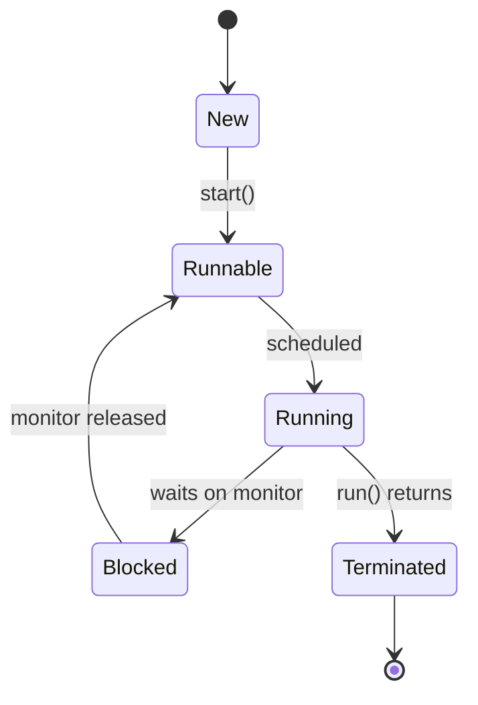
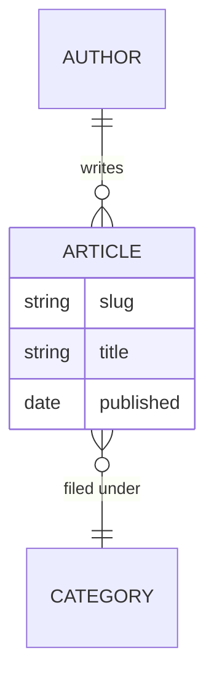
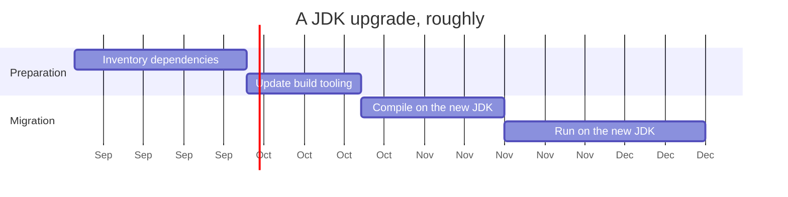

Some things are much easier to show than to describe. A request travelling
through three services, a class hierarchy, the states a connection moves
through: a paragraph explaining it takes real effort to write and still leaves
the reader assembling the picture themselves.

The usual answer is to open a drawing tool, export a PNG, and drop it in the
article folder. That works, and it is what most Foojay articles have done so
far. It also means the diagram is now a binary file that nobody can review,
nobody can correct a typo in, and nobody can update without finding the original
file again — assuming they still have it.

So Foojay articles now support [Mermaid](https://mermaid.js.org/): you write a
diagram as a fenced code block, and it renders as an actual diagram.

## The short version

Put your diagram in a `mermaid` code block:

````

```` 

and the article shows this:


There is no frontmatter flag to set and nothing to enable. If your article
contains a `mermaid` block you get diagrams; if it doesn't, nothing extra is
loaded.

## A few examples

Mermaid covers a lot of diagram types. These are the ones that come up most in
the kind of articles Foojay publishes. Check the source of this article for the code blocks that produced them. 

// TODO add link to GitHub repo once this article is merged.

### Sequence diagrams

Probably the most useful of the lot for anything involving more than one
process — and the most tedious to draw by hand, because every change moves
every arrow below it.



### Class diagrams

Useful for explaining an API shape or a small hierarchy without pasting five
files of source.



Note that an interface is a `class` carrying an `<<interface>>` annotation —
there is no `interface` keyword, which is an easy thing to trip over coming from
Java.

### State diagrams

For anything with a lifecycle — a connection, a session, a virtual thread, a
build.



### Entity-relationship diagrams



### Gantt charts

Handy for a release timeline or a migration plan.



## Why this is worth using

**A diagram in a code block is reviewable.** Foojay articles arrive as pull
requests. A PNG shows up in a diff as "binary file changed"; a Mermaid diagram
shows up as the lines you altered. A reviewer can spot that an arrow points the
wrong way, and you can fix it by editing one line rather than reopening a
drawing tool.

**It stays correct.** When the thing you described changes, you edit two words
instead of recreating an image. The diagrams that go stale are the ones that are
expensive to update.

**It reads well in both themes.** Diagrams follow the site's light and dark
theme, and re-draw when a reader switches. An exported PNG has one background
colour for ever, which is why a lot of diagrams on the web are a white rectangle
in the middle of a dark page.

**It stays sharp.** It is an SVG, so it scales to whatever screen the reader
brought.

**It is the same syntax you already use.** GitHub and GitLab render `mermaid`
blocks in issues, pull requests and READMEs. A diagram from your project's
README can be pasted into an article unchanged.

## Things to know

- **Check your syntax** in the [Mermaid live editor](https://mermaid.live/)
  before submitting. If a diagram doesn't parse, that one diagram is replaced by
  an error message in the rendered article — the rest of the page is fine, but
  the diagram isn't.
- **Don't hard-code colours.** Mermaid supports styling directives, but a colour
  chosen for a light background tends to disappear on a dark one. The default
  theming already follows the reader's choice.
- **Keep them small.** A diagram with forty nodes is unreadable on a phone.
  Several small diagrams beat one enormous one.
- **Diagrams are not a substitute for alt text.** If a diagram carries something
  essential, say it in the surrounding prose too — that serves screen-reader
  users, and it also serves the reader skimming on a train.
  Three things worth knowing:
- **Nothing to switch on.** No frontmatter flag — write the fence and you get a
  diagram. Pages without one don't load the diagram library at all.
- **Diagrams follow the reader's theme**, light or dark, and re-draw when the
  reader flips it. Don't hard-code colours.
- **If the syntax doesn't parse**, that one diagram shows an error message in

  place and the rest of the article is unaffected. Check your diagram in the
  [live editor](https://mermaid.live/) if you're unsure.

Images are of course still fine, and still the right answer for screenshots,
photos and anything hand-drawn. But if you have been describing a flow in three
paragraphs because drawing it was too much hassle, it isn't any more.

## Writing for Foojay

Foojay runs on contributions, and everything here — this feature included — is
in the open. `../../template/post.md` in the
[repository](https://github.com/foojayio/website) documents every formatting
feature available to an author, Mermaid included, and
[How to submit your next article](/today/how-to-submit-your-next-article-on-foojay-io/)
walks through the whole process.

If you spot something missing, open an issue or a pull request. That is how this
one arrived.
