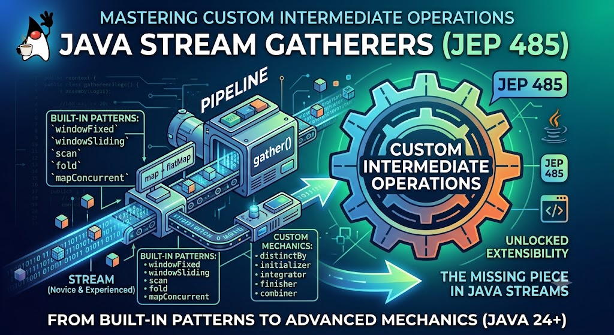
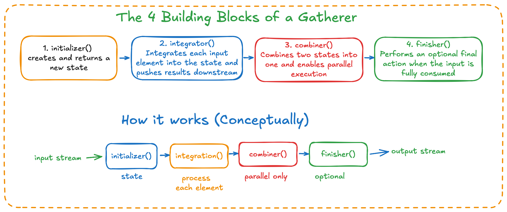

# Java Stream Gatherers: From Built-in Patterns to Custom Pipeline Mechanics

## Table of Contents

* [1. Introduction & Context](#1-introduction--context)
  * [1.1 The Evolution of Streams](#11-the-evolution-of-streams)
  * [1.2 The "Collector Problem"](#12-the-collector-problem)
  * [1.3 What are Stream Gatherers?](#13-what-are-stream-gatherers)
* [2. Getting Started: Built-In Gatherers in Action](#2-getting-started-built-in-gatherers-in-action)
  * [2.1 Understanding Stream Cardinality](#21-understanding-stream-cardinality)
  * [2.2 The Five Ready-to-Use Gatherers](#22-the-five-ready-to-use-gatherers)
    * [2.2.1 Batching Items with `windowFixed`](#221-batching-items-with-windowfixed)
    * [2.2.2 Analyzing Sequences with `windowSliding`](#222-analyzing-sequences-with-windowsliding)
    * [2.2.3 Accumulating Values with `scan`](#223-accumulating-values-with-scan)
    * [2.2.4 Intermediate Aggregations with `fold`](#224-intermediate-aggregations-with-fold)
    * [2.2.5 Bounded Parallelism with `mapConcurrent`](#225-bounded-parallelism-with-mapconcurrent)
* [3. Leveling Up: From Using Gatherers to Authoring Your Own](#3-leveling-up-from-using-gatherers-to-authoring-your-own)
  * [3.1 When Should You Write a Custom Gatherer?](#31-when-should-you-write-a-custom-gatherer)
  * [3.2 Pipeline Composition with `andThen()`](#32-pipeline-composition-with-andthen)
* [4. Under the Hood: Architecture & Anatomy of Custom Gatherers](#4-under-the-hood-architecture--anatomy-of-custom-gatherers)
  * [4.1 Anatomy of a `Gatherer<T, A, R>`](#41-anatomy-of-a-gatherert-a-r)
  * [4.2 The Four Building Blocks (`initializer`, `integrator`, `combiner`, `finisher`)](#42-the-four-building-blocks-initializer-integrator-combiner-finisher)
  * [4.3 Concrete Walkthrough: Building a Custom Gatherer](#43-concrete-walkthrough-building-a-custom-gatherer)
* [5. Production-Ready Gatherers: Parallelism, State, and Pitfalls](#5-production-ready-gatherers-parallelism-state-and-pitfalls)
  * [5.1 Parallel Execution Modes & Combiners](#51-parallel-execution-modes--combiners)
  * [5.2 Greedy vs. Short-Circuiting Integrators](#52-greedy-vs-short-circuiting-integrators)
  * [5.3 State Management & Thread Safety](#53-state-management--thread-safety)
  * [5.4 Gatherer vs. Collector: A Quick Comparison](#54-gatherer-vs-collector-a-quick-comparison)
* [6. Conclusion](#6-conclusion)
* [References](#references)

---



### 1. Introduction & Context
#### 1.1 The Evolution of Streams

In my previous article, I have already covered the evolution of the [Streams API](https://foojay.io/today/java-demystifying-the-stream-api-part-3/) 

In this article, we will delve into Java's Streams Gatherers feature, elucidating its benefits to developers. This feature facilitates the creation of custom operations and enables
data transformation concurrently with built-in operations such as `map`, `filter`, and `reduce`

#### 1.2 The "Collector Problem"

As a Java developer, we often encounter challenges when dealing with intricate nested-collectors and multi-step operations. Writing such code can result in verbose and complex code.
To address this issue, we can leverage the new capability of creating custom intermediate operations.

#### 1.3 What are Stream Gatherers?
**Stream Gatherers** is a novel capability introduced **[JEP 461 - Streams Gatherers](https://openjdk.org/jeps/461)** as a preview feature and finalized in JDK 24 via **[JEP 485](https://openjdk.org/jeps/485). It enables the creation of custom intermediate operations,
providing flexibility in transforming data within stream pipelines in ways that are not readily achievable through existing built-in intermediate operations.

### 2. Getting Started: Built-In Gatherers in Action
#### 2.1 Understanding Stream Cardinality
Prior to the introduction of Java Stream Gatherers, every intermediate operation within the Stream API was governed by stringent "cardinality rules," which defined the mathematical relationship
between the number of elements entering an operation and the number of elements exiting it.

To elucidate the transformative impact of Stream Gatherers, let us examine how standard intermediate operations manage cardinality:

- **1 to 1 (`map`)**: Each input element undergoes a transformation resulting in precisely one output element.
  - _Example_: Converting a stream of strings to lowercase or uppercase, along with their respective lengths `stream.map(String::length)` or `stream.map(String::toUpperCase)`
- **1 to 0 or 1 (`filter`)**: Each input element yields at most one output element (either it passes through or is discarded)
  - _Example_: Retaining only even numbers `stream.filter(n -> n % 2 == 0)`
- **1 to Many (`flatMap`)**: Each input element can generate zero, one, or multiple output elements, which are subsequently flattened into a continuous stream.
   - _Example_:  Splitting a stream of sentences into individual words (`stream.flatMap(sentence -> Arrays.stream(sentence.split(" ")))`).

While most of the built-in intermediate operations cover a predominantly majority of day-to-day data transformations, they come with a significant limitation: they are stateless and operate independently on each element. When our business logic requires many-to-many relationships or stateful grouping across multiple elements, such as:

- Grouping items into fixed-size batches of 10 for bulk database inserts
- Calculating a sliding window moving average of financial stock prices
- Comparing an element to its predecessor or successor
- Running a cumulative sum or rolling balance

Most developers resort to using Nested Collectors, Map, Transform, or Overusing Collectors, which leads to code verbosity.

Stream gatherers bridge this exact gap, enabling intermediate operations to maintain private state, buffer elements, and emit custom chunks of data down the pipeline—all while maintaining clean, lazy, and functionally pure streams.

#### 2.2 The Five Ready-to-Use Gatherers
`java.util.stream.Gatherers` is a factory class introduced to provide standard, built-in implementations of custom intermediate operations for the **Java Stream API**.

Recently, I explored **Virtual Threads** by utilizing the endpoint of [**HackerNews**](https://hacker-news.firebaseio.com/v0/topstories.json) to retrieve the top stories. During this exploration, I attempted to implemented the built-in Gatherers methods.
 
##### 2.2.1 Batching Items with `windowFixed`
`Gatherers.windowFixed(size)`: Splits incoming stream elements into non-overlapping lists (batches) of a specified maximum size. The final batch may contain fewer elements if the stream size is not evenly divisible.

**Use-cases:** Simulating HackerNews top story Ids or batching items for bulk database inserts, pagination chunks, or batch fetching API requests.

```java
// Simulating Hacker News top story IDs
List<Integer> storyIds = List.of(50028275, 50029123, 50019911, 50022292, 49997481, 49981264, 50023450);

// Group into fixed windows of 3
List<List<Integer>> batches = storyIds.stream()
    .gather(Gatherers.windowFixed(3))
    .toList();

batches.forEach(batch -> IO.println("Batch: " + batch));
// Output:
// Batch: [50028275, 50029123, 50019911]
// Batch: [50022292, 49997481, 49981264]
// Batch: [50023450]
```

##### 2.2.2 Analyzing Sequences with `windowSliding`
`Gatherers.windowSliding(size)`: Generates sliding windows of a predetermined size. Unlike `windowFixed`, these windows overlap, incrementally shifting forward by one element at a time.

**Use-cases:**: Utilizing sliding windows of adjacent story IDs to monitor submission velocity or identify sequential ordering discrepancies in real-time.

```java
List<Integer> storyIds = List.of(50028275, 50029123, 50019911, 50022292, 49997481, 49981264, 50023450);

// Examine sliding windows of 3 consecutive story IDs
storyIds.stream()
    .limit(10)
    .gather(Gatherers.windowSliding(3))
    .forEach(window -> IO.println("Sliding ID Window: " + window));

// Output:
Sliding ID Window: [50028275, 50029123, 50019911]
Sliding ID Window: [50029123, 50019911, 50022292]
Sliding ID Window: [50019911, 50022292, 49997481]
Sliding ID Window: [50022292, 49997481, 49981264]
Sliding ID Window: [49997481, 49981264, 50023450]
```

##### 2.2.3 Accumulating Values with `scan`
`Gatherers.scan(initial, function)`: It keeps adding up the numbers as it goes, like a running total, and then sends out **each step along the way**.

**Use-cases:**: Maintaining a running total or cumulative sum of ID values as a lightweight metrics tracker throughout the pipeline.

```java
List<Integer> transactions = List.of(100, 250, -50, 100);

// Calculate running account balance starting at 0
List<Integer> balanceHistory = transactions.stream()
    .gather(Gatherers.scan(() -> 0, Integer::sum))
    .toList();

IO.println(balanceHistory); 
// Output: [100, 350, 300, 400]
```

##### 2.2.4 Intermediate Aggregations with `fold`

`Gatherers.fold(initial, folder)` : Like a terminal `reduce`, but acts as an intermediate operation. It folds all elements into a single result and emits only that final value downstream. It executes strictly sequentially.

**Use-cases:**: Let’s put together a neat summary string by combining the top five story IDs right in the middle of the pipeline, so we can keep things organized as we move forward.

```java
List<Integer> storyIds = List.of(50028275, 50029123, 50019911, 50022292, 49997481, 49981264, 50023450);

// Fold top 5 IDs into a single comma-separated tracking string
String summaryPayload = storyIds.stream()
    .limit(5)
    .gather(Gatherers.fold(
        () -> "Top Stories Snapshot: ",
        (accumulator, id) -> accumulator + "[" + id + "] "
    ))
    .findFirst()
    .orElse("");

IO.println(summaryPayload);
// OUTPUT: Top Stories Snapshot: [50028275] [50029123] [50019911] [50022292] [49997481]
```

##### 2.2.5 Bounded Parallelism with `mapConcurrent`

`Gatherers.mapConcurrent(maxConcurrency, mapper)`: This method applies a mapping function to each stream element concurrently using **Virtual Threads (from Project Loom)**, constrained by a maximum concurrency limit while maintaining the order of encounters.

**Use-cases:**:Concurrently retrieving individual story details from [https://hacker-news.firebaseio.com/v0/item/](https://hacker-news.firebaseio.com/v0/item/){id}.json using Virtual Threads with a bounded concurrency limit while preserving the order of retrieval.

```java
import java.util.List;
import java.util.stream.Gatherers;

public class MapConcurrentDemo {

    public static void main(String[] args) {
        // A small list of Hacker News story IDs
        List<Integer> storyIds = List.of(39121, 39122, 39123, 39124, 39125);

        // Fetch titles concurrently with a max concurrency limit of 3 virtual threads
        List<String> titles = storyIds.stream()
            .gather(Gatherers.mapConcurrent(3, id -> fetchStoryTitle(id)))
            .toList();

        titles.forEach(System.out::println);
    }

    // Simulated API call method
    private static String fetchStoryTitle(int id) {
        try {
            // Simulate network latency (e.g., calling Hacker News API)
            Thread.sleep(500); 
        } catch (InterruptedException e) {
            Thread.currentThread().interrupt();
        }
        return "Story #" + id + " (Fetched on thread: " + Thread.currentThread().getName() + ")";
    }
}
```
- **Bounded Concurrency (3)**: Even if your stream contains thousands of elements, it will only execute up to three tasks simultaneously, thereby preventing downstream services or APIs from being overwhelmed by excessive load.
- **Virtual Threads Under the Hood**: It leverages `Project Loom’s lightweight virtual threads`, ensuring that blocking network calls don’t hinder the execution of critical platform or operating system threads.
- **Order Preservation**: Despite concurrent task execution, `mapConcurrent` ensures that the output list (titles) maintains the exact order of the input storyIds.


### 3. Leveling Up: From Using Gatherers to Authoring Your Own
#### 3.1 When Should You Write a Custom Gatherer?
Custom gatherers can be implemented in the following scenarios:

- When additional control is required beyond the built-in operations (`map`, `filter`, `collect`).
- For advanced transformations such as windowing, scanning, deduplication, etc.
- For performance-optimized and reusable streams processing logic.
  
#### 3.2 Pipeline Composition with `andThen()`

Gatherers support composition through the `andThen(Gatherer)` method, which combines two gatherers where the first produces elements that the second can consume. This enables the creation of complex gatherers by composing simpler ones, akin to function composition.

Semantically, `source.gather(one).gather(two).gather(three).collect(…)` is equivalent to `source.gather(one.andThen(two).andThen(three)).collect(…)`

### 4. Under the Hood: Architecture & Anatomy of Custom Gatherers
#### 4.1 Anatomy of a `Gatherer<T, A, R>`
A Gatherer is an interface that comprises three parameters:

- **T**: Input type elements
- **A**: The potentially mutable state type of the gatherer collection
- **R**: The type of output elements produced by the gatherer operation
  
#### 4.2 The Four Building Blocks (`initializer`, `integrator`, `combiner`, `finisher`,)
The Gatherer is composed of four building blocks:



- **initializer()**: This block creates and returns a new state.
- **integrator()**: This block integrates each input element into the state and pushes the results downstream.
- **combiner()**: This block combines two states into one.
- **finisher()**: This block performs an optional final action once the input is fully consumed.
#### 4.3 Concrete Walkthrough: Building a Custom Gatherer
Envision you are retrieving a continuous stream of narratives from the **Hacker News API**. However, due to frequent updates or pinning, duplicate stories (or stories authored by the same individual or originating from the same domain) recur repeatedly. Your objective is to implement a custom intermediate operation that dynamically filters elements based on a unique key extractor, thereby preserving the stream’s lazy evaluation and avoiding the reliance on external collections.

**Step 1: Define the Data Model**

Let’s imagine our Hacker News story model is a straightforward Java record like this:

```java
public record HackerNewsStory(int id, String title, String author) {}
```
**Step 2: Constructing the Custom Gatherer**
When constructing a custom gatherer utilizing the factory methods, you interact with up to four functional building blocks. The **integrator is universally mandatory;** however, the API provides default values for the other functions, which are only necessary when your gatherer’s specific behavior necessitates their inclusion.
- **Initializer (Supplier<A>)**: This part is responsible for setting up the internal state buffer, which is a HashSet that keeps track of all the keys we’ve already seen.
- **Integrator (Integrator<A, R, T>)**: This component takes each element and checks it against the current state. If it’s new, it pushes it along the stream and tells us to keep going.
- **Combiner (BinaryOperator<A>)**: If the stream is being evaluated in parallel, this part will merge the state sets together.
- **Finisher (BiConsumer<A, Downstream<R>>)**: This is an optional step. It’s there if you want to clear out any extra elements that were buffered up when the stream finished.

```java
import java.util.HashSet;
import java.util.function.Function;
import java.util.stream.Gatherer;

public class HackerNewsGatherers {

    public static <T, K> Gatherer<T, ?, T> distinctBy(Function<? super T, ? extends K> keyExtractor) {
        return Gatherer.ofSequential(
            // 1. Initializer: Creates a private state set
            HashSet::new,
            
            // 2. Integrator: Evaluates each incoming element sequentially
            (state, element, downstream) -> {
                K key = keyExtractor.apply(element);
                if (state.add(key)) {
                    downstream.push(element);
                }
                return true; // Keep consuming upstream elements
            }
        );
    }
}
```
**Step 3: Integrating the Custom DistinctBy Gatherer into a Stream Pipeline**
Now, we can easily add our custom distinctBy gatherer to a stream pipeline to filter stories based on a particular attribute, like removing duplicate submissions from the same author.

```java
import java.util.List;

public class Main {
    public static void main(String[] args) {
        List<HackerNewsStory> fetchedStories = List.of(
            new HackerNewsStory(1, "Java 27 Released", "mahi"),
            new HackerNewsStory(2, "Understanding Virtual Threads", "apj"),
            new HackerNewsStory(3, "Deep Dive into JEP 485", "mahi"), // Duplicate author
            new HackerNewsStory(4, "Building Modern CLI Apps", "kate")
        );

        // Apply our custom distinctBy gatherer
        List<HackerNewsStory> uniqueAuthorStories = fetchedStories.stream()
            .gather(HackerNewsGatherers.distinctBy(HackerNewsStory::author))
            .toList();

        uniqueAuthorStories.forEach(story -> 
            IO.println("Author: " + story.author() + " -> Title: " + story.title())
        );
        
        // Output:
        // Author: mahi -> Title: Java 27 Released
        // Author: apj -> Title: Understanding Virtual Threads
        // Author: kate -> Title: Building Modern CLI Apps
    }
}
```

### 5. Production-Ready Gatherers: Parallelism, State, and Pitfalls
#### 5.1 Parallel Execution Modes & Combiners
* **The Issue**: When you run a parallelStream(), the stream runtime divides the data among several worker threads, processes each piece separately, and then uses the combiner() function to combine their intermediate state objects (A).
* **The Pitfall**: If your custom gatherer doesn’t have a combiner() (or defaults to a state that can’t be combined), parallel streams might not work as expected, or they could silently degrade by reverting to sequential evaluation.
* **Pro Tip**: Make sure you have a strong combiner in place (like (s1, s2) -> { s1.addAll(s2); return s1; }) unless your gatherer is designed to run in a single thread or doesn’t need to manage state.
#### 5.2 Greedy vs. Short-Circuiting Integrators
* **The Mechanics**: Think of an integrator as a switch that tells you whether to keep going or stop. It’s either true (keep consuming) or false (short-circuit and stop).
* **The Performance Win**: Checking this switch on every single element can add a tiny bit of extra work. If your custom gatherer processes every element completely (like mapConcurrent or windowFixed), you can use Integrator.ofGreedy(…).
* **Pro Tip**: Using ofGreedy tells the JVM runtime that you don’t need to check for short-circuiting, which can help the pipeline run faster.
#### 5.3 State Management & Thread Safety
* **The Principle**: The state type A, created by the initializer() supplier, is made for each thread or segment that processes the stream.
* **The Pitfall**: Don’t ever use external, shared mutable collections or static variables inside your integrator. Doing so can cause hidden race conditions when the threads are running at the same time.
* **Pro Tip**: Keep your state only inside the lambda body or factory scope to keep things pure and safe for threads.
#### 5.4 Gatherer vs. Collector: A Quick Comparison
| Feature | Stream Gatherer (`Gatherer<T, A, R>`) | Stream Collector (`Collector<T, A, R>`) |
| :--- | :--- | :--- |
| **Pipeline Position** | **Intermediate Operation** (`.gather(...)`) | **Terminal Operation** (`.collect(...)`) |
| **Processing Semantics** | **Push-based** (emits items downstream dynamically) | **Pull/Accumulation-based** (folds stream into a container) |
| **Return Type** | Returns a new **`Stream<R>`**, allowing further chaining | Returns a **final result** (e.g., `List`, `Map`, `Long`) |
| **Composability** | Highly composable via `.andThen()` | Standalone terminal endpoint |

### 6. Conclusion

Since the introduction of the Streams API in Java 8, many Java developers encountered architectural limitations with intermediate operations. However, terminal operations are extensible through the Collector. With the advent of Stream Gatherers, these limitations are addressed, enabling developers to create custom intermediate operations.

In essence, **Stream Gatherers** not only enhance convenience but also fulfill the functional vision of the Java Stream API, making it fully extensible from inception to completion.

#### References
- https://openjdk.org/jeps/461
- https://openjdk.org/jeps/485
- https://docs.oracle.com/en/java/javase/25/docs/api/java.base/java/util/stream/Gatherer.html
- https://docs.oracle.com/en/java/javase/25/core/stream-gatherers.html#GUID-FE89C89E-38F4-49A0-8663-3EEC1BB9DAA0
