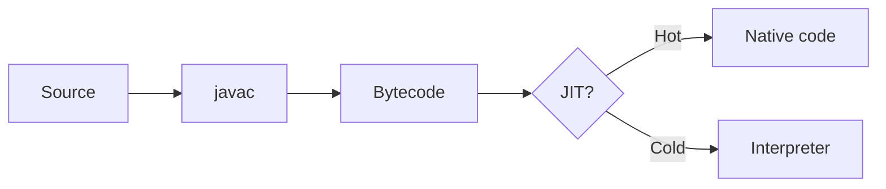

---
# ============================================================================
#  New foojay.io article — starter template
# ----------------------------------------------------------------------------
#  HOW TO USE
#   1. Copy this file to  draft/<your-article-slug>/index.md
#      (yes, it gets renamed to index.md — the FOLDER name is the URL slug)
#      Name the folder with the URL slug you want, e.g. draft/my-great-article/.
#      That folder name becomes the URL: /today/my-great-article/  (no `slug`
#      frontmatter needed — the folder name is the slug). A maintainer moves it
#      into content/posts/<year>/<month>/<day>/ when it is published, so you
#      never have to pick that path yourself. See draft/README.md.
#   2. Fill in the frontmatter below, write the article, and drop any images
#      into the SAME folder next to this file.
#   3. See `categories.md` (next to this file) for the list of existing
#      categories. Don't copy it into your own folder — it's just a reference.
#      `README.md` there lists every starter template.
# ============================================================================

# Article title. Rendered as the page H1 — do NOT repeat it as a "# " heading in
# the content (start your sections at "## "). 
# Required.
title: "Your Article Title Here"

# Publish date, as a plain day: YYYY-MM-DD.
#
# LEAVE THIS AS IT IS unless you want your article out on a particular day. A
# maintainer sets it when the article is published, and moves your folder into
# content/posts/<year>/<month>/<day>/ to match, so you never have to pick either.
#
# DON'T ADD A TIME. Foojay is a static site: it only exists after a build, and
# there is one scheduled build a day, at 07:00 UTC. That is when articles go
# out, and a time here cannot make it earlier. It can make it LATER -- a post
# dated 09:00 is still in the future when the 07:00 build runs, so it misses
# that morning and turns up whenever the site next happens to be rebuilt, which
# might be the following day. The PR check rejects a time on a future date for
# exactly that reason.
#
# A date in the FUTURE schedules the article: it is not published and not 
# searchable until that morning. Until then, it appears in
# "Coming soon" on the home page, by title, date and author.
date: "2026-01-01"

# Optional: last-updated date, if you revise the article later.
# lastmod: "2026-01-02"

# One or two sentences (keep it below 160 characters). 
# Shown on cards/listings and used for SEO and social previews. 
# Required.
description: "A short, one- or two-sentence summary of the article."

# Author slug(s): the FOLDER name of your author profile in content/authors/
# (e.g. content/authors/jane-doe/  ->  "jane-doe"). One or more.
# Every post needs at least one author. If you don't have a profile
# yet, copy template/author.md to that folder and include it in the same PR.
# Required.
authors:
  - "your-author-slug"

# Preview / hero image. Put the file in THIS folder and reference it by name.
# Required as it is used in the preview card of your post and when sharing your post on social media.
image: ""

# Categories (see categories.md for the existing list — prefer existing ones). 
# Required.
categories:
  - "Java"

# Slugs (folder names) of related foojay articles to show at the bottom. 
# Optional.
related_posts: []

# Advanced / Optional:
# slug: "override-url-slug"   # only to make the URL differ from the folder name
# canonical: "https://example.com/original/"  # only if first published elsewhere
---

<!--
  Write your article below in Markdown.

  IMPORTANT: do NOT use a top-level "# Heading" — the `title` above is already the
  page's H1. Start your section headings at "## " (H2) and go deeper with "###".

  This block is an HTML comment and won't be published; delete it (and everything
  below that you don't need) once you get going.
-->

## Use Headings

Write normal paragraphs. Inline formatting: **bold**, *italic*, `inline code`,
and [a link](https://foojay.io/). Links to other sites automatically open in a
new tab; links to other foojay pages stay in the same tab.

Make the link TEXT say where the link goes: "see the [Hugo documentation](https://gohugo.io/documentation/)",
not "see the documentation [here](https://gohugo.io/documentation/)". A screen
reader can list every link on a page on its own, out of the sentences around
them, so a page of "here", "this" and "read more" is a list of destinations
nobody can tell apart — and it reads better for anyone skimming, too.

## Extra Formatting Options

### Lists

- A bullet
- Another bullet
  - A nested bullet

1. A numbered item
2. Another one

### Quote and horizontal rule

> A blockquote for pull-quotes or citations.

---

### Code

Fence code blocks with `` ``` ``. The content gets syntax-highlighted
automatically with [EnlighterJS](https://github.com/EnlighterJS/EnlighterJS)
if you add the language after the opening fence.

For example, Java code:

```java
public class Hello {
    public static void main(String[] args) {
        System.out.println("Hello, foojay!");
    }
}
```

The tags used most on Foojay: `java`, `bash`, `yaml`, `xml`, `kotlin`, `json`, `cpp`, `html`, `python`, `javascript`, `css`, `sql`, `groovy`, `dockerfile`, `rust`, `powershell`, `c`, `lua`. 

Others that work: `csharp`, `go`, `typescript`, `ruby`, `php`, `scala`, `swift`, `dart`, `r`, `markdown`, `diff`, `ini`, `nginx`, `shell`, `latex`, `matlab`, `scss`, `less`, `jsx`.

Use a tag even when it isn't in this list — an unknown one just renders unhighlighted, never broken. Or leave the tag off entirely for plain, unhighlighted output, for example:

```
$ ./gradlew build
```

### Images

Put the image file in THIS folder, then reference it by filename:


The text in the square brackets is the DESCRIPTION, and it is the only part of
an image a reader using a screen reader gets. Write what the image shows, the way
you would say it out loud to someone on a call: "The Ports view in IntelliJ,
showing the app on port 8080", not "screenshot". Leave it empty — `` —
only when the image is decoration and the text around it already says everything;
the PR check reports empty ones so you can confirm that was on purpose, and it
never fails your pull request over it.

For a smaller, floated, or captioned image, use the `img` shortcode
(class can be `alignleft`, `alignright` or `aligncenter`). Give it an `alt`, for
the same reason:



Every image in an article is click-to-enlarge automatically — you don't need to
do anything for that, and it works with the keyboard too.

### Image gallery

Several images as a responsive grid — one filename per line. A `|` adds a
caption to an image, and the caption doubles as its description (add a second
`|` when the two should differ):


one.png
two.png | The second one
three.png


`cols` sets the number of columns (default 3, and a *maximum* — the grid still
drops to fewer columns on a phone), and `caption` writes one caption under the
whole gallery:


one.png
two.png


Clicking an image enlarges it, so no thumbnails or links are needed.

### YouTube video

Pass just the video id:



Add a `title` when the article embeds more than one video — it is what a screen
reader announces, and without it every frame on the page is called "YouTube
video":



### Tables

| Feature      | Supported |
|--------------|-----------|
| Markdown     | Yes       |
| Shortcodes   | Yes       |

## Advanced Features

### Diagrams

Write a diagram as a `mermaid` code block and it is rendered as a real diagram
in the article — no image to draw, export, or keep up to date, and the source
stays reviewable in the pull request. This is the same syntax GitHub renders in
issues and READMEs, so you can paste a diagram you already have.



For more examples, see the blog post TODO. You can use the [Mermaid live editor](https://mermaid.live/) to create diagrams.

